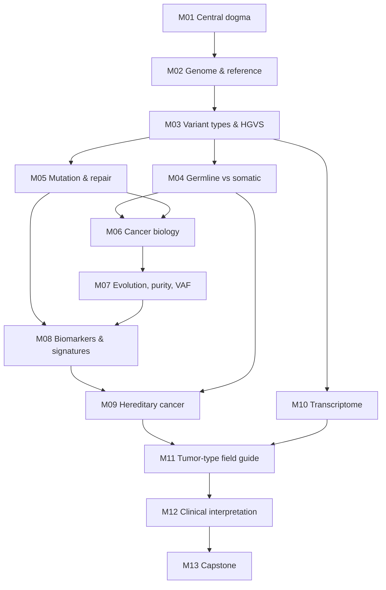

# Cancer Genomics for Pipeline Engineers — Course Overview

**Format:** self-paced, 16 weeks × 5 h = 80 h · **Level:** undergraduate to early graduate
**Audience:** a bioinformatician who runs a WGS/WGTS tumor–normal pipeline (BWA/GATK, Mutect2) and wants to understand the biology and clinical meaning of what it detects.
**Coordinates:** GRCh38 throughout unless stated.

## Course goal

By the end, you can take a tumor–normal case from FASTQ to an interpreted variant report and explain, at every step, what is biologically happening and why it matters clinically. You'll be able to make sharper QC calls and talk confidently with clinicians and scientists.

## How each module works

Every module file (`module_XX_*.md`) contains:
- learning objectives
- lesson notes with "Pipeline connection" boxes
- common misconceptions
- a worked example on a real gene or variant
- a hands-on exercise
- further reading
- a "facts to double-check" log

Quizzes live in `quizzes/` and answer keys in `answer_keys/`, so you can test yourself before checking. Flashcards for all modules are in `flashcards.csv` (Anki: File → Import, fields Front/Back/Tags, tags `M01`–`M13`).

A typical week:

| Activity | Time |
|---|---|
| Notes + reading | ~2 h |
| Exercise | ~1.5 h |
| Quiz + flashcards | ~1 h |
| Buffer | ~0.5 h |

## Weekly schedule

| Week | Module | Topic |
|---|---|---|
| 1 | M01 | DNA, genes and the central dogma |
| 2 | M02 | Human genome organization and reference genomes |
| 3–4 | M03 | Variation, mutation types and HGVS |
| 5 | M04 | Germline vs somatic variation; matched normal; panel of normals |
| 6 | M05 | How mutations arise and are repaired (+ sequencing/sample artifacts) |
| 7 | M06 | Cancer biology fundamentals (hallmarks, oncogenes, tumor suppressors, two-hit, LOH) |
| 8–9 | M07 | Tumor evolution, heterogeneity, purity, ploidy and VAF |
| 10 | M08 | Genomic biomarkers and signatures (TMB, MSI, HRD, COSMIC SBS, copy-number patterns) |
| 11 | M09 | Hereditary cancer (BRCA1/2, Lynch, Li-Fraumeni; secondary findings) |
| 12 | M10 | Transcriptome in cancer (expression, fusions, ASE; what RNA adds) |
| 13 | M11 | Tumor-type field guide: breast, colorectal, lung, prostate, pancreatic, heme (AML, CML, MPN, CLL), GBM, myeloma |
| 14 | M12 | Clinical interpretation (AMP/ASCO/CAP, ClinGen/CGC/VICC, ACMG/AMP; COSMIC, ClinVar, OncoKB, gnomAD, CIViC) |
| 15–16 | M13 | Capstone: FASTQ → interpreted report, biology explained at each step |

**Tumor spotlight boxes** appear throughout the earlier modules and connect each concept to the eight cancer types covered in M11.

## Prerequisites map



## Core readings

**Textbook:** Weinberg RA. *The Biology of Cancer*, 2nd ed. Garland Science; 2014. Use it for the biology. It was published in 2013, so it is dated on signatures, biomarker thresholds, clinical tiers and current therapies; later modules use newer sources for those topics.

| Module | Weinberg chapters |
|---|---|
| M01 | Ch 1 |
| M02 | Ch 1 (chromosome changes in cancer) |
| M03 | Ch 4 |
| M04 | Ch 1 (germline vs soma), Ch 7 (familial cancers) |
| M05 | Ch 12 |
| M06 | Ch 2, 4, 7 core; Ch 9 selected; Ch 5, 6, 8, 10 optional |
| M07 | Ch 11 |
| M08 | Ch 12; Ch 15 optional |
| M09 | Ch 7, 12 |
| M10 | Ch 4 |
| M11–M12 | Ch 16 |

Optional: Ch 3 (tumor viruses; HPV/HBV integration is visible in WGS), Ch 13–14.

**The Hallmarks of Cancer series**
1. Hanahan D, Weinberg RA. The hallmarks of cancer. *Cell*. 2000. doi:10.1016/s0092-8674(00)81683-9 — **M06**
2. Hanahan D, Weinberg RA. Hallmarks of cancer: the next generation. *Cell*. 2011. doi:10.1016/j.cell.2011.02.013 — **M06**
3. Hanahan D. Hallmarks of Cancer: New Dimensions. *Cancer Discov*. 2022;12(1):31–46. doi:10.1158/2159-8290.CD-21-1059 — **M07 (week 2)**, revisited at the capstone

## Files

```
00_course_overview.md
module_01_central_dogma.md
module_02_genome_organization.md
module_03_variant_types_hgvs.md
module_04_germline_vs_somatic.md
module_05_mutation_and_repair.md
module_06_cancer_biology.md
module_07_evolution_purity_vaf.md
module_08_biomarkers_signatures.md
module_09_hereditary_cancer.md
module_10_transcriptome.md
module_11_tumor_type_field_guide.md
module_12_clinical_interpretation.md
capstone_project.md
quizzes/quiz_01.md … quiz_12.md, quiz_13_final.md
answer_keys/answer_key_01.md … answer_key_13_final.md
answer_keys/capstone_model_answer.md
flashcards.csv
glossary.md
progress_tracker.md
```

## Accuracy conventions

- Every module ends with a "facts to double-check" list. Verify those items against the named resource before relying on them at work.
- Guidelines (AMP/ASCO/CAP, ACMG/AMP, WHO classifications) and drug approvals change. Each mention is dated; check the current version.
- Established facts and areas of active research are labeled as such.
