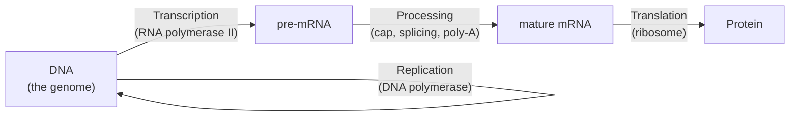

# Module 1 — DNA, Genes and the Central Dogma

**Week 1 of 16 · ~5 hours · Prerequisites: none**

| Activity | Time |
|---|---|
| Lesson notes (this file) + Weinberg reading | 2 h |
| Hands-on exercise (Ensembl, UCSC, ClinVar, Python) | 1.5 h |
| Quiz (`quizzes/quiz_01.md`) + flashcards (tag `M01`) | 1 h |
| Buffer / revisit weak spots | 0.5 h |

Coordinates in this module are **GRCh38** unless stated otherwise.

---

## Learning objectives

By the end of this module you can:

1. **Write** the reverse complement of any DNA sequence and **explain** why a read with SAM FLAG `0x10` stores the reverse complement of what the sequencer actually read.
2. **Label** gene, transcript, exon, intron, UTR, CDS, start codon and stop codon on a GTF record or a genome-browser view.
3. **Translate** a coding sequence into protein in the correct reading frame, and **predict** the amino-acid effect of a single-base change.
4. **Convert** a variant between genomic (VCF) coordinates and coding (`c.`) coordinates for a gene on either strand.
5. **Explain** why one genomic variant can have different `c.`/`p.` names on different transcripts, and what MANE Select solves.

---

## 1. The big picture: the central dogma

The **central dogma** describes how stored genetic information becomes a working molecule:



**A pipeline analogy (with its limits stated):**

| Biology | Software analogy |
|---|---|
| Genome (DNA) | The repository: one master copy per cell, never shipped |
| Gene | One source file in that repo |
| Transcription | Checking out a working copy of one file — many temporary copies can exist |
| Splicing | A build step that removes sections and joins the rest |
| Translation | Compiling the working copy into the running program (the protein) that actually does the job |

Where the analogy breaks: introns are not "comments" — they can contain regulatory sequence, and mutations in them can change splicing. Many genes produce functional RNAs that are never translated. And information can flow backward (RNA → DNA, via reverse transcriptase, used by retroviruses and LINE-1 retrotransposons). Treat the dogma as the main highway, not the only road.

**Which layer does your data see?**

- **WGS** reads DNA → you see the genome (the repo itself).
- **RNA-seq** (the "T" in WGTS) reads mRNA after it is converted to cDNA → you see which files were checked out, how often, and how they were spliced.
- **Protein** is not measured by your pipeline at all. Every claim about protein effect in a report is a *prediction* from DNA/RNA.

---

## 2. DNA: the molecule

**Nucleotide** = a sugar (deoxyribose) + a phosphate + one of four **bases**: adenine (A), cytosine (C), guanine (G), thymine (T).

- A and G are **purines** (two-ring bases); C and T are **pyrimidines** (one ring). You will need this in Module 3: a **transition** swaps purine↔purine or pyrimidine↔pyrimidine (A↔G, C↔T); a **transversion** swaps across classes.
- Nucleotides link through the sugar–phosphate backbone. Each strand has a direction: a **5′ end** and a **3′ end** (named after carbon atoms in the sugar). By convention, sequences are always written **5′ → 3′**.
- DNA polymerases (the enzymes that copy DNA) only build new strands in the 5′→3′ direction. That one fact explains a lot of later biology, including the 3′ bias in some RNA-seq libraries.

**The double helix.** Two strands wind around each other, running in opposite directions (**antiparallel**). Bases pair by **complementarity**: A with T, G with C. One strand fully determines the other.

**Reverse complement** — the operation you will do constantly:

```
Strand given:          5′- A T G A C T G A A -3′
Complement (paired):   3′- T A C T G A C T T -5′
Reverse complement:    5′- T T C A G T C A T -3′   (the paired strand, rewritten 5′→3′)
```

**The reference genome stores one strand per chromosome**, called the **forward** or **plus (+)** strand. The other strand (**reverse**, **minus**, −) is implied. Which physical strand is called "+" is simply a convention of the assembly.

> **Pipeline connection — strands in your BAM**
> - Library fragments are double-stranded; each read comes from one strand. BWA tries both orientations. If the read matches the − strand, the aligner sets **FLAG 0x10 (16)** and stores **SEQ and QUAL reverse-complemented**, so everything in the BAM is expressed on the + strand. `samtools view` never shows you the "raw" orientation of a reverse read.
> - A real variant should usually be supported by reads from **both** orientations. Artifacts often appear on one orientation only. That is the logic behind `FilterMutectCalls`' **strand bias** filter. (Orientation-specific *damage* artifacts — the F1R2/read-orientation model — come in Module 5.)
> - In IGV you can color alignments by read strand to check this by eye.

---

## 3. Genes and their anatomy

A **gene** is a region of DNA that is transcribed into a functional RNA. About 20,000 human genes are **protein-coding**; many more produce non-coding RNAs. (Counts differ by annotation release — check GENCODE/Ensembl for the current number.)

**Genes live on either strand.** A gene's own "direction" (5′→3′) follows its RNA. In a genome browser, + strand genes read left→right; − strand genes read right→left (shown with ◄ arrows). **KRAS, BRAF and TP53 are all on the − strand** — keep this in mind; it drives the worked example.

**Anatomy of a protein-coding gene** (in the gene's own 5′→3′ direction):

```
 5′ ─[promoter]─▶TSS
       Exon 1            Exon 2                       Exon 3
     ┌─────────┐       ┌──────────────────┐         ┌───────────────────────┐
─────│  5′UTR  │─GT…AG─│5′UTR│ATG   CDS   │──GT…AG──│  CDS   STOP│  3′UTR   │──── 3′
     └─────────┘intron └──────────────────┘ intron  └───────────────────────┘
```

| Term | Meaning |
|---|---|
| **Promoter** | Upstream DNA where the transcription machinery assembles. Not part of the RNA. |
| **TSS** | Transcription start site — first base of the RNA. |
| **Exon** | Segment kept in the mature mRNA. **Exons include UTRs** — an exon is not necessarily coding. |
| **Intron** | Segment transcribed but removed by splicing. Usually much longer than exons. |
| **UTR** | Untranslated region (5′ UTR before the start codon, 3′ UTR after the stop). Regulates stability and translation. |
| **CDS** | Coding sequence — the exonic bases from start codon to stop codon, which encode protein. |
| **Start codon** | ATG (AUG in RNA); encodes methionine and sets the reading frame. |
| **Stop codons** | TAA, TAG, TGA — end translation. |

Coding sequence is a small fraction of the genome (commonly cited as ~1–2%). This is why WGS and exome sequencing are such different products: most WGS reads land outside genes or in introns.

### Reading a GTF record

GTF is the annotation file your pipeline (VEP, Funcotator, featureCounts, STAR index) uses to know where genes are. Here is a **made-up gene, TOY1, on a made-up contig** — coordinates are illustrative, not real:

```
#seqname source feature     start end   score strand frame attributes
chrT     TOY    gene        1001  4000  .     +      .     gene_id "TOY1";
chrT     TOY    transcript  1001  4000  .     +      .     gene_id "TOY1"; transcript_id "TOY1-201"; tag "MANE_Select";
chrT     TOY    exon        1001  1100  .     +      .     transcript_id "TOY1-201"; exon_number "1";
chrT     TOY    exon        2001  2150  .     +      .     transcript_id "TOY1-201"; exon_number "2";
chrT     TOY    exon        3801  4000  .     +      .     transcript_id "TOY1-201"; exon_number "3";
chrT     TOY    start_codon 2051  2053  .     +      0     transcript_id "TOY1-201";
chrT     TOY    CDS         2051  2150  .     +      0     transcript_id "TOY1-201"; exon_number "2";
chrT     TOY    CDS         3801  3880  .     +      2     transcript_id "TOY1-201"; exon_number "3";
chrT     TOY    stop_codon  3881  3883  .     +      0     transcript_id "TOY1-201";
```

What to notice:

- **Exon 1 has no CDS line** → it is entirely 5′ UTR. (The real KRAS gene is like this.)
- The 5′ UTR is 1001–1100 plus 2001–2050; the 3′ UTR is 3884–4000.
- CDS segments: 100 bp + 80 bp, plus the 3 bp stop codon = 183 bp = 61 codons (60 amino acids + stop). In Ensembl/GENCODE GTFs the CDS feature excludes the stop codon.
- **The `frame` column** (phase) says how many bases to skip at the start of this CDS segment to reach the first base of a complete codon. The first segment is 100 bp; 100 = 33 codons + 1 leftover base, so the codon straddles the intron and the next segment starts with 2 bases that finish it → frame **2**.
- GTF coordinates are **1-based, inclusive** — same as VCF.

---

## 4. Transcription and RNA processing

**RNA** differs from DNA in three ways: the sugar is ribose, **uracil (U) replaces thymine (T)**, and it is usually single-stranded.

**Transcription.** RNA polymerase II reads the **template strand** and builds RNA 5′→3′. The RNA therefore has the same sequence as the *other* strand — the **coding (sense) strand** — with U in place of T. **Gene annotation, cDNA sequences and `c.` notation are all written on the coding strand.**

**Processing** of pre-mRNA into mature mRNA:

1. **5′ cap** added to the start.
2. **Splicing** — the **spliceosome** removes introns. Introns almost always begin with **GT** and end with **AG** (GU…AG in RNA). The intron start is the **splice donor** (5′ splice site); the end is the **splice acceptor** (3′ splice site).
3. **Poly(A) tail** added at the 3′ end.

Variants at the GT or AG dinucleotides (the ±1 and ±2 intronic positions) usually break splicing. Module 3 covers how those are named and classified.

**Alternative splicing.** Most multi-exon human genes produce more than one transcript: exons can be skipped, splice sites shifted, introns retained, or different first/last exons used. KRAS makes two well-known protein isoforms, KRAS4A and KRAS4B, that differ in their final coding exon.

> **Pipeline connection — RNA reads cross introns**
> An RNA-seq read can start in one exon and end in the next, with thousands of intron bases missing in between. A DNA aligner like BWA would soft-clip or mis-place it. **Spliced aligners** (STAR, HISAT2) represent the skipped intron with the CIGAR operator **`N`**. This is how WGTS confirms splicing effects, such as the **MET exon 14 skipping** you will meet in the lung cancer field guide.

---

## 5. Translation and the genetic code

The **ribosome** reads mRNA 5′→3′ in **codons** (three nucleotides each), starting at AUG. **tRNAs** carry amino acids and recognize codons by complementary **anticodons**.

- 4³ = **64 codons**: 61 encode the 20 amino acids, 3 are stops.
- The code is **degenerate** (redundant): most amino acids have several codons, which often differ only at the **third position**. Third-position changes are therefore frequently **synonymous** (no amino-acid change). Only Met (ATG) and Trp (TGG) have a single codon.
- A **reading frame** is one way of dividing a sequence into codons. Each strand has 3 frames, so there are 6 in total. An **open reading frame (ORF)** runs from a start codon to a stop codon without interruption.

**Standard genetic code** (DNA letters, as in your reference; x = any base):

| 1st ↓ / 2nd → | T | C | A | G |
|---|---|---|---|---|
| **T** | TTT, TTC Phe (F); TTA, TTG Leu (L) | TCx Ser (S) | TAT, TAC Tyr (Y); **TAA, TAG Stop** | TGT, TGC Cys (C); **TGA Stop**; TGG Trp (W) |
| **C** | CTx Leu (L) | CCx Pro (P) | CAT, CAC His (H); CAA, CAG Gln (Q) | CGx Arg (R) |
| **A** | ATT, ATC, ATA Ile (I); **ATG Met (M)** | ACx Thr (T) | AAT, AAC Asn (N); AAA, AAG Lys (K) | AGT, AGC Ser (S); AGA, AGG Arg (R) |
| **G** | GTx Val (V) | GCx Ala (A) | GAT, GAC Asp (D); GAA, GAG Glu (E) | GGx Gly (G) |

You will see both **three-letter** (p.Gly12Asp) and **one-letter** (p.G12D) amino-acid codes in reports. They mean the same thing; HGVS prefers three-letter.

---

## 6. Three coordinate systems for one variant

| System | Example | Counts from | Notes |
|---|---|---|---|
| **Genomic** (VCF, GTF, HGVS `g.`) | chr12:25245350 | Chromosome start, 1-based | + strand only |
| **Genomic, BED** | `chr12 25245349 25245350` | 0-based, half-open | Classic off-by-one trap |
| **Coding** (`c.`) | c.35 | A of the ATG = c.1 | Counts only CDS bases of one transcript; introns skipped |
| **Protein** (`p.`) | p.Gly12 | First Met = 1 | Codon *n* = c.(3n−2) to c.3n |

Useful formulas:

- Codon number = ⌈c / 3⌉ (round up).
- Position within codon = ((c − 1) mod 3) + 1.
- So c.35 → codon 12, position 2. Codon 12 spans c.34–c.36.

Quick preview of non-coding `c.` positions (Module 3 covers the full rules): 5′ UTR bases are `c.-1, c.-2…` counting back from the A of ATG; 3′ UTR bases are `c.*1, c.*2…` after the stop; intronic bases are written relative to the nearest exon, e.g. `c.87+1` (first intron base after the exon ending at c.87).

**For a − strand gene, c. coordinates increase as genomic coordinates decrease, and every base is complemented.** This is the single most common source of confusion between the VCF and the report.

---

## 7. Transcripts, identifiers and MANE Select

The two big annotation sets are **Ensembl/GENCODE** (transcript IDs `ENST…`) and **NCBI RefSeq** (`NM_…` curated mRNAs; `XM_…` model predictions). The suffix (e.g. `.5`) is a **version**: when the sequence changes, the version increments. Always report the version.

Because `c.` positions are counted along one transcript, **the same genomic variant can get different `c.` and `p.` names on different transcripts** — and can even be exonic on one transcript and intronic on another. Historically, labs and databases each picked their own preferred transcript, which caused real reporting discrepancies.

**MANE (Matched Annotation from NCBI and EMBL-EBI)** fixes this by defining:

- **MANE Select** — one representative transcript per protein-coding gene, where the RefSeq `NM_` and Ensembl `ENST` versions are **100% identical** (5′ UTR, CDS and 3′ UTR) and perfectly aligned to GRCh38.
- **MANE Plus Clinical** — a small number of extra transcripts for genes where MANE Select alone cannot describe all known pathogenic/likely pathogenic variants.

MANE v1.0 covered about 99% of human protein-coding genes. MANE Select is now the recommended default for clinical reporting.

> **Pipeline connection — your annotation depends on your transcript set**
> - VEP, SnpEff and Funcotator annotate against a transcript set derived from a GTF/GFF or cache. If two pipelines disagree on a `c.` name, check **which transcript and which version** each used before suspecting the caller.
> - Annotators can flag or restrict output to MANE Select transcripts. If your reports do not say which transcript was used, that is a gap worth raising.
> - **BED (0-based) vs VCF/GTF (1-based)**: off-by-one errors in target or blacklist BED files silently drop or mis-assign variants at region edges.

---

## Worked example: KRAS G12D, from VCF line to protein

**KRAS** encodes a small GTPase — a molecular on/off switch in growth-signaling pathways. It is one of the most frequently mutated oncogenes in human cancer, especially pancreatic, colorectal and lung adenocarcinoma.

**Step 1 — The VCF line (GRCh38).** A somatic caller reports:

```
#CHROM  POS       ID  REF  ALT
chr12   25245350  .   C    T
```

**Step 2 — Which strand is KRAS on?** The − strand. The VCF always shows the + strand, so reverse-complement the change: **C>T on + = G>A on the coding strand.**

**Step 3 — Map to the transcript.** On the KRAS MANE Select transcript (NM_004985.5 — verify in the exercise), this genomic base is **c.35**.

**Step 4 — Find the codon.** ⌈35 / 3⌉ = **codon 12**, position 2. The first 13 codons of the KRAS CDS (coding strand):

```
c.       1   4   7   10  13  16  19  22  25  28  31  34  37
codon    1   2   3   4   5   6   7   8   9   10  11  12  13
DNA      ATG ACT GAA TAT AAA CTT GTG GTA GTT GGA GCT GGT GGC
aa       M   T   E   Y   K   L   V   V   V   G   A   G   G
```

**Step 5 — Apply the change.** Codon 12 is **GGT** (Gly). c.35G>A changes the middle base: **GGT → GAT** = Asp.
Result: **c.35G>A, p.Gly12Asp (p.G12D)** — a **missense** variant.

**Step 6 — See it from the genome's side.** Codons 11–13 on the coding strand read `GCT GGT GGC`. On the + strand (what IGV and the reference FASTA show, left to right) that is the reverse complement, `GCC ACC AGC`. The fifth base, a **C**, is c.35 — the base that becomes **T** in the tumor.

```
+ strand (genome, →)     G C C A C C A G C       ← VCF shows C>T at the 5th base
coding strand (gene, ←)  G C T G G T G G C       ← read right-to-left on the genome
                                 ↑ c.35 (G>A)
```

**Step 7 — Why it matters biologically (preview of Module 6).** Glycine 12 sits in the **P-loop**, the part of KRAS that binds the phosphates of GTP. Substitutions here impair GTP hydrolysis, so KRAS stays locked in its active GTP-bound "on" state and keeps sending growth signals. Codons 12, 13 and 61 are the classic KRAS **hotspots**. G12D is among the most frequent KRAS alleles in pancreatic and colorectal cancer. Different G12 substitutions are not clinically equivalent: G12C has approved targeted inhibitors, while G12D-targeted drugs are still in clinical development (check current status — this area changes fast).

---

## Common misconceptions

1. **"REF/ALT in the VCF tell me the change in the gene."** They describe the + strand of the reference. For − strand genes the gene-level change is the reverse complement. KRAS, BRAF and TP53 are on the − strand; EGFR is on the + strand. Always check.
2. **"Exon means coding."** Exons include UTRs. KRAS exon 1 is entirely non-coding; codon 12 is in exon 2.
3. **"Introns don't matter clinically."** Intronic variants can destroy splice sites or create new ones. WGS sees them; exome and panel data often don't.
4. **"One gene = one transcript = one protein."** Alternative splicing produces several transcripts. The `c.`/`p.` name depends on which transcript you annotate against.
5. **"Every base change in a codon changes the amino acid."** The code is redundant; many third-position changes are synonymous. ("Synonymous" does not always mean "harmless" — a synonymous change near an exon edge can still alter splicing.)
6. **"c.35 is the 35th base of the gene."** It is the 35th base of the *coding sequence* of a *specific transcript*, counting from the A of ATG and skipping introns.

---

## Hands-on exercise (~1.5 h)

**Goal:** verify the worked example yourself in public resources, then automate the logic in Python. Record your answers in the table at the end.

### Part A — Ensembl (GRCh38), 30 min

1. Go to https://www.ensembl.org (the main site uses GRCh38). Search **KRAS** and open the *Homo sapiens* gene page.
2. From the gene summary, record: chromosome, start–end coordinates, strand, and number of transcripts.
3. In the transcript table, find the transcript tagged **MANE Select**. Record its `ENST` ID and the matching RefSeq `NM_` ID (both with versions).
4. Open that transcript → **Exons**. Count the exons. Which exon(s) are entirely UTR? Which exon contains the ATG?
5. Open **Sequence → cDNA** with the translation shown. Find codon 12 and confirm it is GGT. Note: Ensembl shows this sequence on the coding strand, not the + strand.

### Part B — UCSC Genome Browser, 20 min

1. Go to https://genome.ucsc.edu → Genome Browser → assembly **hg38** (UCSC's name for GRCh38).
2. Enter `chr12:25,245,340-25,245,360` and zoom to base level.
3. Make sure the MANE and GENCODE gene tracks are visible. Which way do the gene arrows point, and what does that tell you?
4. Read the + strand bases around position 25,245,350. Do you find `GCCACCAGC`, with the C at 25,245,350 in the middle of the second triplet?
5. Use the browser's option to display the reverse strand / complement (the setting's location varies by version; look in the View menu or Base Position track settings). The sequence should now read like the coding strand.

### Part C — ClinVar, 15 min

1. Go to https://www.ncbi.nlm.nih.gov/clinvar/ and search `NM_004985.5(KRAS):c.35G>A` (or `KRAS G12D`).
2. Open the variant record. Record the **GRCh38** and **GRCh37** locations shown. Why are they different? (You'll answer this properly in Module 2.)
3. Note how ClinVar writes the `p.` notation.

### Part D — Python, 25 min

No libraries needed. Save as `m01_translate.py`:

```python
# Standard genetic code in TCAG order (a compact, well-known encoding)
BASES = "TCAG"
AAS = "FFLLSSSSYY**CC*WLLLLPPPPHHQQRRRRIIIMTTTTNNKKSSRRVVVVAAAADDEEGGGG"
CODON = {a + b + c: aa for (a, b, c), aa in
         zip(((a, b, c) for a in BASES for b in BASES for c in BASES), AAS)}

def revcomp(seq):
    return seq.translate(str.maketrans("ACGTacgt", "TGCAtgca"))[::-1]

def translate(cds):
    return "".join(CODON[cds[i:i+3]] for i in range(0, len(cds) - 2, 3))

def apply_c(cds, c_pos, ref, alt):
    assert cds[c_pos - 1] == ref, f"REF mismatch at c.{c_pos}: {cds[c_pos-1]}"
    return cds[:c_pos - 1] + alt + cds[c_pos:]

# First 18 codons of KRAS CDS (coding strand) — check against your Part A result
kras = "ATGACTGAATATAAACTTGTGGTAGTTGGAGCTGGTGGCGTAGGCAAGAGTGCC"

print("WT :", translate(kras))
print("G12D:", translate(apply_c(kras, 35, "G", "A")))
print("+ strand of codons 11-13:", revcomp(kras[30:39]))
```

Tasks:

1. Run it. Confirm the WT protein starts `MTEYKLVVVGAGG` and that the mutant has `D` at position 12.
2. Confirm the last line prints `GCCACCAGC` — matching what you saw in UCSC.
3. Extend the script with a function `p_notation(cds, c_pos, ref, alt)` that returns a string like `p.Gly12Asp`. (You need a one-letter → three-letter amino acid map.)
4. Use it to name **c.34G>T** and **c.38G>A**. Check your answers against ClinVar.

### Part E — IGV (optional), 10 min

Open https://igv.org/app, select hg38, and type `KRAS`. Expand the gene track to see multiple transcripts and compare their last exons. If your data governance allows it, open one of your own tumor BAMs locally in IGV desktop at `chr12:25245350`, color alignments by read strand, and check whether any variant reads are present on both strands.

### Record your answers

| Item | Your answer |
|---|---|
| KRAS chromosome, coordinates, strand | |
| Number of transcripts | |
| MANE Select ENST and NM (with versions) | |
| Number of exons; UTR-only exon(s) | |
| Codon 12 sequence | |
| GRCh38 vs GRCh37 position of c.35 | |
| Names for c.34G>T and c.38G>A | |

---

## Self-test

- Quiz: `quizzes/quiz_01.md` (answer key in `answer_keys/answer_key_01.md` — attempt the quiz first)
- Flashcards: `flashcards.csv`, filter by tag `M01`

---

## Further reading

1. **Weinberg RA. *The Biology of Cancer*, 2nd ed. Garland Science; 2014. Chapter 1.**
   Core: the sections from "Genotype embodied in DNA sequences creates phenotype through proteins" onward (DNA → RNA → protein). Optional: the earlier Mendelian-genetics sections — they preview germline vs somatic (Module 4). Check section numbers against your copy.
2. **Alberts B, et al. *Molecular Biology of the Cell*, 4th ed. Garland Science; 2002. Chapter 6, "How Cells Read the Genome: From DNA to Protein."**
   Free on the NCBI Bookshelf (search the title there). Older, but the fundamentals haven't changed.
3. **Morales J, et al. A joint NCBI and EMBL-EBI transcript set for clinical genomics and research. *Nature*. 2022;604(7905):310–315. doi:10.1038/s41586-022-04558-8.**
   The MANE paper. Read the introduction and the section on MANE Select.
4. **SAM/BAM format specification** — https://samtools.github.io/hts-specs/ (SAMv1). Re-read the FLAG table and the definition of SEQ for reverse-strand reads with this module in mind.

---

## Facts to double-check (accuracy log)

- KRAS c.35G>A at **chr12:25245350 (GRCh38)** — confirm in ClinVar (Part C).
- KRAS MANE Select = **NM_004985.5** (KRAS4B) — confirm in Ensembl (Part A); versions change over time.
- The KRAS CDS fragment in Part D — confirm against the Ensembl cDNA sequence.
- Protein-coding gene count (~20,000) and coding fraction (~1–2%) are approximate; current numbers are on the GENCODE/Ensembl statistics pages.
- KRAS G12D drug-development status changes quickly — check current trials or OncoKB before repeating this claim.
