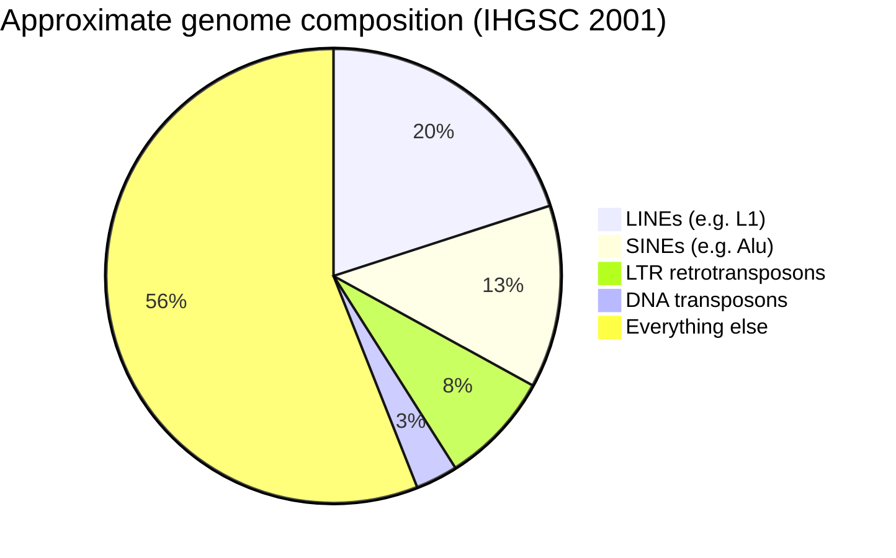

# Module 2 — Human Genome Organization and Reference Genomes

**Week 2 of 16 · ~5 hours · Prerequisite: Module 1**

| Activity | Time |
|---|---|
| Lesson notes + Weinberg reading | 2 h |
| Hands-on exercise (UCSC, LiftOver, your own reference/BAM) | 1.5 h |
| Quiz (`quizzes/quiz_02.md`) + flashcards (tag `M02`) | 1 h |
| Buffer | 0.5 h |

Coordinates are **GRCh38** unless stated otherwise.

---

## Learning objectives

By the end of this module you can:

1. **Describe** how ~2 metres of DNA is packaged into 46 chromosomes, and **name** the functional parts of a chromosome (centromere, arms, telomeres, cytobands).
2. **Explain** ploidy, aneuploidy and chromosomal instability, and **give** two examples of chromosome-level changes that define specific cancers.
3. **Explain** the end-replication problem, how telomerase or ALT solves it, and why TERT promoter mutations are cancer drivers.
4. **Compare** GRCh37, GRCh38 and T2T-CHM13, and **identify** what your own pipeline's reference contains (alts, decoys, EBV, masked PARs).
5. **Predict** where short-read mapping fails (repeats, segmental duplications, pseudogenes, extreme GC) and **explain** how MAPQ and region stratifications capture this.

---

## 1. From a 2-metre molecule to 46 chromosomes

Each diploid human cell holds about **6 billion base pairs** — two copies of a ~3.1 Gb haploid genome. Stretched out, that is roughly 2 metres of DNA, packed into a nucleus a few micrometres across.

**Packaging works in levels:**

1. **Nucleosome** — ~147 bp of DNA wrapped around a core of eight **histone** proteins. This is the "beads on a string" fibre.
2. **Chromatin** — nucleosomes folded further, plus associated proteins. Chromatin comes in two broad states:
   - **Euchromatin** — open, gene-rich, actively transcribed.
   - **Heterochromatin** — compact, gene-poor, transcriptionally quiet. *Constitutive* heterochromatin (around centromeres, for example) is always compact and is dominated by repeats.
3. **Chromosome** — during cell division, chromatin condenses into the familiar X-shaped structures you see in a karyotype.

Chemical marks on DNA (e.g. **CpG methylation**) and on histones control which regions are open. These marks are **epigenetic**: they change gene activity without changing the sequence, so **WGS cannot see them**. MGMT promoter methylation in glioblastoma — a key treatment-response marker — is a classic example your pipeline will never report. Hanahan's 2022 hallmarks update lists "non-mutational epigenetic reprogramming" as an enabling characteristic of cancer for this reason.

---

## 2. Anatomy of a chromosome

```
 p arm (short)                 centromere               q arm (long)
 CCCTAA…━━━━━━ 17p13.1 ━━━━━━━[●●● α-satellite ●●●]━━━━━━━ 17q12 ━━━━━━━━━━━━━…TTAGGG
 ↑ telomere                                                               telomere ↑
```

| Part | What it is | Why you care |
|---|---|---|
| **Centromere** | Constriction where the two sister copies are held together and where spindle fibres attach during division. Built from **α-satellite** DNA: a ~171 bp unit repeated into arrays that can be megabases long. | Essentially unmappable with short reads. Represented in GRCh38 by *modelled* sequence, not real assembled sequence. |
| **p and q arms** | Short arm (p) and long arm (q) either side of the centromere. | Copy-number changes often affect whole arms ("17p loss", "1q gain"). |
| **Telomeres** | Chromosome ends: thousands of tandem copies of **TTAGGG**, protected by a protein complex called **shelterin**. | Shorten with each division; central to cancer immortality (Section 4). In the reference FASTA, a chromosome begins with (CCCTAA)ₙ and ends with (TTAGGG)ₙ — the same repeat seen from the other strand. |
| **Cytobands** | Light/dark bands seen after Giemsa staining (G-banding), named arm + region + band, e.g. **17p13.1**. | Clinicians and cytogeneticists still locate genes this way. TP53 is at 17p13.1. |

**Acrocentric chromosomes** (13, 14, 15, 21, 22) have their centromere near one end. Their tiny p arms carry the repeated ribosomal RNA gene arrays and were missing from GRCh38 entirely; T2T-CHM13 was the first assembly to include them (Section 7).

**Biology trivia that turns out to matter:**

- Chromosomes were numbered by apparent size, but **chr21 (~46.7 Mb) is actually smaller than chr22 (~50.8 Mb)**.
- Gene density varies hugely. **chr19** is very gene-dense; **chr13, 18 and 21** are gene-poor. That is why trisomies 13, 18 and 21 are the only autosomal trisomies seen in live births: an extra copy of a gene-poor chromosome is tolerated.

---

## 3. Cell division, ploidy and what goes wrong in cancer

Before a cell divides it **replicates** every chromosome into two identical **sister chromatids**. In **mitosis**, the spindle pulls one chromatid of each pair into each daughter cell, so each daughter gets a complete diploid set. **Meiosis** (in germ cells only) halves the chromosome number to make eggs and sperm, and shuffles parental chromosomes by **recombination**. That is why germline variants are inherited in blocks (haplotypes) — relevant again in Modules 4 and 9.

**Ploidy vocabulary:**

| Term | Meaning |
|---|---|
| **Haploid (n)** | One set: 23 chromosomes (eggs, sperm) |
| **Diploid (2n)** | Two sets: 46 chromosomes (normal body cells) |
| **Aneuploid** | Gain or loss of whole chromosomes or arms (e.g. 47 chromosomes) |
| **Polyploid** | Whole extra sets (e.g. tetraploid, 4n) |

**Most solid tumours are aneuploid.** Weinberg's Chapter 1 section on chromosome alterations covers this. Many tumours have **chromosomal instability (CIN)**: they keep mis-segregating chromosomes at each division, so different cells carry different karyotypes. Some tumours also undergo **whole-genome doubling (WGD)**, copying their entire genome once. Their "baseline" copy number becomes 4, not 2. This changes every VAF expectation you will compute in Module 7.

> **Tumor spotlight — chromosome-level changes that define cancers**
> - **CML:** the **Philadelphia chromosome**, t(9;22)(q34;q11), fuses BCR on chr22 to ABL1 on chr9. It was the first recurrent chromosome change linked to a specific cancer, and the target of imatinib (Module 11; Weinberg Ch 16).
> - **Glioblastoma (IDH-wildtype):** **gain of chromosome 7 together with loss of chromosome 10** (+7/−10) is one of the molecular features that defines the diagnosis.
> - **Myeloma:** about half of cases are **hyperdiploid** — extra copies of odd-numbered chromosomes (3, 5, 7, 9, 11, 15, 19, 21). Most of the rest carry translocations involving the immunoglobulin heavy-chain locus (IGH) on chr14.

---

## 4. Telomeres: the cell's division counter

**The end-replication problem.** DNA polymerase cannot fully copy the very end of a linear chromosome, so telomeres lose some sequence with every division. When telomeres become critically short, cells stop dividing (**senescence**) or die. This caps how many times a normal somatic cell can divide (the **Hayflick limit**). It is a built-in brake on runaway growth.

**How cancers escape** — "enabling replicative immortality" is one of the hallmarks of cancer (Module 6):

- **Telomerase reactivation (~85–90% of cancers).** Telomerase is an enzyme (catalytic protein **TERT** plus an RNA template **TERC**) that adds TTAGGG repeats back. It is active in stem cells but silenced in most adult cells, and many cancers switch it back on.
- **ALT (alternative lengthening of telomeres, ~10–15%).** Telomeres are maintained by recombination between telomeres instead. ALT is strongly associated with loss of **ATRX** or **DAXX**, and is common in some sarcomas, pancreatic neuroendocrine tumours and lower-grade gliomas.

*Deeper reading: Weinberg Ch 10 (optional).*

---

## 5. Sex chromosomes and the mitochondrial genome

**X and Y.** chrX (~156 Mb) carries many genes; chrY (~57 Mb) carries few. Two short **pseudoautosomal regions (PAR1, PAR2)** at the tips of X and Y are identical between them, so males are effectively diploid there but haploid for the rest of X and Y. In females, one X is largely silenced (**X-inactivation**).

> **Pipeline connection — sex chromosomes**
> - Because PAR sequence appears on both X and Y, GRCh38 *analysis sets* hard-mask the chrY copy of the PARs with N. Reads then map uniquely to chrX instead of splitting between X and Y with MAPQ 0.
> - **Mosaic loss of chrY (LOY)** is common in blood cells of older men and in many tumours. A "male" normal sample with low chrY coverage is often biology, not a pipeline bug — and it matters when the normal is blood.
> - Sex checks (X/Y coverage ratio) catch tumour–normal sample swaps.

**Mitochondrial DNA (mtDNA).** Mitochondria carry their own small circular genome: **16,569 bp, 37 genes** (13 protein-coding, 22 tRNA, 2 rRNA). It is inherited only from the mother, and each cell holds hundreds to thousands of copies. A variant present in only some copies is **heteroplasmic**, so mtDNA VAFs do not follow the 0/50/100% logic of nuclear DNA.

> **Pipeline connection — chrM**
> - GRCh38's chrM is the **revised Cambridge Reference Sequence (rCRS)**. The old UCSC **hg19 chrM was a different sequence** — a classic source of bogus mtDNA "variants" when mixing builds.
> - **NUMTs** — fragments of mtDNA inserted into the nuclear genome during evolution — attract mis-mapped mitochondrial reads and create false nuclear calls. Recent GATK releases include a `possible_numt` filter for this; check your version's filter list.

---

## 6. What the genome is made of: repeats

Protein-coding sequence is only ~1–2% of the genome. Close to half is derived from **transposable elements (TEs)** — "jumping genes" that copied themselves around the genome over evolutionary time.



| Repeat class | Biology | Mapping consequence |
|---|---|---|
| **LINE-1 (L1)** | ~6 kb retrotransposon. Copies itself via an RNA intermediate and reverse transcriptase. A small number of copies are still active, and **somatic L1 insertions occur in some cancers** (an area of active research). | Long, similar copies → ambiguous mapping; insertions show up as SV-like signals. |
| **Alu (a SINE)** | ~300 bp element, >1 million copies (~10% of the genome). Relies on L1 machinery to move. | Short reads inside an Alu often map to many locations. |
| **Segmental duplications** | Blocks >1 kb copied elsewhere with >90% identity; ~5% of the genome. Hotspots for rearrangements. | Reads cannot tell the copies apart → MAPQ 0, false or missed calls. |
| **Pseudogenes** | Disabled gene copies. *Processed* pseudogenes (e.g. PTENP1, a copy of PTEN) are reverse-transcribed mRNAs, so they lack introns. *Unprocessed* ones come from duplications (e.g. PMS2CL). | Processed copies can mimic exon–exon junctions; duplicated copies steal reads. |
| **Microsatellites** | Short tandem repeats with 1–6 bp units (e.g. AAAAAA, CACACA). DNA polymerase "slips" on them. | Indel noise and stutter; the basis of **MSI** testing (Module 8). |
| **Satellites** | Large tandem arrays (centromeric α-satellite). | Mostly unassembled or unmappable. |

### Mini case: PMS2 and its pseudogene

**PMS2** is one of the mismatch-repair genes behind Lynch syndrome (Modules 5 and 9). Its 3′ exons are nearly identical to a nearby pseudogene, **PMS2CL**, created by a segmental duplication. Short reads from these exons map equally well to both copies, so they get MAPQ 0 and are discarded by callers. A germline PMS2 variant can therefore be silently missed — or a PMS2CL difference wrongly assigned to PMS2. Clinical labs typically confirm PMS2 findings with specialised methods (for example, long-range PCR designed to amplify only the true gene). If your report says "no PMS2 variants", that statement covers less of the gene than it implies.

---

## 7. Reference genomes: what they are and which one you use

A **reference genome** is a single, mostly **haploid**, consensus sequence assembled from DNA of a small number of anonymous donors. Much of GRCh38 comes from one donor library (commonly cited as ~70%). It is **not** a "healthy" or "normal" genome: it carries some rare and even disease-associated alleles, and it represents human diversity poorly. It is a **coordinate system**, not a standard of health.

| | **GRCh37 (hg19, b37)** | **GRCh38 (hg38)** | **T2T-CHM13** |
|---|---|---|---|
| Released | 2009 | Dec 2013, updated by patches | 2022 |
| Gaps | Many | Fewer; centromeres represented by models | **None** — first complete, gapless assembly |
| Alternate loci (ALTs) | Few | Hundreds, e.g. for the highly variable **MHC/HLA** region | Single haplotype |
| Mitochondrion | b37: rCRS; UCSC hg19: a different sequence | rCRS | rCRS |
| Clinical tooling | Legacy; many older papers and variant names | **Current standard** | Growing research use; annotations and clinical databases mostly GRCh38 |

**Beyond a single reference — active research.** The **Human Pangenome Reference Consortium** released its first draft pangenome in 2023, built from dozens of individuals of diverse ancestry. Pangenome graphs aim to fix reference bias. They are not yet routine in clinical cancer pipelines.

**Patches** (e.g. GRCh38.p14) add fixes and novel sequence as *extra* scaffolds without changing primary-chromosome coordinates.

### Analysis sets: what is actually inside your FASTA

Pipelines rarely use the raw GRC release. Common variations:

- **No-alt analysis set** — primary chromosomes plus unplaced/unlocalised contigs, with ALT loci removed. This avoids reads splitting their MAPQ between a chromosome and its ALT copy.
- **Alt-aware set** — keeps ALTs, plus an `.alt` file so BWA can handle them correctly (BWA's "alt-aware" mode with post-processing). Broad's GATK hg38 bundle is of this type.
- **Decoys** (e.g. hs38d1) — sequences that are in real genomes but not in the reference. They "soak up" reads that would otherwise mis-map.
- **chrEBV** — the Epstein–Barr virus genome. EBV is causally linked to nasopharyngeal carcinoma, some gastric cancers and some lymphomas, so EBV reads in a tumour can be biology, not contamination.
- **Masked chrY PARs** (Section 5), and in some newer references, **masked false duplications** (see the pipeline box below).

### Liftover — moving between builds

Tools such as UCSC LiftOver, CrossMap and Picard LiftoverVcf convert coordinates. They can fail in several ways:

- **The region has no equivalent** in the new build, so it is dropped.
- **The reference base itself differs** between builds — GRCh38 corrected some errors and rare alleles. Your REF/ALT may then need swapping.
- **Strand flips** happen where a segment was inverted between builds.
- **Duplicated or moved regions** map ambiguously.

Many famous variant names are frozen in old coordinates. The worked example below is one.

---

## 8. Where short reads fail — and how your pipeline knows

**MAPQ (mapping quality)** is the aligner's Phred-scaled confidence that the read is placed correctly. MAPQ 60 (BWA's maximum) means confident; **MAPQ 0 means the read fits two or more places equally well**.

Hard regions, and the biology behind each:

| Region type | Biological reason it exists | Effect |
|---|---|---|
| Segmental duplications, pseudogenes | Gene duplication during evolution | MAPQ 0, lost or false calls |
| Centromeres, satellites | Structural roles that need huge repeat arrays | Unassembled or unmappable |
| Recent TE insertions | Retrotransposition | Multi-mapping |
| High-GC promoters and CpG islands | Promoters of many genes are GC-rich | PCR and capture bias → low coverage |
| Microsatellites | Polymerase slippage hotspots | Indel noise |
| Highly polymorphic regions (HLA) | Selection for immune diversity | Reads diverge from the reference |

**Region resources:**

- **GIAB genome stratifications** — BED files classifying the genome (segdups, low mappability, tandem repeats, GC extremes, etc.).
- **ENCODE Blacklist** — regions with anomalous signal in high-throughput sequencing.
- **UCSC mappability tracks** (e.g. Umap).

> **Pipeline connection — mapping quality in your calls**
> - **Mutect2** ignores reads below a minimum MAPQ (default 20). **FilterMutectCalls** applies a `map_qual` filter when ALT-supporting reads have low median MAPQ. A cluster of `map_qual` failures in one gene usually points to a duplicated region, not bad data.
> - **Chromosome naming** — `chr1` (UCSC/GATK hg38) vs `1` (Ensembl, b37), and `chrM` vs `MT`. Mismatched names between a BED and a VCF silently give zero overlap.
> - **Use a matching build everywhere** — reference, PoN, gnomAD resource, intervals, annotation cache. A GRCh37 PoN on GRCh38 calls fails quietly.
> - **False duplications in GRCh38.** A small number of regions were wrongly duplicated in GRCh38, including part of chr21 containing **U2AF1**, a recurrent splicing-factor mutation in myelodysplastic syndrome and AML. Reads split between the copies, so U2AF1 hotspot variants can be missed. This has been reported in the clinical genomics literature; some newer references mask the false copy. **Check whether your reference does.**

---

## Worked example: the TERT promoter hotspots (C228T / C250T)

This example brings together telomere biology, non-coding drivers, strand, build coordinates and hard-to-sequence regions.

**The biology.** **TERT** encodes the catalytic subunit of telomerase. In 2013, two groups reported recurrent mutations in melanoma — not in TERT's coding sequence but in its **promoter**, just upstream of the ATG. They are now known to be among the most common non-coding driver mutations in cancer. Frequencies are high in IDH-wildtype glioblastoma, melanoma and bladder cancer (check current figures in COSMIC or cBioPortal).

**The mechanism.** Each mutation creates a new binding site for **ETS-family transcription factors** (GABP in particular). That switches TERT transcription back on, telomerase is reactivated, and the cell gains replicative immortality. Two important lessons follow: **a driver does not have to change a protein**, and a non-coding variant can be clinically meaningful (it is a diagnostic feature of IDH-wildtype glioblastoma).

**The names are frozen in GRCh37 coordinates.**

| Name | GRCh37 | GRCh38 | On TERT's coding strand | In a GRCh38 VCF (+ strand) |
|---|---|---|---|---|
| **C228T** | chr5:1,295,228 | chr5:1,295,113 | c.-124C>T | G>A |
| **C250T** | chr5:1,295,250 | chr5:1,295,135 | c.-146C>T | G>A |

TERT is on the − strand, so the "C>T" in the name appears as G>A in your VCF. The `c.-124` form means 124 bases upstream of the A of ATG (Module 1).

**Why your pipeline might miss them:**

1. **High GC content.** The TERT promoter is GC-rich, so it often has low coverage, especially after PCR amplification or hybrid capture.
2. **Not in exomes.** Most exome and coding-focused panels do not target it. WGS covers it.
3. **Annotation filters.** The variant is annotated as `upstream_gene_variant` or 5′ flank, which many "coding only" report filters drop. That is exactly the wrong outcome for a known driver.

**Practical takeaway.** Keep a short "known non-coding hotspot" whitelist for reporting, and check depth at these two positions as a QC metric for GBM, melanoma and bladder samples.

---

## Common misconceptions

1. **"The reference genome is a normal, healthy human genome."** It is a mosaic, mostly haploid coordinate system from a few donors. It contains rare alleles and under-represents global diversity.
2. **"GRCh37 → GRCh38 is just a coordinate shift."** Sequence was corrected, gaps filled, centromeres modelled and ALT loci added. Liftover can drop variants, flip strands or change which base is REF.
3. **"No variants called in a region means no variants are there."** In segmental duplications, pseudogene-shared exons, centromeres and GC-extreme promoters, absence of calls often means absence of *visibility*.
4. **"Every chromosome region is diploid."** Male X and Y outside the PARs are haploid; mtDNA has hundreds to thousands of copies; tumours are often aneuploid or genome-doubled.
5. **"Ns in the reference mean there's no DNA there."** The DNA exists; it just wasn't assembled. T2T-CHM13 filled the remaining gaps in 2022.
6. **"Drivers are always protein-coding."** TERT promoter mutations are non-coding drivers.

---

## Hands-on exercise (~1.5 h)

### Part A — Chromosome geography in UCSC, 20 min

Open https://genome.ucsc.edu → Genome Browser → **hg38**. For each gene, search the name, then record its chromosome, cytoband (shown in the chromosome ideogram at the top) and strand:

**TP53, EGFR, KRAS, MYC, ERBB2, CDKN2A, ABL1, BCR, TERT.**

Questions:
- Which two genes form the Philadelphia chromosome fusion? Do their cytobands match t(9;22)(q34;q11)?
- Which genes sit on the arms involved in GBM's +7/−10? (Check EGFR, and look up PTEN.)

### Part B — The TERT promoter as a hard region, 25 min

1. Go to `chr5:1,295,000-1,295,300` (hg38).
2. Turn on these tracks: **GC Percent**, **CpG Islands**, **RepeatMasker**, a **mappability** track (e.g. Umap), and **GENCODE/MANE**.
3. Locate 1,295,113 and 1,295,135 (the C228T and C250T positions). Are they in a CpG island? What is the GC percent?
4. Repeat the track check at the KRAS codon-12 region from Module 1 (`chr12:25,245,300-25,245,400`) and compare.

### Part C — PMS2 and PMS2CL, 20 min

1. Search **PMS2** in hg38 and turn on the **Segmental Dups** and mappability tracks.
2. Which exons overlap segmental duplications? Click a segmental-dup feature to see where its partner copy lies. Is it near **PMS2CL**?
3. Write two sentences on what this means for a "no pathogenic PMS2 variant" result from short-read WGS.

### Part D — LiftOver, 15 min

Use https://genome.ucsc.edu/cgi-bin/hgLiftOver:

1. Convert `chr5:1295228-1295228` from **hg19 → hg38**. Do you get 1,295,113?
2. Convert the Module 1 KRAS position `chr12:25245350-25245350` from **hg38 → hg19**, and compare with what ClinVar showed you.

### Part E — Inspect your own reference and a BAM, 15–20 min

Run these on the cluster, using whatever reference your pipeline uses:

```bash
# Which contigs does the reference contain?
wc -l < ref.fa.fai                                  # total contigs
grep -c '_alt'   ref.fa.fai                         # ALT loci
grep -c 'decoy'  ref.fa.fai                         # decoy contigs
grep -cE '^HLA-' ref.fa.fai                         # HLA allele contigs
grep -E '^(chrEBV|chrM|MT)\b' ref.fa.fai | cut -f1,2 # EBV / mito naming
ls ref.fa.alt 2>/dev/null && echo "alt-aware .alt file present"

# Is the chrY PAR1 hard-masked? (GRCh38 PAR1 = chrY:10,001-2,781,479)
samtools faidx ref.fa chrY:10001-10100

# Reads per contig in one tumour BAM — check chrM, chrEBV and decoys
samtools idxstats tumor.bam | sort -k3,3nr | head -30
```

Then compare **mapping quality** between a hard region and an easy one. Use the PMS2 3′-exon coordinates you found in Part C, and KRAS from Module 1:

```bash
samtools view -c tumor.bam chrX:START-END        # all reads in region
samtools view -c -q 1 tumor.bam chrX:START-END   # reads with MAPQ >= 1
```

Replace `chrX:START-END` with each region.

### Record your answers

| Item | Your answer |
|---|---|
| Cytobands: ABL1 / BCR / TP53 / EGFR / TERT | |
| GC% at the TERT promoter vs at KRAS codon 12 | |
| PMS2 exons in segmental duplications | |
| hg19→hg38 for C228T; hg38→hg19 for KRAS c.35 | |
| Your reference: alts? decoys? EBV? PAR masked? `.alt` file? | |
| % reads with MAPQ ≥ 1: PMS2 region vs KRAS | |

---

## Self-test

- Quiz: `quizzes/quiz_02.md` → answer key `answer_keys/answer_key_02.md`
- Flashcards: `flashcards.csv`, tag `M02`

---

## Further reading

1. **Weinberg RA. *The Biology of Cancer*, 2nd ed. 2014.** Ch 1 — the section "Chromosomes are altered in most types of cancer cells". Optional: Ch 10 (telomeres and immortalization).
2. **Alberts B, et al. *Molecular Biology of the Cell*, 4th ed. 2002. Chapter 4, "DNA and Chromosomes"** — free on NCBI Bookshelf. Covers chromatin, nucleosomes, centromeres and telomeres in depth.
3. **Schneider VA, et al. Evaluation of GRCh38 and de novo haploid genome assemblies demonstrates the enduring quality of the reference assembly. *Genome Res.* 2017;27(5):849–864.** — what changed in GRCh38 and why.
4. **Nurk S, et al. The complete sequence of a human genome. *Science.* 2022;376(6588):44–53.** — the T2T-CHM13 paper. Read the abstract and the figures on newly added sequence.

---

## Facts to double-check (accuracy log)

- **TERT C228T/C250T GRCh38 positions** (chr5:1,295,113 / 1,295,135) and `c.` names (c.-124C>T / c.-146C>T) — verify with LiftOver (Part D) and ClinVar or COSMIC.
- **"~70% of the reference from one donor"** — a commonly cited approximate figure. See Schneider et al. 2017 for the GRC's own description.
- **Repeat percentages** (pie chart, Alu ~10%, segdups ~5%) — approximate figures from the 2001 IHGSC analysis; newer assemblies give slightly different values.
- **Telomerase ~85–90% / ALT ~10–15%** — widely cited approximate split.
- **GRCh38 false duplication affecting U2AF1** — I have not given a specific citation; search "U2AF1 GRCh38 false duplication" to find the primary report before quoting it at work.
- **Mutect2 default minimum MAPQ (20)** and the filter names `map_qual` and `possible_numt` — confirm against your GATK version's documentation.
