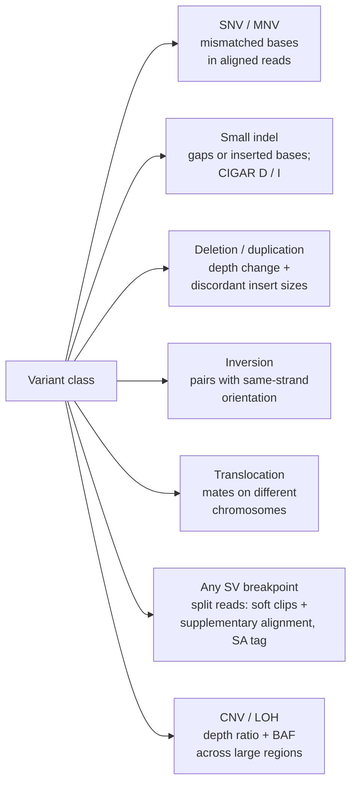

# Module 3 — Variation, Mutation Types and HGVS

**Weeks 3–4 of 16 · ~10 hours · Prerequisites: Modules 1–2**

| Week | Focus | Time |
|---|---|---|
| 3 | Small variants and what they do to genes and proteins (Sections 1–5) + Exercise Parts A–C + quiz Q1–5 | 5 h |
| 4 | Copy number, structural variants, fusions, read evidence, HGVS (Sections 6–10) + Exercise Parts D–F + quiz Q6–10 | 5 h |

Coordinates are **GRCh38** unless stated otherwise.

---

## Learning objectives

By the end of this module you can:

1. **Classify** a variant by size and type (SNV, MNV, indel, CNV, SV, fusion) and **name** the mutational mechanism most likely to have produced it.
2. **Predict** the biological consequence of a coding or splice variant — including nonsense-mediated decay, domain disruption, and gain vs loss of function.
3. **Explain** why oncogenes and tumour suppressors show different mutation patterns, using KRAS, TP53, IDH1 and PTEN as examples.
4. **Recognise** each variant class in read evidence (allele counts, soft clips, split reads, discordant pairs, depth and B-allele frequency).
5. **Read and write** HGVS `g.`/`c.`/`p.` descriptions for substitutions and indels, and **explain** why HGVS's 3′ rule and VCF left-normalisation can disagree.

---

# Week 3 — Small variants and what they do

## 1. A size map of genetic variation

| Class | Size (convention) | Example | Typical mechanism |
|---|---|---|---|
| **SNV** (single-nucleotide variant) | 1 bp | KRAS c.35G>A | Base damage, replication error |
| **MNV** (multi-nucleotide variant) | 2+ adjacent bases changed together | CC>TT | One mutational event hitting adjacent bases (e.g. UV) |
| **Indel** | 1–49 bp insertion or deletion | EGFR exon 19 15-bp deletion | Polymerase slippage, break repair |
| **SV** (structural variant) | ≥50 bp | Deletions, duplications, inversions, translocations, insertions | Double-strand-break repair, recombination between repeats, replication errors |
| **CNV** (copy-number variant) | SV that changes copy number | ERBB2 amplification, CDKN2A deletion | As for SV |
| **Aneuploidy** | Whole chromosome or arm | +7/−10 in glioblastoma | Mis-segregation during mitosis (Module 2) |

The 50 bp boundary between indel and SV is a convention driven by detection methods, not biology. A 60 bp deletion is biologically similar to a 40 bp one; it is just found with different tools.

**Germline vs somatic is a separate axis.** Any class above can be inherited or acquired in a tumour (Module 4).

---

## 2. Base substitutions: not all changes are equally likely

There are 12 possible base changes, but only 6 *classes* once you treat a change and its reverse complement as the same event (C>T on one strand = G>A on the other). By convention they are written with a pyrimidine (C or T) as the reference: **C>A, C>G, C>T, T>A, T>C, T>G**. This six-class system is the basis of mutational signatures (Module 8).

- **Transitions** (purine↔purine, pyrimidine↔pyrimidine: C>T, T>C) are about twice as common as **transversions** across the germline genome. One big reason is **CpG deamination**: the C in a CpG dinucleotide is often methylated (5-methylcytosine), and methylated C can spontaneously lose an amine group and become T. This happens steadily throughout life, which is why it behaves like a molecular clock.
- **MNVs** often come from a single event. **UV light** links adjacent pyrimidines together, producing characteristic **CC>TT** changes in skin cancers; tobacco smoke is associated with other doublet changes. These patterns are catalogued as "doublet base substitution" (DBS) signatures (Module 8).

> **Pipeline connection — substitutions**
> - **Ti/Tv ratio** is a standard QC metric: about 2.0–2.1 for germline whole-genome calls and higher (~3) in exomes, where CpG-rich coding sequence dominates. A Ti/Tv far below expectation suggests artifacts, which are often transversions (e.g. oxidative G>T damage, Module 5).
> - **MNVs and phasing.** If two adjacent bases in one codon are changed on the *same* molecule, the amino-acid change differs from what either SNV predicts alone. Mutect2 can merge adjacent SNVs into an MNV (controlled by `--max-mnp-distance`). If your annotator receives two separate SNVs, it may report two wrong protein changes.

---

## 3. Coding variants: from DNA change to protein consequence

### 3.1 The consequence classes

| Class | DNA change | Protein effect | Typical VEP term / impact |
|---|---|---|---|
| **Synonymous** | Codon changes, amino acid doesn't | None (usually) | `synonymous_variant` / LOW |
| **Missense** | One amino acid substituted | Altered protein; may gain, lose or change function | `missense_variant` / MODERATE |
| **Nonsense** | Codon becomes a stop | Truncated protein, or no protein via NMD | `stop_gained` / HIGH |
| **Frameshift** | Indel not a multiple of 3 | Scrambled downstream sequence, usually an early stop | `frameshift_variant` / HIGH |
| **In-frame indel** | Indel that is a multiple of 3 | Amino acids added or removed; frame kept | `inframe_deletion` / `inframe_insertion` / MODERATE |
| **Start-loss / stop-loss** | ATG destroyed / stop destroyed | No protein or a wrong start; extended protein | `start_lost` / `stop_lost` / HIGH |

VEP's IMPACT label is a rough triage, not a judgement of pathogenicity. A "MODERATE" missense can be the most important driver in the tumour.

### 3.2 Missense: why location and chemistry matter

Amino acids differ in size, charge and how much they like water:

| Group | Amino acids | Typical role |
|---|---|---|
| Hydrophobic | A, V, L, I, M, F, W | Protein core, membrane segments |
| Polar | S, T, N, Q, Y, C | Surface, hydrogen bonding; C forms disulfide bonds and binds metals |
| Positively charged | K, R, H | Binding DNA and phosphates (both negatively charged) |
| Negatively charged | D, E | Binding metal ions, catalysis |
| Special | G (tiny, flexible), P (rigid, kinks chains) | Tight turns, loops |

Whether a missense change matters depends on **where** it lands and **how drastic** the swap is:

- **KRAS G12D.** Glycine is the only amino acid with no side chain. The P-loop needs that space; aspartate's bulky, charged side chain blocks GTP hydrolysis and locks KRAS "on" (Module 1).
- **TP53 R248 and R273** are **contact** mutations: these arginines touch DNA directly, and losing their positive charge stops p53 binding its targets. **R175H** is a **structural** mutation: it disrupts the folding of the DNA-binding domain.
- **IDH1 R132H** is a **neomorphic** mutation: it gives the enzyme a *new* activity. Instead of its normal product, mutant IDH1 makes **2-hydroxyglutarate**, an "oncometabolite" that disrupts epigenetic regulation. It is a defining marker in gliomas and is also found in some AML.

### 3.3 Truncating variants and nonsense-mediated decay

A **premature termination codon (PTC)** — from a nonsense or frameshift variant — usually does not produce a short protein. Cells run a quality-control system, **nonsense-mediated decay (NMD)**, that destroys mRNAs with a PTC.

**The rule of thumb:** a PTC more than ~50–55 nucleotides upstream of the **last exon–exon junction** triggers NMD. The result is no protein, i.e. loss of function.

**NMD escape:** a PTC in the **last exon** (or just before the last junction) escapes NMD and produces a truncated protein. Truncated proteins can be harmless, partly functional, or **dominant-negative** (interfering with the normal copy).

This is why the same "stop_gained" label can have different consequences depending on exon position — and why RNA data can confirm NMD (low expression of the mutant allele, Module 10).

### 3.4 Oncogenes and tumour suppressors leave different fingerprints

| | Oncogene (gain of function) | Tumour suppressor (loss of function) |
|---|---|---|
| Typical variants | Recurrent missense **hotspots**, in-frame indels, amplification, fusions | Nonsense, frameshift, splice, deletions scattered along the gene |
| How many copies need hitting | Usually one ("dominant" at the cell level) | Usually both (two hits, Module 6) |
| Examples | KRAS G12/G13/Q61, BRAF V600, EGFR exon 19/L858R, IDH1 R132 | PTEN, APC, RB1, CDKN2A |

Vogelstein and colleagues formalised this as the **"20/20 rule"**: a gene is classed as an oncogene if >20% of its mutations are missense at recurrent positions, and as a tumour suppressor if >20% are inactivating (truncating).

**TP53 is the famous exception.** It is a tumour suppressor, yet most of its mutations are missense, clustered in the DNA-binding domain. p53 works as a **tetramer** (four copies bound together). One mutant subunit can poison the whole complex — a **dominant-negative** effect — and some mutants also gain new oncogenic activities.

> **Tumor spotlight**
> - **Colorectal:** APC truncations cluster in a region called the "mutation cluster region".
> - **Pancreatic:** KRAS hotspot missense in the large majority of tumours.
> - **Glioma:** IDH1 R132H (neomorphic).
> - **Breast:** PIK3CA hotspots (e.g. E545K, H1047R).
> - **Prostate:** PTEN truncations or deletions.

---

## 4. Splicing variants: changing which exons are used

Recall from Module 1 that introns start with **GT** (donor) and end with **AG** (acceptor). The spliceosome also uses the **branch point** upstream of the acceptor, a **polypyrimidine tract**, and **exonic splicing enhancers** (short motifs inside exons).

| Location | VEP term | Typical effect |
|---|---|---|
| Intron ±1 or ±2 (the GT/AG) | `splice_donor_variant` / `splice_acceptor_variant` (HIGH) | Site destroyed → exon skipping or a cryptic site used |
| Last 3 exonic bases, or intron positions 3–8 | `splice_region_variant` (LOW) | Weakened site; effect varies |
| Deep intronic, or exonic "synonymous" | often `intron_variant` / `synonymous_variant` | Can create a new splice site or disrupt an enhancer — easy to miss |

Outcomes: **exon skipping** (often in-frame), **intron retention**, or **cryptic splice site** use (often frameshift → NMD).

### Biology example: MET exon 14 skipping

MET encodes a receptor tyrosine kinase. **Exon 14** encodes part of the juxtamembrane region, including the docking site for **CBL**, an enzyme that tags MET for degradation. Variants that destroy the exon 14 splice sites (or branch point), or delete them, cause the spliceosome to skip exon 14. The resulting MET protein:

- is still in frame and still an active kinase, but
- can no longer be tagged by CBL, so it accumulates and keeps signalling.

MET exon 14 skipping occurs in a few percent of non-small-cell lung cancers and is targetable with MET inhibitors. The causal variants are diverse — SNVs, small indels and larger deletions — so DNA calling can miss some. **RNA showing the exon 13–15 junction directly confirms the outcome**, a strong argument for WGTS (Module 10).

---

## 5. Non-coding variants

| Region | Example | Effect |
|---|---|---|
| **Promoter** | TERT C228T/C250T (Module 2) | New transcription-factor site → gene switched on |
| **5′/3′ UTR** | — | Altered mRNA stability or translation (often uncertain) |
| **Enhancer** (distant regulatory element) | Enhancer hijacking: a rearrangement moves a strong enhancer next to an oncogene | Overexpression |
| **Deep intronic** | Can create a cryptic exon ("pseudoexon") | Aberrant transcript |

Non-coding drivers are rarer than coding ones and are an area of active research. WGS sees them; exomes mostly don't.

---

# Week 4 — Copy number, structural variants, fusions and naming

## 6. Copy-number changes

| Term | Meaning (diploid baseline) | Cancer example |
|---|---|---|
| **Gain** | One or a few extra copies | 1q gain in myeloma |
| **Amplification** | Many copies of a focal region (often >5–10) | ERBB2 (breast), EGFR (glioblastoma), MYC |
| **Shallow (heterozygous) deletion** | 1 copy left | Many tumour suppressors |
| **Deep (homozygous) deletion** | 0 copies | CDKN2A at 9p21 (glioblastoma, pancreatic, many others) |
| **Copy-neutral LOH** | 2 copies, both from the same parent | Converts a germline heterozygous TSG variant into a homozygous one (Modules 6 and 9) |

**Where amplified DNA lives.** High-level amplifications can sit in the chromosome as tandem repeats (sometimes visible as "homogeneously staining regions"), or on **extrachromosomal DNA (ecDNA)** — small circular DNA elements that segregate unevenly at division. This lets copy number change rapidly and differ between cells. ecDNA is an active research area and is linked to poor outcomes and drug resistance.

**What depth and BAF show:**

- **Depth ratio** (tumour vs normal) reflects total copy number.
- **B-allele frequency (BAF)** at germline heterozygous SNPs reflects allelic balance. A heterozygous SNP shows BAF ≈ 0.5 in a balanced region; in an LOH region (in a pure tumour) it moves to 0 or 1.
- **Copy-neutral LOH shows no depth change at all — only BAF reveals it.**

Purity and ploidy complicate all of these numbers (Module 7).

---

## 7. Structural variants and the biology that makes them

| SV type | What happens | Example |
|---|---|---|
| **Deletion** | Segment lost | CDKN2A homozygous deletion |
| **Tandem duplication** | Segment copied next to itself | KIAA1549::BRAF in pilocytic astrocytoma |
| **Inversion** | Segment flipped | EML4::ALK on chr2p |
| **Translocation** | Exchange between chromosomes (balanced or unbalanced) | BCR::ABL1 t(9;22) |
| **Insertion** | New sequence inserted, including mobile elements (L1, Alu) or viral DNA (HPV, HBV) | Somatic L1 insertions; HPV integration in cervical cancer |
| **Complex** | Many breaks repaired at once, e.g. **chromothripsis** ("chromosome shattering") | Module 8 |

**How the breaks get joined.** Mechanisms leave fingerprints at the breakpoint junction:

- **NAHR (non-allelic homologous recombination)** — recombination between two similar repeats (segmental duplications from Module 2). Breakpoints fall inside the repeats, so short reads often can't resolve them.
- **NHEJ / MMEJ** — direct rejoining of broken ends with no or very short (a few bp) **microhomology** at the junction. Module 5 covers these repair pathways.
- **Replication-based mechanisms** — template switching during DNA replication. These often produce complex rearrangements with microhomology.

---

## 8. Gene fusions

A **fusion** joins parts of two genes. Fusions arise from translocations, inversions, interstitial deletions or tandem duplications. Name them with a double colon, 5′ partner first: **BCR::ABL1**.

**Two ways a fusion becomes oncogenic:**

1. **Kinase fusion → constitutive activity.** The 3′ partner contributes an intact **kinase domain**, and the 5′ partner contributes a strong promoter plus a domain that makes the protein stick to itself (dimerise or oligomerise). Self-association activates the kinase permanently. The fusion must be **in frame**.
   *Examples:* BCR::ABL1 (CML), EML4::ALK (lung), ROS1, RET and NTRK fusions (lung and others).
2. **Promoter/enhancer swap → overexpression of an intact gene.** A strong regulatory element is placed upstream of a whole oncogene. The coding sequence is not altered.
   *Examples:* TMPRSS2::ERG (prostate) — the androgen-responsive TMPRSS2 promoter drives ERG. IGH translocations — immunoglobulin enhancers drive CCND1 (t(11;14), mantle cell lymphoma and myeloma) or MYC (t(8;14), Burkitt lymphoma).

**DNA vs RNA view of a fusion.** Genomic breakpoints usually fall in **introns**, so WGS shows an intron-to-intron junction. Splicing then joins the exons, and RNA shows an **exon-to-exon** junction. You need RNA (or careful exon-phase reasoning) to know whether the fusion transcript is in frame. This is a key reason WGTS beats WGS alone for fusions (Module 10).

> **Tumor spotlight — fusions by cancer type**
> - CML: BCR::ABL1.
> - Lung adenocarcinoma: EML4::ALK, ROS1, RET, NTRK fusions; NRG1 fusions in some KRAS-wild-type tumours.
> - Prostate: TMPRSS2::ERG.
> - Myeloma and lymphoma: IGH translocations.

---

## 9. What each variant class looks like in your reads



| Evidence | Where in the BAM | Seen for |
|---|---|---|
| Mismatches | Read sequence vs reference; MD/NM tags | SNV, MNV |
| CIGAR `I`/`D` | Alignment record | Small indels (larger ones get soft-clipped or mapped as split reads) |
| **Discordant pairs** | Insert size or orientation unexpected; mate on another chromosome | Deletions (long insert), tandem duplications (reversed orientation), inversions, translocations |
| **Split reads** | One read aligned in two pieces: soft clip `S` in CIGAR + supplementary alignment (FLAG 0x800, `SA` tag) | Exact breakpoints for SVs |
| **Depth** | Coverage in bins along the genome | CNV |
| **BAF** | Allele fractions at germline het SNPs | Allelic imbalance, LOH |

> **Pipeline connection — one caller doesn't see everything**
> - **Mutect2 calls SNVs, MNVs and small indels** using local haplotype assembly. It does **not** call SVs or copy number.
> - Those need separate tools: SV callers such as Manta, GRIDSS or DELLY; CNV/purity tools such as GATK CNV, PURPLE, ASCAT or FACETS. Check what your pipeline actually runs. "No EGFR amplification reported" means nothing if no CNV caller ran.
> - **Indels in microsatellites** suffer polymerase slippage in both biology and library prep. FilterMutectCalls has a `slippage` filter for exactly this.
> - Large insertions and complex events are the hardest classes for short reads. Expect lower sensitivity there.

---

## 10. HGVS essentials

**HGVS** (Human Genome Variation Society) nomenclature is the standard way to write variants in reports and papers. You need to read it fluently, and to write the common forms.

### Reference prefixes

| Prefix | Reference | Example |
|---|---|---|
| `g.` | Genomic | `NC_000012.12:g.25245350C>T` (chr12, GRCh38) |
| `c.` | Coding DNA (transcript) | `NM_004985.5:c.35G>A` |
| `n.` | Non-coding RNA gene | `n.` positions on a non-coding transcript |
| `r.` | RNA (observed) | `r.35g>a` (lower case) |
| `p.` | Protein | `p.(Gly12Asp)`, written with the protein's `NP_` ID in full reports |
| `m.` | Mitochondrial | `m.3243A>G` |

Always include the **reference sequence ID with version**. `c.35G>A` alone is ambiguous.

### Variant types

| Type | `c.` example | Notes |
|---|---|---|
| Substitution | `c.35G>A` | |
| Deletion | `c.2235_2249del` | Range of deleted bases; no need to list them |
| Duplication | `c.103dup` | Use **dup**, not ins, when the inserted bases copy the adjacent sequence |
| Insertion | `c.123_124insAGT` | Positions are the two flanking bases |
| Deletion–insertion | `c.100_102delinsTT` | Covers MNVs and complex changes |
| Intronic | `c.88+1G>A` (donor +1), `c.89-2A>G` (acceptor −2) | Position relative to the nearest exon boundary |
| UTR | `c.-124C>T` (5′ UTR/promoter), `c.*30A>G` (3′ UTR) | |

### Protein descriptions

- `p.(Gly12Asp)` — the parentheses mean *predicted* from DNA, not measured in protein. Your pipeline's `p.` calls are always predictions.
- Nonsense: `p.(Arg213*)` (`Ter` is also accepted in place of `*`).
- Frameshift: `p.(Arg97Profs*23)` — the first changed amino acid (Arg97) becomes Pro, then the frame shifts, and a new stop appears at position 23 counting Pro97 as 1.
- In-frame deletion: `p.(Glu746_Ala750del)`.
- Synonymous: `p.(Leu858=)`.

### The 3′ rule vs VCF left-normalisation

In a repeat, a deletion or insertion can be placed at several equivalent positions. The two conventions pick opposite ends:

- **HGVS:** shift it as far **3′ as possible relative to the transcript**.
- **VCF tools** (`bcftools norm`, GATK): shift it as far **left on the genome (+ strand)** as possible.

**Example.** A + strand gene has `AAAA` at c.100–c.103, and one A is deleted:
- HGVS: `c.103del` (the most 3′ A).
- VCF: anchored at the base before c.100 (leftmost).

Same variant, different positions. For **− strand genes, "3′ of the transcript" is leftward on the genome**, so the two conventions agree.

> **Pipeline connection — normalisation**
> - Always normalise VCFs (left-align and split multiallelics) before comparing callers, merging samples or matching against databases. Unnormalised indels are a classic cause of "missing" known variants.
> - Let tools produce HGVS: VEP's `--hgvs` option and free validators such as **VariantValidator** or **Mutalyzer**. Don't hand-write HGVS for reports.

---

## Worked example: EGFR exon 19 deletion

**The gene.** EGFR (chr7, **+ strand**) encodes a receptor tyrosine kinase. When growth factor binds, two EGFR molecules pair up and their kinase domains switch on, triggering RAS–MAPK and PI3K–AKT signalling (Module 6).

**The variant.** In-frame deletions in exon 19 are one of the two "classic" EGFR-activating changes in lung adenocarcinoma; the other is L858R (`c.2573T>G`). The most common is:

`NM_005228.5:c.2235_2249del` → `p.(Glu746_Ala750del)`, a 15 bp deletion that removes five amino acids, E-L-R-E-A.

**Why it activates EGFR.** Residues 746–750 sit in the loop just before the kinase domain's **αC-helix**. That helix must swing into position for the kinase to be active. Deleting **ELREA** (which includes the "LREA" motif) shortens the loop and holds the αC-helix in the "on" position. The kinase becomes active without growth factor — a gain of function. Because the frame is preserved, the rest of the protein, including the kinase active site, is intact.

**Degeneracy in action: two DNA deletions, one protein.** Codon 745 (Lys) is AAG and codon 750 (Ala) is GCA.

- `c.2236_2250del` removes exactly codons 746–750.
- `c.2235_2249del` removes the last G of codon 745 through the first two bases of codon 750. The remaining `AA` + `A` rebuilds codon 745 as **AAA — still Lys**.

Both give `p.(Glu746_Ala750del)`. They are different DNA variants (different HGVS, different VCF lines), but the same protein and the same clinical meaning. When matching against a database, match at the **protein level** as well as the DNA level.

**Clinical biology.** Tumours with exon 19 deletions or L858R are typically sensitive to EGFR tyrosine kinase inhibitors (TKIs). Resistance commonly evolves:

- **T790M** (the "gatekeeper" mutation) causes resistance to first- and second-generation TKIs. Osimertinib was developed to overcome it.
- **C797S** can then cause resistance to osimertinib.
- **EGFR exon 20 insertions** behave differently and are generally insensitive to classic TKIs; other drugs are used for them.

Drug approvals change — check OncoKB or current guidelines.

**What to check in your data:**

1. Is the 15 bp deletion called by Mutect2 as a single event, or split/represented as a complex `delins`? Some exon 19 variants are deletion–insertions, e.g. `p.(Leu747_Pro753delinsSer)`.
2. Does the annotator produce the expected `p.` on the **MANE Select** transcript?
3. In IGV, the reads show a clean 15 bp gap (CIGAR `15D`) in the tumour and none in the normal.

---

## Common misconceptions

1. **"A stop-gained variant always makes a short protein."** Usually the mRNA is destroyed by NMD; only PTCs near or in the last exon produce truncated protein.
2. **"Synonymous means harmless."** Synonymous changes can disrupt splicing enhancers or create cryptic splice sites. Rare, but real.
3. **"Tumour suppressors only have truncating mutations."** TP53 is mostly missense, acting through dominant-negative and gain-of-function effects.
4. **"Mutect2's output is the complete mutation list."** It covers SNVs, MNVs and small indels only. Copy number, SVs and fusions need other callers — and RNA for fusion confirmation.
5. **"Same protein change = same DNA variant."** EGFR exon 19 shows that different deletions can encode the same protein deletion, and the reverse holds too: one HGVS `c.` can map to different `p.` on different transcripts.
6. **"A fusion found in DNA is an expressed, in-frame fusion protein."** Genomic breakpoints are usually intronic. Expression and frame need RNA (or careful reasoning).

---

## Hands-on exercise (~3 h total across the two weeks)

### Week 3

**Part A — Consequences with VEP (45 min).**

1. Open Ensembl VEP: https://www.ensembl.org/Tools/VEP
2. Paste these variants, one per line. If VEP rejects `NM_` identifiers, set the transcript database to **RefSeq** or **Merged** in the options.

   ```
   NM_004985.5:c.35G>A
   NM_000546.6:c.524G>A
   NM_000546.6:c.637C>T
   NM_005228.5:c.2235_2249del
   NM_005228.5:c.2573T>G
   ```
3. For each, record: gene, consequence term, IMPACT, `p.` change, exon number (and how many exons the transcript has).
4. Biology questions:
   - Which variants are likely gain-of-function and which loss-of-function?
   - For `c.637C>T` (TP53, a nonsense change), use the exon number to predict whether the transcript undergoes NMD.
   - Which TP53 missense is a "structural" mutation?

**Part B — Lollipops: oncogene vs tumour suppressor (45 min).**

1. Go to https://www.cbioportal.org and pick a large pan-cancer cohort (e.g. a TCGA PanCancer Atlas study, or a set of them).
2. Query **KRAS, TP53, PTEN, APC, PIK3CA** and open the **Mutations** tab, which shows lollipop plots along each protein with domains marked.
3. For each gene, classify the pattern (hotspot vs scattered; missense vs truncating), apply the 20/20 rule, and note which domain the hotspots fall in.
4. Write two sentences explaining TP53's pattern in terms of tetramers and dominant-negative effects.

**Part C — Splicing biology (30 min).**

1. In Ensembl, open **MET** → the MANE Select transcript → **Exons**. Find exon 14 and its length.
2. Is exon 14's length a multiple of 3? What does that predict about the protein when exon 14 is skipped?
3. In ClinVar, search `MET exon 14`. Browse a few variants and classify them by location (donor, acceptor, deletion spanning a splice site, other).

### Week 4

**Part D — Fusion puzzles in UCSC (30 min).**

In hg38, look up **EML4** and **ALK** and record their cytobands and strands.

- Both are on chr2p. Given their strands, why can an **inversion** (but not a simple deletion) create an EML4::ALK fusion in which both pieces are read in the same direction?
- Repeat for **TMPRSS2** and **ERG** on chr21. Which simple rearrangement can join them?

**Part E — Read evidence in IGV (30 min).**

If your data governance allows, open a tumour BAM in IGV desktop at an SV call from your pipeline's SV caller. (If your pipeline has no SV caller, note that as a finding.)

1. Turn on **View as pairs**, **Color alignments by → insert size and pair orientation**, and **Show soft-clipped bases**.
2. Identify discordant pairs and split reads, and check the coverage track for a step change.
3. Compare with the normal BAM at the same locus.

**Part F — HGVS checks with VariantValidator (30 min).**

1. Go to https://variantvalidator.org. Validate `NM_005228.5:c.2235_2249del` and `NM_005228.5:c.2236_2250del`. Do both give `p.(Glu746_Ala750del)`? Record the genomic (GRCh38) description of each.
2. Make up a single-base deletion inside a homopolymer run in any + strand gene. Validate it at a non-3′ position and note how VariantValidator corrects the position.

### Record your answers

| Item | Your answer |
|---|---|
| VEP consequences and exon numbers for the 5 variants | |
| NMD prediction for TP53 c.637C>T | |
| Lollipop patterns: KRAS / TP53 / PTEN / APC / PIK3CA | |
| MET exon 14 length; in-frame skipping? | |
| EML4 / ALK / TMPRSS2 / ERG strands and the mechanism for each fusion | |
| SV evidence seen in IGV | |
| GRCh38 `g.` for the two EGFR deletions | |

---

## Self-test

- Quiz: `quizzes/quiz_03.md` → answer key `answer_keys/answer_key_03.md`
- Flashcards: `flashcards.csv`, tag `M03`

---

## Further reading

1. **Weinberg RA. *The Biology of Cancer*, 2nd ed. 2014. Chapter 4 (Cellular Oncogenes).** Focus on the sections describing how proto-oncogenes are activated by point mutation, amplification and chromosomal translocation.
2. **Vogelstein B, et al. Cancer genome landscapes. *Science.* 2013;339(6127):1546–1558.** Introduces the 20/20 rule and the driver-gene landscape. Still the clearest overview.
3. **den Dunnen JT, et al. HGVS recommendations for the description of sequence variants: 2016 update. *Hum Mutat.* 2016;37(6):564–569.** Pair this with the current HGVS nomenclature website (hgvs-nomenclature.org) for up-to-date rules.
4. **Mertens F, Johansson B, Fioretos T, Mitelman F. The emerging complexity of gene fusions in cancer. *Nat Rev Cancer.* 2015;15(6):371–381.** Fusion mechanisms and biology.

---

## Facts to double-check (accuracy log)

- **EGFR c.2235_2249del sequence and codon reasoning** (codons 745 AAG, 750 GCA). Confirm with VariantValidator (Part F) or the Ensembl cDNA sequence.
- **Transcript versions** NM_005228.5 (EGFR), NM_000546.6 (TP53), NM_004985.5 (KRAS) as MANE Select. Versions update over time; check in Ensembl.
- **TP53 c.637C>T = p.(Arg213\*)** and **c.524G>A = p.(Arg175His)**. Confirm with VEP (Part A).
- **Mutect2 `--max-mnp-distance`** behaviour and the `slippage` filter name — check against your GATK version.
- **Prevalence figures** (MET exon 14 ~3% of NSCLC; TMPRSS2::ERG in ~half of prostate cancers in Western cohorts) are approximate; check cBioPortal or COSMIC.
- **Strand orientations** of EML4/ALK and TMPRSS2/ERG — you verify these yourself in Part D.
- **Drug-response statements** (T790M, C797S, exon 20 insertions) — check OncoKB for the current status.
