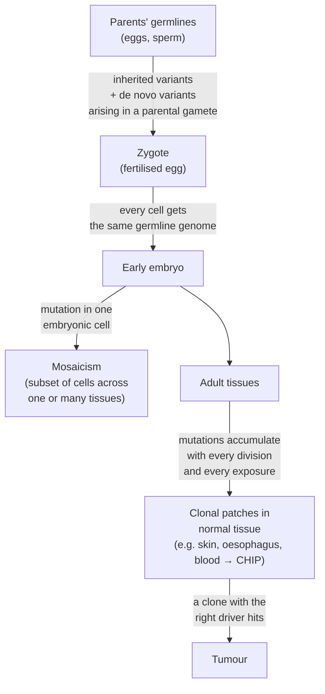
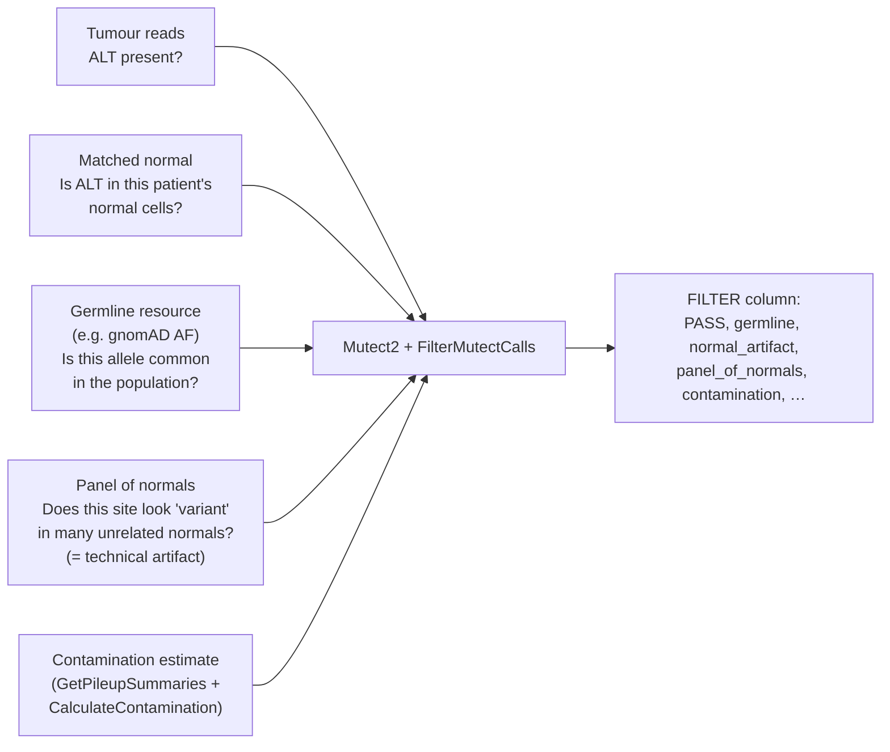

# Module 4 — Germline vs Somatic Variation

**Week 5 of 16 · ~5 hours · Prerequisites: Modules 1–3**

| Activity | Time |
|---|---|
| Lesson notes + Weinberg reading | 2 h |
| Hands-on exercise (gnomAD, ClinVar, your Mutect2 VCF) | 1.5 h |
| Quiz (`quizzes/quiz_04.md`) + flashcards (tag `M04`) | 1 h |
| Buffer | 0.5 h |

Coordinates are **GRCh38** unless stated otherwise.

---

## Learning objectives

By the end of this module you can:

1. **Distinguish** germline, de novo, mosaic and somatic variants, and clonal haematopoiesis, by *when* they arose and *which cells* carry them.
2. **Predict** the expected variant allele fraction (VAF) in tumour and normal for germline heterozygous, germline-plus-LOH, clonal somatic and contaminated scenarios.
3. **Explain** how Mutect2 uses the matched normal, the panel of normals and a population germline resource — and how each can fail.
4. **Recognise** tumour-in-normal contamination, CHIP and germline leakage from VAF patterns, and say what to do about each.
5. **Explain** why a tumour–normal analysis is also a germline test, and what that implies for consent and reporting.

---

## 1. A life history of the variants in one body

Every variant in a person's DNA arose at some moment. **When it arose decides which cells carry it** — and that is the core of germline vs somatic.



| Type | Arose when | Carried by | Passed to children? |
|---|---|---|---|
| **Inherited germline** | In a parent or earlier ancestor | Every cell | Yes (50% chance per child for one heterozygous variant) |
| **De novo germline** | In a parental egg or sperm | Every cell of the child; absent in both parents | Yes |
| **Mosaic** | In an early embryo | A subset of cells, maybe in several tissues | Only if it reached the germ cells |
| **Somatic** | Any time after the embryo | One cell and its descendants (a clone) | No |

**Numbers to keep in your head:**

- A typical person carries **4–5 million germline differences** from the reference genome. Nearly all are common, harmless polymorphisms.
- Each person has **dozens of de novo variants**, mostly from the father's germline. Their number rises with paternal age.
- A tumour typically has a few thousand to hundreds of thousands of somatic mutations, depending on cancer type and exposures.

**So in a tumour genome, germline variants outnumber somatic ones by roughly 100 to 1,000 times.** Separating them is the first thing your pipeline must get right.

**Normal tissues are mosaics of clones too.** Deep sequencing of healthy tissue (sun-exposed skin, oesophagus, colon crypts, blood) finds that with age they fill up with expanding clones. Many of these clones carry mutations in "cancer genes": in normal ageing oesophagus, NOTCH1 mutations are actually *more* common than in oesophageal cancers. Carrying a driver mutation is not the same as having cancer. This is an active research area, and it matters for interpreting low-VAF calls.

*Weinberg: Chapter 1, section "Mutations causing cancer occur in both the germ line and the soma".*

---

## 2. Alleles, genotypes and expected VAF

At a given position, a diploid cell has two alleles, one from each parent:

| Genotype | Meaning | Expected VAF in pure diploid DNA |
|---|---|---|
| Homozygous reference | Both alleles match the reference | 0 |
| **Heterozygous** | One reference, one alternate | ~0.5 |
| Homozygous alternate | Both alternate | ~1.0 |

**VAF (variant allele fraction)** = ALT-supporting reads ÷ total reads at the position. It is a noisy estimate. At 30× coverage a true heterozygous site typically shows a VAF somewhere around 0.35–0.65, simply from sampling.

**In a tumour, a somatic heterozygous mutation in a diploid region is diluted by normal cells**:

  Expected somatic VAF ≈ **purity ÷ 2**

So a tumour sample that is 60% tumour cells gives ~0.30. Module 7 covers the full formula, including copy number and subclones.

### Expected patterns

| Scenario | Tumour VAF | Normal VAF |
|---|---|---|
| Germline heterozygous | ~0.5 | ~0.5 |
| Germline heterozygous + **LOH** in tumour, keeping the ALT allele | ↑ towards ~1 (depending on purity) | ~0.5 |
| Germline heterozygous + LOH, losing the ALT allele | ↓ towards 0 | ~0.5 |
| Clonal somatic, diploid region | ~purity/2 | 0 |
| Subclonal somatic | < purity/2 | 0 |
| Somatic + **tumour-in-normal** contamination | ~purity/2 | small but > 0 |
| **CHIP** clone in blood normal | ~0 or small (from infiltrating leukocytes) | small (often 0.02–0.2) |

**LOH (loss of heterozygosity)** is when a tumour loses one parental copy of a region. It is the classic "second hit" on a tumour suppressor (Module 6), and it pushes germline heterozygous VAFs away from 0.5 in the tumour only.

---

## 3. Why we sequence a matched normal

A **matched normal** is DNA from the same patient's non-tumour cells. Subtracting it removes:

- the patient's **germline** variants — including rare ones no database has ever seen;
- **patient-specific technical noise** at difficult sites.

**Choosing the normal tissue is a biology decision:**

| Normal source | Pros | Watch out for |
|---|---|---|
| **Blood** | Easy, high yield | CHIP clones; in haematological cancers, *the tumour is in the blood* |
| Adjacent "normal" tissue | Same tissue type | Microscopic tumour cells; field effects (pre-cancerous clones) |
| Saliva / buccal swab | Non-invasive | Contains leukocytes, so blood-cancer cells can be present |
| Skin (cultured fibroblasts), nails, hair | Truly non-haematopoietic | Slower and more effort; lower DNA yield from nails or hair |

For **haematological cancers** (AML, CLL, myeloma, lymphoma), labs often use cultured skin fibroblasts, or sorted non-tumour cells, as the normal.

**Tumour-only sequencing** (no normal) is common in clinical panels and liquid biopsy. It relies entirely on databases and statistical models to guess which variants are germline. It cannot reliably separate rare germline variants, CHIP and somatic mutations.

---

## 4. How Mutect2 separates somatic from germline

Mutect2 combines three sources of evidence, each answering a different biological question:



| Component | Biological logic | Related FILTER |
|---|---|---|
| **Matched normal** | If the patient's normal cells carry the ALT, it isn't tumour-specific | `normal_artifact` (and germline evidence) |
| **Germline resource** (population allele frequencies, e.g. gnomAD) | A common population allele at a tumour VAF close to 0.5 is probably germline, even if the normal has low coverage | `germline` |
| **Panel of normals (PoN)** | Built by running many **unrelated** normal samples through the same pipeline. Sites that look variant in several of them are technical artifacts (mapping, chemistry, reference errors) | `panel_of_normals` |
| **Contamination estimate** | Measures another person's DNA in the sample, using allele fractions at common germline SNPs | `contamination` |

A PoN is mainly a **technical-artifact** blacklist built from your own lab's process. That is why it must come from the same sequencing platform, library prep and reference build as your samples.

---

## 5. Failure modes — biology you can see in VAFs

### 5.1 Tumour-in-normal (TiN)

Tumour cells are present in the "normal". This happens with blood normals in leukaemia, with circulating tumour cells, and with adjacent tissue. True somatic mutations then show ALT reads in the normal. Mutect2 may reject them (`normal_artifact`, or simply not call them), so **real drivers disappear**.

Clues: a set of high-confidence tumour mutations all showing small, *proportional* VAFs in the normal. Tools such as **deTiN** estimate the TiN fraction and rescue variants.

### 5.2 Clonal haematopoiesis (CHIP)

With age, blood stem cells acquire mutations, and some expand into clones. **CHIP (clonal haematopoiesis of indeterminate potential)** is usually defined as a blood clone carrying a leukaemia-associated mutation at VAF ≥ 2%, in someone without a blood cancer.

- The most common genes are **DNMT3A, TET2 and ASXL1**. **PPM1D and TP53** clones are enriched after chemotherapy or radiotherapy.
- CHIP becomes common with age (around 10% of people in their 70s in early exome studies; more with deeper sequencing) and modestly raises the risk of blood cancer and cardiovascular disease.

**Consequences for your pipeline:**

- **Tumour–normal with a blood normal:** the CHIP variant is in the normal, so it is filtered. That is usually correct, but it costs you nothing to notice.
- **Tumour-only or liquid biopsy (cfDNA):** most cell-free DNA comes from blood cells. CHIP variants appear as convincing "somatic" calls — a top source of false positives, including in TP53.
- **Leukocytes infiltrating the tumour** can carry the CHIP variant into the tumour sample at low VAF.

### 5.3 Germline leakage

A rare germline variant gets called as somatic when:

- the normal has **low coverage** at that site (no ALT reads by chance), **and**
- the variant is **absent from the population resource**. This is more likely in people of **ancestries under-represented in gnomAD** — a real equity issue.

Clue: a "somatic" call at VAF ≈ 0.5 (or ≈ 1 with LOH) in a tumour of only moderate purity.

### 5.4 Cross-sample contamination and swaps

Another person's DNA in the tumour sample creates many low-VAF "somatic" calls at that person's germline SNP sites. Check `CalculateContamination` output, and confirm tumour and normal come from the same person (genotype concordance; sex check from Module 2).

---

## 6. A tumour–normal analysis is also a germline test

The matched normal is, in effect, a germline genome. Large clinical sequencing studies report that a **meaningful minority of cancer patients** (often cited around 10% or more, depending on cancer type and gene list) carry a pathogenic germline variant in a cancer-predisposition gene — BRCA1/2, Lynch syndrome genes, TP53, ATM, PALB2 and others.

Implications (Module 9 goes deeper):

- **Consent** must cover whether germline findings will be returned.
- A germline finding affects **blood relatives**, who may be at risk too.
- Germline findings from a research or somatic pipeline usually need **confirmation in an accredited clinical lab** and referral to **genetic counselling**.
- Guidelines such as the ACMG secondary-findings list define which genes are reported when found incidentally. The list is updated periodically, so check the current version.

---

## Worked example: one TP53 variant, five stories

**TP53** (chr17p13.1, − strand) encodes p53, the "guardian of the genome". It is the most frequently mutated gene in human cancer. **R175H** (`NM_000546.6:c.524G>A`, `p.(Arg175His)`) is one of its classic hotspots — a structural mutation that misfolds the DNA-binding domain (Module 3). Germline TP53 pathogenic variants cause **Li-Fraumeni syndrome**, which carries a very high lifetime cancer risk.

Now imagine your pipeline sees R175H in five different patients. Tumour purity is ~60% in each.

| # | Tumour VAF | Normal VAF | Most likely biology | What Mutect2 tends to do | What you should do |
|---|---|---|---|---|---|
| 1 | 0.30 | 0.00 | **Clonal somatic** mutation in a diploid region (0.6 / 2) | PASS | Report as somatic |
| 2 | 0.50 | 0.49 | **Germline heterozygous** — possible Li-Fraumeni | Filtered as germline or not called | Do **not** silently drop it. Follow your germline-findings policy: consent check, clinical confirmation, genetic counselling |
| 3 | 0.80 | 0.50 | **Germline + LOH** in the tumour: the wild-type allele was lost (classic two hits, Module 6) | Not called as somatic | As #2; the tumour VAF also tells you the second hit happened |
| 4 | 0.30 | 0.04 | Somatic, with **tumour-in-normal** contamination (e.g. a blood normal in a haematological cancer, or contaminated adjacent tissue) | May be filtered as `normal_artifact` → **false negative** | Check the normal source; estimate TiN; review other high-VAF mutations for the same pattern; rescue if consistent |
| 5 | 0.02 | 0.06 | **CHIP**: a TP53 clone in the blood (enriched after chemotherapy); leukocytes in the tumour carry a trace | Filtered or called at very low VAF | Not tumour-derived. Note it; in tumour-only or cfDNA testing this would be a false "somatic TP53" |

**The lesson:** the *same* `c.`/`p.` change can mean a somatic driver, an inherited cancer syndrome, a contamination artefact or an age-related blood clone. The **VAF pattern across tumour and normal — read through biology** — tells you which.

---

## Pipeline connection — summary box

> - Read the **FILTER column as biology**: `germline` = population + allele-fraction evidence; `normal_artifact` = ALT in the normal; `panel_of_normals` = technical recurrence; `contamination` = another person's DNA.
> - Normal coverage matters. A thin normal turns rare germline variants into false somatic calls. Track normal depth as a QC metric.
> - Build or obtain a **PoN that matches** your platform, library prep and reference build. A mismatched PoN quietly lets artifacts through.
> - For haematological tumours, record **what tissue the normal is**. It changes how you read every low normal VAF.
> - Know your lab's **germline-findings policy** before you see your first LFS-like pattern.

---

## Common misconceptions

1. **"The panel of normals removes germline variants."** Its main job is to remove recurrent **technical artifacts**. Germline removal comes from the matched normal and the population resource.
2. **"If a variant is in gnomAD, it's germline and harmless."** gnomAD includes some low-frequency pathogenic variants, and some cancer hotspots appear because of CHIP in blood-derived samples. Presence in gnomAD is not proof of benign.
3. **"Blood is always a clean normal."** Not with CHIP, and certainly not in blood cancers.
4. **"A somatic call is always tumour-derived."** In tumour-only and cfDNA testing, CHIP is a major source of "somatic" calls.
5. **"Tumour–normal sequencing is purely a tumour test."** The normal reveals inherited variants with consequences for the patient and their family.
6. **"Somatic mutations only exist in cancer."** Normal tissues accumulate clonal somatic mutations with age, including in cancer genes.

---

## Hands-on exercise (~1.5 h)

### Part A — gnomAD: what population data can and can't tell you (30 min)

1. Go to https://gnomad.broadinstitute.org and select the latest dataset on **GRCh38**.
2. Search **TP53** and find **p.Arg175His** in the variant table. Record its allele count and frequency, if it is present at all. Open the variant page and look at the **allele balance** histogram, if shown.
3. Repeat for **DNMT3A p.Arg882His** (a classic CHIP hotspot).
4. Questions:
   - Why might a somatic cancer hotspot appear in a database of "healthy" people at all? Give two reasons, at least one biological.
   - What allele-balance pattern would you expect if carriers are CHIP clones rather than germline heterozygotes?

### Part B — ClinVar: germline vs somatic interpretation (20 min)

1. In ClinVar (https://www.ncbi.nlm.nih.gov/clinvar/), search `NM_000546.6(TP53):c.524G>A`.
2. Look at how ClinVar separates **germline** classification from any **somatic** classifications on the record.
3. Note the conditions listed for the germline classification. Which syndrome appears?

### Part C — Your own Mutect2 output (40 min)

Use a tumour–normal VCF from your pipeline, if your governance allows.

```bash
# How often does each filter fire? (multiple filters are separated by ';')
bcftools query -f '%FILTER\n' somatic.filtered.vcf.gz | tr ';' '\n' | sort | uniq -c | sort -k1,1nr

# Tumour vs normal allele fraction per call (check sample order with: bcftools query -l)
bcftools query -f '%CHROM\t%POS\t%REF\t%ALT\t%FILTER\t[%AF\t]\n' somatic.filtered.vcf.gz > af_table.tsv
```

1. Plot normal AF against tumour AF (any tool you like). Mark PASS calls vs `normal_artifact` and `germline` calls.
2. Look for:
   - a diagonal cloud of calls with small but proportional normal AF (tumour-in-normal?);
   - calls at tumour AF ≈ 0.5 with zero normal AF and low normal depth (germline leakage?).
3. Find your pipeline's contamination estimate (`CalculateContamination` output) and record it.
4. Record the normal tissue type for this case and whether it changes your reading of the plot.

### Record your answers

| Item | Your answer |
|---|---|
| gnomAD: TP53 R175H AC/AF; DNMT3A R882H AC/AF | |
| Two reasons a cancer hotspot can appear in gnomAD | |
| ClinVar germline condition for TP53 R175H | |
| Top 5 FILTER values in your VCF, with counts | |
| Any TiN or germline-leakage pattern seen? | |
| Contamination estimate; normal tissue type | |

---

## Self-test

- Quiz: `quizzes/quiz_04.md` → answer key `answer_keys/answer_key_04.md`
- Flashcards: `flashcards.csv`, tag `M04`

---

## Further reading

1. **Weinberg RA. *The Biology of Cancer*, 2nd ed. 2014.** Ch 1, the section on mutations in the germ line and the soma; Ch 7, the sections on familial cancers and retinoblastoma (also a preview of Modules 6 and 9).
2. **Jaiswal S, et al. Age-related clonal hematopoiesis associated with adverse outcomes. *N Engl J Med.* 2014;371(26):2488–2498.** A foundational CHIP paper.
3. **Martincorena I, et al. Somatic mutant clones colonize the human esophagus with age. *Science.* 2018;362(6417):911–917.** Normal tissue as a mosaic of driver-carrying clones.
4. **GATK documentation: "Somatic short variant discovery (SNVs + Indels)" Best Practices workflow** (gatk.broadinstitute.org). Read alongside Sections 4–5 for the current Mutect2 filters and PoN guidance.

---

## Facts to double-check (accuracy log)

- **"4–5 million germline differences per genome"** — 1000 Genomes Project estimate; varies by ancestry.
- **De novo count and paternal-age effect** — I gave this as "dozens"; see recent trio-sequencing studies for figures.
- **Fraction of cancer patients with pathogenic germline variants (~10%+)** — varies widely by cancer type, gene list and cohort; check primary studies before quoting.
- **CHIP prevalence (~10% in the 70s)** and the VAF ≥ 2% definition — from early exome studies; deeper sequencing finds more.
- **ClinVar separation of germline and somatic classifications** — ClinVar's somatic classification system was introduced recently; check how the record displays it now.
- **FILTER names** (`germline`, `normal_artifact`, `panel_of_normals`, `contamination`) — confirm against your GATK version.
- **DNMT3A R882H** as the most common CHIP hotspot — check the variant page in gnomAD and the literature.
