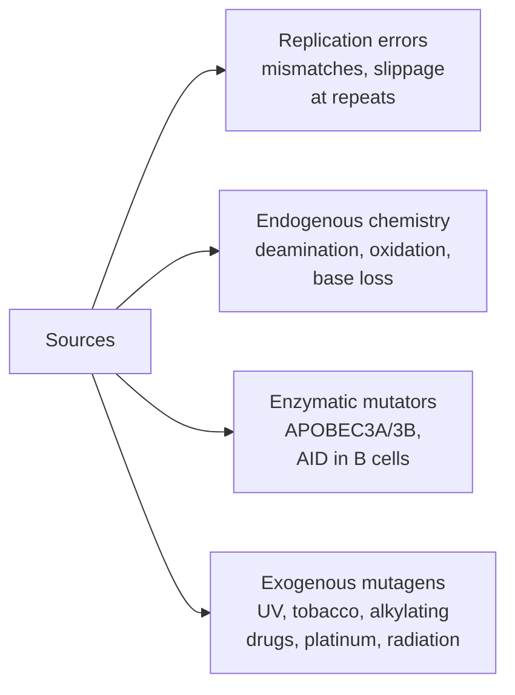

# Module 5 — How Mutations Arise and Are Repaired

**Week 6 of 16 · ~5 hours · Prerequisites: Modules 1–4**

| Activity | Time |
|---|---|
| Lesson notes + Weinberg Ch 12 (selected sections) | 2 h |
| Hands-on exercise (COSMIC signatures, cBioPortal, your VCF) | 1.5 h |
| Quiz (`quizzes/quiz_05.md`) + flashcards (tag `M05`) | 1 h |
| Buffer | 0.5 h |

Coordinates are **GRCh38** unless stated otherwise.

---

## Learning objectives

By the end of this module you can:

1. **Classify** the sources of mutation — replication errors, endogenous chemical damage, enzymatic mutators (APOBEC) and exogenous mutagens — and **name** the substitution each typically produces.
2. **Match** each DNA repair pathway (direct reversal, BER, NER, MMR, proofreading, HR, NHEJ, MMEJ) to the lesion it repairs and the key genes involved.
3. **Predict** the genomic "scar" a tumour shows when a pathway fails: MSI and hypermutation (MMR), ultramutation (POLE), microhomology deletions and LOH scars (HR).
4. **Explain** synthetic lethality with PARP inhibitors, and how BRCA reversion mutations cause resistance.
5. **Distinguish** true biological mutations from ex vivo artifacts (FFPE deamination, oxidative damage during library prep), and **explain** what Mutect2's read-orientation filter models.

---

## 1. The mutation budget of a cell

DNA is chemically fragile, and copying it is error-prone. A cell faces two constant pressures:

- **Replication errors.** Each division copies ~6 billion bases. Polymerase base selection, its own **proofreading**, and post-replication **mismatch repair** together bring the error rate down to roughly one mistake per billion or more bases per division.
- **DNA damage.** Each cell's DNA suffers many thousands of chemical lesions per day: lost bases, oxidised bases, deaminated bases and strand breaks. These come from normal metabolism, water and oxygen alone — before any external mutagen.

Almost all of this is repaired. **A mutation is damage or an error that escaped repair and was then fixed in place by replication.** That framing explains why:

- the **pattern** of mutations records *which* damage happened and *which* repair failed — this is the basis of mutational signatures (Module 8);
- losing a repair pathway can raise the mutation rate 10- to 1,000-fold.

**Mutations are not spread evenly across the genome.** Late-replicating, compact heterochromatin accumulates more mutations than early-replicating, open chromatin. Expressed genes receive extra repair on their transcribed strand. When you look at mutation density along a genome, part of the variation is biology, not coverage.

---

## 2. Where mutations come from



| Source | Lesion | Typical mutation | COSMIC signature (Module 8) |
|---|---|---|---|
| **5-methylcytosine deamination** | 5mC → T, creating a T:G mismatch | **C>T at CpG** | SBS1 ("clock-like") |
| **Oxidation** (reactive oxygen species) | Guanine → **8-oxoguanine**, which pairs with A | **G>T** (written C>A) | SBS18 |
| **APOBEC3A/3B** (antiviral cytidine deaminases) | Deaminate C in single-stranded DNA, at TCW motifs | **C>T and C>G** at TpC; often in clusters ("kataegis") | SBS2, SBS13 |
| **UV light** | Links adjacent pyrimidines (cyclobutane dimers, 6-4 photoproducts) | **C>T** at dipyrimidines; **CC>TT** doublets | SBS7a/b, DBS1 |
| **Tobacco smoke** (e.g. benzo[a]pyrene) | Bulky adducts on guanine | **C>A**, stronger on the non-transcribed strand | SBS4 |
| **Temozolomide** (alkylating chemotherapy) | O6-methylguanine, which pairs with T | **C>T** | SBS11 |
| **Platinum drugs** (cisplatin, oxaliplatin) | Crosslinks between adjacent guanines | C>T and C>A at specific contexts | SBS31, SBS35 |
| **Ionising radiation** | Double-strand breaks | Small deletions, structural rearrangements | Indel/SV patterns |
| **Replication slippage** | Polymerase slips on repeats | ±1 bp indels in homopolymers | ID1, ID2 |

**AID** (activation-induced cytidine deaminase) deliberately mutates antibody genes in B cells to improve antibody binding. Its off-target activity — together with the deliberate double-strand breaks made during antibody gene rearrangement and class switching — explains why **IGH translocations** (IGH::MYC, IGH::CCND1, IGH::BCL2) are so common in lymphomas and myeloma (Module 3).

---

## 3. The repair toolbox

| Pathway | Fixes | Key genes | What failure looks like in a genome |
|---|---|---|---|
| **Direct reversal** | O6-methylguanine | **MGMT** | Silencing of MGMT by promoter methylation makes glioblastoma more sensitive to temozolomide (and invisible to WGS — Module 2) |
| **Base excision repair (BER)** | Single damaged bases (8-oxoG, uracil, small alkylations); single-strand breaks | OGG1, **MUTYH**, UNG, APE1, POLB, **PARP1**, XRCC1 | Germline biallelic **MUTYH** loss → MUTYH-associated polyposis, with excess C>A (SBS18/SBS36) |
| **Nucleotide excision repair (NER)** | Bulky, helix-distorting lesions (UV dimers, tobacco adducts) | XPA–XPG, ERCC1 | **Xeroderma pigmentosum**: extreme UV sensitivity and skin cancers |
| **Polymerase proofreading** | Wrong base inserted during replication, removed immediately | **POLE**, POLD1 exonuclease domains | Ultramutation (often >100 mut/Mb), SBS10a/b |
| **Mismatch repair (MMR)** | Mismatches and small insertion/deletion loops left after replication | **MLH1, MSH2, MSH6, PMS2** (EPCAM deletions silence MSH2) | **MSI**: indels in microsatellites, hypermutation, SBS6/15/26/44, ID1/ID2 |
| **Homologous recombination (HR)** | Double-strand breaks, using the **sister chromatid** as template; error-free; S/G2 phases only | **BRCA1, BRCA2, PALB2**, RAD51C/D | **HRD**: deletions with microhomology (ID6), SBS3, large-scale LOH scars, small tandem duplications (BRCA1) |
| **Non-homologous end joining (NHEJ)** | Double-strand breaks in any phase; ligates ends directly; error-prone | KU70/80, DNA-PKcs, LIG4 | Also used deliberately for antibody gene rearrangement (V(D)J recombination) |
| **Microhomology-mediated end joining (MMEJ, alt-EJ)** | Back-up DSB repair using a few bp of matching sequence | **POLQ** (Pol θ) | Deletions flanked by microhomology — prominent when HR is lost |

**The DNA damage response sits above all of this.** Sensors such as **ATM** (double-strand breaks) and **ATR** (stalled replication) activate checkpoint kinases (CHK2, CHK1) and **p53**. These pause the cell cycle so repair can happen, or trigger apoptosis if the damage is too great. Losing p53 lets damaged cells keep dividing, which is one reason TP53 loss and genomic instability travel together (Module 6).

**Caretakers vs gatekeepers.** DNA repair genes are called **caretaker** tumour suppressors. Losing them doesn't directly drive growth; it raises the mutation rate, so other drivers arrive faster. **Gatekeepers** (APC, RB1) directly control proliferation. This is the "genome instability and mutation" enabling characteristic in the 2011 Hallmarks paper (Module 6).

---

## 4. Three repair failures every cancer genomicist must recognise

### 4.1 Mismatch repair deficiency (dMMR) → MSI

Without MMR, replication slippage errors at **microsatellites** go uncorrected. The result is **microsatellite instability (MSI)**: microsatellite lengths in the tumour differ from the normal. Frameshifts accumulate in genes containing coding microsatellites; TGFBR2's poly-A tract is the classic example in colorectal cancer.

Causes:
- **Lynch syndrome:** a germline MMR variant, then a somatic second hit (Modules 6 and 9).
- **Sporadic:** both copies of **MLH1** silenced by promoter hypermethylation. This is the most common cause of MSI in colorectal cancer and often co-occurs with **BRAF V600E**.
- **"Lynch-like":** two somatic MMR hits.

Clinical meaning: dMMR/MSI-high tumours carry many mutant proteins, which the immune system can recognise. They often respond to **immune checkpoint inhibitors**, which in the US received a tumour-agnostic approval for MSI-high/dMMR solid tumours.

### 4.2 POLE proofreading loss → ultramutation

Hotspot mutations in the POLE exonuclease domain (e.g. **P286R**, **V411L**) disable proofreading but leave the polymerase working. Tumours become **ultramutated** with SNVs at characteristic contexts (C>A at TCT, C>T at TCG) but are usually **MSS** (few indels). This pattern is seen especially in endometrial and colorectal cancers.

### 4.3 Homologous recombination deficiency (HRD) and PARP inhibitors

Without HR, double-strand breaks are repaired by error-prone NHEJ and MMEJ. That leaves **deletions with microhomology at their junctions**, **large-scale LOH and allelic-imbalance scars**, and SBS3 (Module 8 scores these as HRD).

**Synthetic lethality.** Two defects are each survivable, but together lethal.

1. **PARP inhibitors** trap PARP1 on single-strand breaks.
2. When a replication fork meets a trapped PARP, it collapses into a **double-strand break**.
3. Normal cells fix these breaks by HR. **BRCA-deficient tumour cells cannot, and die.**

This is why PARP inhibitors are used in BRCA-mutant or HRD ovarian, breast, prostate and pancreatic cancers. (Indications differ by country and change over time — check current guidance.)

**Reversion mutations — resistance you can sequence.** Under PARP inhibitor or platinum pressure, a tumour can acquire a second mutation in BRCA1/2 that **restores the reading frame**. For example, a deletion that removes the original frameshift plus nearby bases, so their combined length becomes a multiple of 3. HR comes back, and the drug stops working. A careful look at reads around a known BRCA frameshift in a progression biopsy or cfDNA sample can reveal it.

> **Tumor spotlight — repair defects by cancer type**
> - **Colorectal:** ~15% are MSI; most of those are sporadic (MLH1 methylation, often with BRAF V600E) and a minority are Lynch. POLE ultramutated tumours also occur.
> - **Breast, prostate, pancreatic (and ovarian):** BRCA1/2, PALB2 → HRD → PARP inhibitor relevance.
> - **Glioblastoma:** MGMT methylation predicts temozolomide benefit. Temozolomide can induce MMR-loss hypermutation at recurrence (SBS11).
> - **Lung:** tobacco SBS4 in smokers; APOBEC signatures common.

---

## 5. Not all "mutations" happened in the patient: artifacts

DNA can be damaged **after** it leaves the body — during fixation, storage, shearing or amplification. This damage looks like mutation but has no biological meaning.

| Artifact | Cause | Pattern |
|---|---|---|
| **FFPE deamination** | Formalin fixation and storage deaminate cytosine to uracil | Low-VAF **C>T** (G>A) across many contexts; worse in old or poorly stored blocks |
| **8-oxoG from library prep** | Oxidation during acoustic shearing or heat | Low-VAF **G>T** (C>A) with read-orientation bias |
| **End-repair / polymerase errors** | Errors at fragment ends during library construction | Variants clustered near read ends |
| **PCR errors and index hopping** | Amplification mistakes; mis-assigned reads in multiplexed runs | Very low VAF; may appear in several samples |

**Why orientation reveals pre-amplification damage.** If one strand of the original DNA fragment was damaged *before* PCR, every amplified copy of that strand carries the change. When paired-end reads are produced, the change appears only in read pairs with one particular orientation relative to that original strand — **F1R2** (read 1 forward, read 2 reverse) or **F2R1**, but not both.

A genuine mutation is present on both strands of the double helix, so it appears in **both orientations**.

> **Pipeline connection — artifacts in Mutect2**
> - **Read-orientation model.** Run Mutect2 with `--f1r2-tar-gz`, then `LearnReadOrientationModel`, and pass the result to `FilterMutectCalls --ob-priors`. Calls failing this model get FILTER **`orientation`**. This is essential for FFPE samples and recommended generally.
> - **Strand bias ≠ orientation bias.** `strand_bias` asks whether ALT reads align only to the + or − strand of the reference (Module 1). `orientation` asks whether ALT reads come only from one F1R2/F2R1 class — a marker of damage on one original strand.
> - **Read-end artifacts** are handled by the `position` filter; homopolymer slippage by `slippage`.
> - **A spectrum sanity check:** if most of your filtered calls are low-VAF C>T (FFPE) or G>T (oxidation), the filters are working. If those patterns dominate your *PASS* calls, something is leaking.
> - **Mitigation in the lab:** UDG (uracil-DNA glycosylase) treatment removes uracils from FFPE DNA before library prep.

### How to argue "biology, not artifact"

A call is more likely real if it:

- appears in **both orientations and both strands**;
- has a **VAF consistent with the tumour's clonal structure** (Module 7);
- fits a **plausible biological signature** for this tumour type and exposure history;
- is **absent from the PoN** and has good mapping and base qualities;
- is **reproduced** in an independent library, sample or orthogonal assay.

---

## Worked example: three "hypermutated" colorectal cancers

You receive three colorectal tumours, all flagged by your pipeline as having a very high mutation count. The biology behind each is different, and so are the clinical consequences.

| | Tumour A | Tumour B | Tumour C |
|---|---|---|---|
| Mutation burden | High | High | **Extremely high** (ultramutated) |
| Indels in homopolymers | **Many** (MSI-high) | **Many** (MSI-high) | Few (MSS) |
| Key findings | **BRAF V600E**; no MMR coding mutation; low MLH1 RNA expression | Germline **MLH1** truncating variant (normal VAF ~0.5) + tumour LOH of MLH1 | **POLE P286R**; dominant SNVs C>A at TCT, C>T at TCG |
| Most likely cause | **Sporadic** MLH1 promoter hypermethylation | **Lynch syndrome** (germline + second hit) | **Polymerase proofreading** defect |
| Germline implications | Usually none, though this still needs ruling out by clinical testing | Yes — patient and relatives; genetic counselling | Usually somatic, but germline POLE/POLD1 variants exist (polymerase proofreading-associated polyposis) |
| Immunotherapy relevance | High (dMMR/MSI-H) | High (dMMR/MSI-H) | Often high (very high neoantigen load) |

**What makes the reasoning work:**

1. **Indel pattern separates MMR loss from proofreading loss.** MMR fixes slippage loops; POLE proofreading fixes base mispairs.
2. **BRAF V600E points to sporadic methylation.** Lynch tumours are typically BRAF wild-type, and BRAF V600E is strongly associated with the methylator phenotype that silences MLH1.
3. **The matched normal turns Tumour B from a somatic finding into a family finding** (Module 4).
4. **RNA helps.** In WGTS, near-absent MLH1 expression in Tumour A supports silencing, because methylation itself is invisible to WGS.

---

## Common misconceptions

1. **"Most mutations come from external carcinogens."** Many come from endogenous chemistry and replication. SBS1 and SBS5 clock-like signatures are found in nearly all tumours.
2. **"High TMB always means MSI."** POLE ultramutation, tobacco, UV and temozolomide can all give high TMB in MSS tumours.
3. **"A BRCA2 mutation guarantees PARP inhibitor response."** Response needs functional HR loss — usually a second hit or LOH. Reversion mutations can restore function later.
4. **"Low-VAF C>T calls in FFPE are subclones."** Many are formalin deamination artifacts. Check the orientation filter, signature and VAF distribution before believing them.
5. **"Strand bias and orientation bias are the same filter."** They test different things (alignment strand vs original-molecule strand).
6. **"DNA repair genes are drivers like KRAS."** They act as caretakers: their loss accelerates mutation rather than directly driving growth.

---

## Hands-on exercise (~1.5 h)

### Part A — COSMIC mutational signatures (30 min)

Go to https://cancer.sanger.ac.uk/signatures (browsing is free).

1. Open **SBS1, SBS2, SBS4, SBS7a, SBS3 and SBS10a**. For each, record the dominant substitution class, the trinucleotide context and the proposed aetiology.
2. Open the indel signature **ID6** and describe its key feature.
3. Which two signatures are "flat" (spread across many contexts), and why does that make them harder to attribute?

### Part B — Repair defects in real tumours via cBioPortal (35 min)

1. Open https://www.cbioportal.org and select the TCGA colorectal PanCancer Atlas study.
2. Query **MLH1, MSH2, MSH6, PMS2, POLE, BRAF**.
3. In the **Plots** tab, plot **mutation count** against **POLE mutation status**, and then against **MLH1 mRNA expression**.
4. Questions:
   - Which group has the highest mutation counts?
   - Do tumours with very low MLH1 expression have high mutation counts?
   - Is BRAF V600E enriched among low-MLH1 tumours?

### Part C — Artifacts in your own data (25 min)

Use a Mutect2 VCF from your pipeline, if your governance allows.

```bash
# Does your pipeline use the orientation model? Look for the filter and the header line.
bcftools view -h somatic.filtered.vcf.gz | grep -i orientation

# Substitution spectrum of orientation-filtered calls vs PASS calls (SNVs only)
for f in 'FILTER~"orientation"' 'FILTER="PASS"'; do
  echo "== $f"
  bcftools view -v snps -i "$f" somatic.filtered.vcf.gz \
    | bcftools query -f '%REF>%ALT\n' | sort | uniq -c | sort -k1,1nr
done
```

1. Collapse the counts into the six pyrimidine classes (e.g. G>T counts as C>A).
2. Are orientation-filtered calls dominated by C>T (FFPE) or C>A (oxidation)? Is the sample FFPE or fresh-frozen?
3. Note whether the PASS spectrum looks like plausible biology for this tumour type.

### Record your answers

| Item | Your answer |
|---|---|
| Context + aetiology for SBS1, 2, 4, 7a, 3, 10a; feature of ID6 | |
| cBioPortal: highest-mutation group; MLH1 expression vs mutation count; BRAF enrichment | |
| Your VCF: orientation model used? Top classes in filtered vs PASS calls | |

---

## Self-test

- Quiz: `quizzes/quiz_05.md` → answer key `answer_keys/answer_key_05.md`
- Flashcards: `flashcards.csv`, tag `M05`

---

## Further reading

1. **Weinberg RA. *The Biology of Cancer*, 2nd ed. 2014. Chapter 12 (Maintenance of Genomic Integrity and the Development of Cancer).** Core reading. Its signature discussion predates the current COSMIC catalogue.
2. **Alexandrov LB, et al. The repertoire of mutational signatures in human cancer. *Nature.* 2020;578(7793):94–101.** The PCAWG signature paper — skim now, read properly in Module 8.
3. **Lord CJ, Ashworth A. PARP inhibitors: synthetic lethality in the clinic. *Science.* 2017;355(6330):1152–1158.**
4. **Costello M, et al. Discovery and characterization of artifactual mutations in deep coverage targeted capture sequencing data due to oxidative DNA damage during sample preparation. *Nucleic Acids Res.* 2013;41(6):e67.** The paper behind orientation-bias filtering.

---

## Facts to double-check (accuracy log)

- **Signature aetiologies** (SBS numbers above) — confirm on the current COSMIC signatures pages; some aetiologies are revised as evidence accumulates.
- **POLE hotspots** (P286R, V411L) and their characteristic contexts — confirm in COSMIC or OncoKB.
- **~15% of colorectal cancers MSI**, and the split between sporadic and Lynch — approximate; varies by stage and cohort.
- **Tumour-agnostic checkpoint-inhibitor approval for MSI-H/dMMR** and **PARP inhibitor indications** — regulatory status differs by country (e.g. Health Canada vs FDA) and changes over time.
- **Mutect2 orientation workflow** (`--f1r2-tar-gz` → `LearnReadOrientationModel` → `--ob-priors`) and the filter names `orientation`, `position` and `slippage` — confirm for your GATK version.
- **"One error per billion bases per division"** — an order-of-magnitude figure.
