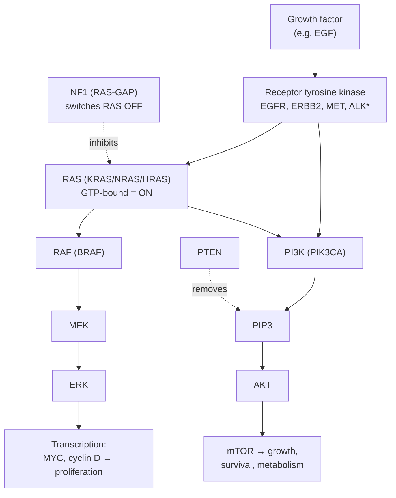
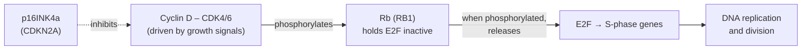
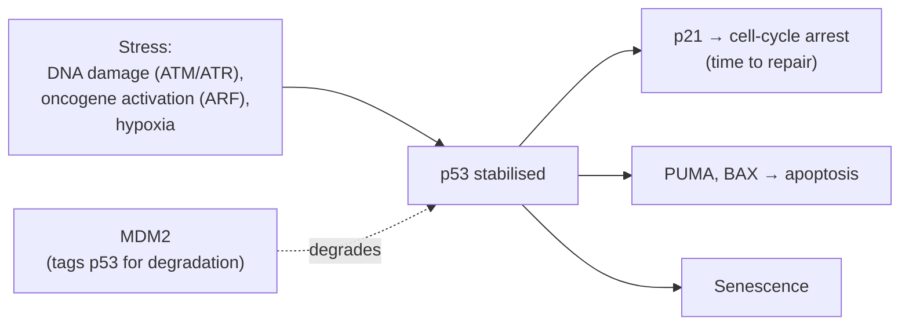
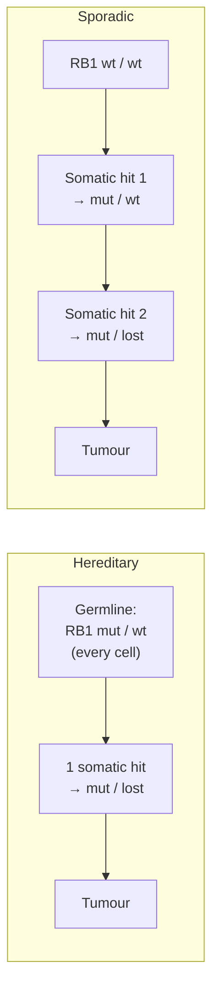
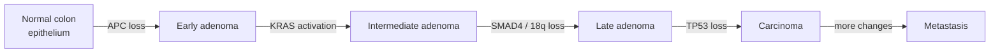

# Module 6 — Cancer Biology Fundamentals

**Week 7 of 16 · ~5 hours · Prerequisites: Modules 1–5**

| Activity | Time |
|---|---|
| Lesson notes | 1 h |
| Reading: Hanahan & Weinberg 2000 and 2011 (both core) + Weinberg Ch 2, 4, 7 (selected) | 1.5 h |
| Hands-on exercise (cBioPortal, COSMIC Cancer Gene Census) | 1 h |
| Quiz (`quizzes/quiz_06.md`) + flashcards (tag `M06`) | 1 h |
| Buffer | 0.5 h |

**Reading strategy for the week.** Read the 2000 paper first (it is short). Then read the 2011 paper's sections on the new hallmarks and enabling characteristics, plus its figures. Use the Weinberg chapters as reference for the pathways in Sections 3–5 rather than reading them cover to cover.

Coordinates are **GRCh38** unless stated otherwise.

---

## Learning objectives

By the end of this module you can:

1. **List** the hallmarks of cancer (2000 and 2011 versions) and **map** common driver genes from your reports onto them.
2. **Explain** the normal function of three core circuits — growth-factor signalling (RTK→RAS→MAPK and PI3K→AKT), the Rb cell-cycle switch, and the p53 stress response — and **predict** how specific drivers break them.
3. **Contrast** oncogenes and tumour suppressors by mechanism (gain vs loss of function), dosage (one vs two hits) and genomic pattern.
4. **Apply** Knudson's two-hit model, and **identify** the mechanisms of the second hit, including copy-neutral LOH and epigenetic silencing.
5. **Evaluate** whether a mutation is a driver or a passenger using recurrence, functional and selection-based evidence.

---

## 1. What makes a cell cancerous: the hallmarks

Cancer is not one defect. It is a set of acquired **capabilities** that normal cells are prevented from having. Hanahan and Weinberg organised these as the hallmarks of cancer.

| 2000 hallmark (original name) | 2011 name | Example drivers |
|---|---|---|
| Self-sufficiency in growth signals | **Sustaining proliferative signalling** | EGFR, ERBB2, KRAS, BRAF, PIK3CA |
| Insensitivity to anti-growth signals | **Evading growth suppressors** | RB1, CDKN2A, PTEN, APC |
| Evading apoptosis | **Resisting cell death** | TP53 loss, BCL2 overexpression |
| Limitless replicative potential | **Enabling replicative immortality** | TERT promoter, ATRX/DAXX (ALT) |
| Sustained angiogenesis | **Inducing angiogenesis** | VHL loss (kidney) → constant hypoxia signalling |
| Tissue invasion and metastasis | **Activating invasion and metastasis** | CDH1 loss (lobular breast, diffuse gastric) |

**2011 additions:**

| Type | Item | Example |
|---|---|---|
| Emerging hallmark | **Reprogramming energy metabolism** | IDH1/2 oncometabolite (Module 3) |
| Emerging hallmark | **Avoiding immune destruction** | B2M or HLA loss; PD-L1 upregulation |
| Enabling characteristic | **Genome instability and mutation** | MMR, HR, POLE defects (Module 5) |
| Enabling characteristic | **Tumour-promoting inflammation** | Chronic inflammation in colitis-associated and liver cancers |

*The 2022 update (new dimensions such as phenotypic plasticity and non-mutational epigenetic reprogramming) is assigned to Module 7.*

**Why this matters to you:** a report lists genes; a clinician thinks in capabilities and pathways. Being able to say "this tumour has RAS-pathway activation, Rb-pathway loss via CDKN2A deletion, and TP53 loss" is more useful than reading out three gene names.

---

## 2. Proto-oncogenes, oncogenes and tumour suppressors

| | **Proto-oncogene → oncogene** | **Tumour suppressor gene (TSG)** |
|---|---|---|
| Normal job | Accelerator: promotes growth or survival when signalled | Brake or guardian: restrains growth, repairs DNA, triggers death |
| Cancer mechanism | **Gain of function** — always on, or too much | **Loss of function** — brake removed |
| Copies that need hitting | Usually **one** (acts dominantly in the cell) | Usually **both** (two hits) |
| Variant types | Hotspot missense, in-frame indels, amplification, fusions, promoter activation | Truncating, splice, deletion, LOH, promoter methylation |
| Drug strategy | Inhibit the overactive protein (TKIs, BRAF and KRAS G12C inhibitors) | Hard to restore function → exploit the weakness instead (e.g. PARP inhibitors in HR loss) |

**Caveats from real biology:**

- **Haploinsufficiency.** For some TSGs, losing one copy already gives a partial advantage (PTEN is a dose-sensitive example). Not every TSG strictly needs two hits.
- **Context dependence.** Some genes act as oncogenes in one tissue and suppressors in another (NOTCH1 is a well-known case).
- **Oncogene addiction.** Some tumours become dependent on a single oncogene (BCR::ABL1, EGFR, ALK). Blocking it causes dramatic responses — the biological basis of targeted therapy.

*Weinberg: Ch 4 (oncogenes) and Ch 7 (tumour suppressors).*

---

## 3. Circuit 1 — growth-factor signalling

*\*ALK is normally barely expressed in adults. It becomes oncogenic mainly through fusions (Module 3).*

The pathway is a **relay of switches**. A driver can break it at almost any step:

- **Receptor:** EGFR mutation or amplification, ERBB2 amplification, ALK/ROS1/RET fusions.
- **RAS:** KRAS/NRAS hotspot mutations lock RAS in the GTP-bound "on" state. Losing **NF1** (the off-switch) has a similar effect.
- **RAF:** BRAF V600E (worked example below).
- **PI3K arm:** PIK3CA hotspots (gain) or PTEN loss (loss of the brake). Both raise PIP3 and activate AKT.

**Mutual exclusivity.** Within a tumour, KRAS, NRAS and BRAF hotspot mutations rarely co-occur. Once the pathway is on, a second hit in the same pathway gives little extra advantage, and too much signalling can even trigger senescence. Mutual exclusivity in cohort data is a strong clue that genes act in the same pathway.

---

## 4. Circuit 2 — the Rb cell-cycle switch

Before committing to copy its DNA (entering **S phase**), a cell passes a decision point called the **restriction point** in G1.

How cancers break it:

- **RB1 loss** — retinoblastoma, small-cell lung cancer, some others.
- **CDKN2A deletion** — removes p16, the CDK4/6 inhibitor.
- **CCND1 amplification or translocation**, or **CDK4 amplification** — too much accelerator.

**CDK4/6 inhibitors** (e.g. palbociclib) are standard in hormone-receptor-positive breast cancer. They only work if Rb is present, so **RB1 loss predicts resistance**.

### A Module 1 callback: one locus, two proteins, two pathways

The **CDKN2A** locus at 9p21 encodes two different proteins, using **different first exons and different reading frames** over shared downstream exons:

- **p16INK4a** — inhibits CDK4/6 (Rb pathway).
- **p14ARF** (ARF = "alternative reading frame") — inhibits MDM2, protecting p53 (p53 pathway).

A single homozygous deletion of CDKN2A therefore disables **both** the Rb and p53 pathways. That is part of why it is among the most common deletions in cancer — glioblastoma, pancreatic cancer, melanoma and many others.

---

## 5. Circuit 3 — p53, the guardian of the genome

Normally, MDM2 keeps p53 levels low. Stress blocks MDM2, p53 accumulates, and as a transcription factor it switches on genes for arrest, death or senescence.

Cancers disable this circuit by:

- **TP53 mutation** — the most common route, mutated in roughly half of all cancers (Module 3 covers why it is mostly missense);
- **MDM2 amplification** — degrades normal p53 (seen in some sarcomas and gliomas, typically in TP53-wild-type tumours, another example of mutual exclusivity);
- **CDKN2A deletion** — loss of ARF, see above;
- **viral proteins** — HPV's E6 protein targets p53 for degradation (and E7 targets Rb).

**Why TP53 loss enables everything else.** Without p53, cells with DNA damage or abnormal chromosome numbers keep dividing instead of arresting or dying. TP53-mutant tumours are therefore often highly aneuploid and genomically unstable.

**Resisting death more directly.** **BCL2**, an anti-apoptosis protein, is overexpressed via t(14;18) in follicular lymphoma. The BCL2 inhibitor venetoclax is used in CLL and AML.

*Weinberg: selected sections of Ch 9 (p53 and apoptosis).*

---

## 6. Knudson's two-hit model and loss of heterozygosity

In 1971, Alfred Knudson analysed **retinoblastoma**, a childhood eye cancer:

- **Hereditary** cases were often **bilateral** (both eyes) and appeared **earlier**.
- **Sporadic** cases were **unilateral** and appeared **later**.

He proposed that two "hits" are needed. In hereditary cases the first hit is inherited in every cell, so a single additional somatic hit in any retinal cell suffices — this happens often enough to strike both eyes. In sporadic cases both hits must occur by chance in the same cell, which is rare and slow. The gene was later identified as **RB1** (13q14), the first tumour suppressor cloned.

### How the second hit happens

| Mechanism | What happens | How your pipeline sees it |
|---|---|---|
| Second point mutation or small indel | Different mutation on the other allele | Two SNV/indel calls in the gene (ideally confirmed on different alleles by phasing) |
| **Deletion** | The wild-type copy is lost | Copy loss + LOH (depth ↓, BAF shifts) |
| **Chromosome or arm loss**, sometimes followed by duplication of the remaining copy | Wild-type copy lost; mutant may be duplicated | Copy loss, or **copy-neutral LOH** |
| **Mitotic recombination** | Exchange between homologous chromosomes makes the region homozygous out to the telomere | **Copy-neutral LOH** extending to the chromosome end |
| **Promoter methylation** | The wild-type copy is silenced, with no sequence change | **Invisible to WGS** — RNA shows low expression (MLH1, CDKN2A) |

**LOH (loss of heterozygosity)** means the tumour has lost one parental allele in a region. It is detected through **B-allele frequency** at germline heterozygous SNPs (Module 3). A germline variant plus tumour LOH is the classic Lynch, BRCA or Li-Fraumeni pattern (Modules 4 and 9).

> **Pipeline connection — finding both hits**
> - A single heterozygous truncating call in a TSG is half a story. Look for the second hit in your **CNV/LOH output**, a **second small variant**, or **RNA expression**.
> - **VAF is your clue.** A TSG mutation at a VAF well above purity/2 suggests LOH of the wild-type allele (Module 7 shows how to compute this).
> - Reports that say "biallelic loss of TP53/RB1/BRCA2" combine SNV and CNV evidence. If your pipeline doesn't integrate the two, someone is doing it by hand.

---

## 7. Drivers and passengers

A **driver** mutation gives its cell a selective growth advantage. A **passenger** mutation was simply present in the cell that expanded, and is carried along. Most mutations in a tumour are passengers. Vogelstein and colleagues estimated that typical solid tumours have only a handful of driver mutations — roughly two to eight.

**Evidence that a mutation is a driver:**

1. **Recurrence beyond chance:** the same position (hotspot) or gene is mutated in many tumours, more often than its local background mutation rate predicts. Tools: MutSigCV, OncodriveFML.
2. **Selection signals:** in a gene under positive selection, **dN/dS > 1** — more protein-changing mutations than expected relative to synonymous ones (tool: dNdScv).
3. **Pattern:** hotspots for oncogenes; truncations and two hits for TSGs (20/20 rule, Module 3).
4. **Functional evidence:** experiments showing transformation, pathway activation or drug sensitivity.
5. **Curated knowledge:** COSMIC Cancer Gene Census, OncoKB and CIViC (Module 12).

**A driver mutation is not the same as cancer.** As Module 4 showed, normal tissues carry clones with driver mutations, and benign moles are full of BRAF V600E (worked example). Cancer usually needs several drivers acting together — the **multistep** model.

*The classic Fearon–Vogelstein colorectal sequence. The order is a tendency, not a rule. Module 7 covers tumour evolution properly (Weinberg Ch 11).*

---

## Worked example: BRAF V600E — one mutation, many contexts

**The variant.** `NM_004333.6:c.1799T>A`, `p.(Val600Glu)`. BRAF is on chr7 (− strand); in a GRCh38 VCF this appears as `chr7:140753336 A>T` (Module 1 quiz).

**Normal biology.** BRAF is a serine/threonine kinase in the RAS→RAF→MEK→ERK relay (Section 3). Normally it switches on only when active RAS recruits it, and it works as a dimer. Its **activation segment** must be phosphorylated to turn it on.

**What V600E does.** Valine 600 sits in the activation segment. Glutamate's negative charge mimics the phosphorylation that normally activates the kinase. The result:

- BRAF V600E is **constitutively active**, **independent of RAS**, and signals **as a monomer**.
- It is called a **class I** BRAF mutation. Class II mutants signal as RAS-independent dimers; class III mutants are kinase-impaired and depend on RAS. This classification matters for drug choice.

**Hallmark mapping:** sustaining proliferative signalling.

**Same mutation, very different outcomes by tissue:**

| Context | What happens | Lesson |
|---|---|---|
| **Benign naevi (moles)** | BRAF V600E is common, but the cells stop dividing (**oncogene-induced senescence**) | A strong driver alone is not cancer; senescence is a barrier that needs further hits, e.g. CDKN2A loss, to overcome |
| **Melanoma** | Found in about half of cutaneous melanomas; BRAF + MEK inhibitors are effective | Oncogene addiction |
| **Colorectal cancer** | In ~10% of tumours; BRAF inhibitor alone works poorly because EGFR feedback reactivates the pathway. Combining with EGFR antibodies helps. Associated with MLH1 methylation and MSI (Module 5) | Same mutation, different wiring → different drug strategy |
| **Papillary thyroid cancer, hairy cell leukaemia** | Very common (nearly universal in hairy cell leukaemia) | A diagnostic marker as well as a target |
| **NSCLC** | A small percentage of cases | Targetable when found |

**Mutual exclusivity in the data.** In colorectal cancer, BRAF V600E and KRAS hotspots rarely co-occur — same pathway, redundant hits.

**A side effect that teaches biology.** BRAF inhibitors can **paradoxically activate** MAPK signalling in cells with mutant RAS and wild-type BRAF, because the drug promotes RAF dimers. Early BRAF-inhibitor patients developed skin squamous cell carcinomas driven by pre-existing RAS-mutant clones. This is pathway wiring made visible.

**For your QC.** BRAF V600E is in a high-quality, uniquely mappable region, so a missing call in a BRAF-expected tumour type (e.g. hairy cell leukaemia) is worth checking for purity or coverage problems.

---

## Common misconceptions

1. **"Finding a driver mutation means cancer."** Normal tissues and benign lesions carry drivers (BRAF V600E in naevi, NOTCH1 in oesophagus). Cancer needs several cooperating hits and escape from barriers such as senescence.
2. **"Oncogenes and tumour suppressors are fixed categories."** Dosage, tissue context and specific variants matter (haploinsufficiency; NOTCH1 acting as oncogene or suppressor).
3. **"One heterozygous TSG mutation inactivates the gene."** Usually a second hit is needed — check CNV/LOH, a second variant, or expression.
4. **"All BRAF mutations are V600E and respond to BRAF inhibitors."** Class II and III BRAF mutations behave differently, and tissue context changes response (melanoma vs colorectal).
5. **"Mutations in the same pathway add up."** Pathway mutations are often mutually exclusive; a second hit in an already-activated pathway gives little advantage.
6. **"Every mutation in a known cancer gene is a driver."** Passengers land in cancer genes too, especially in hypermutated tumours. Position, type and recurrence matter.

---

## Hands-on exercise (~1 h)

### Part A — Pathways and mutual exclusivity in cBioPortal (25 min)

1. At https://www.cbioportal.org, open the TCGA colorectal PanCancer Atlas study.
2. Query **KRAS NRAS BRAF**. In the **OncoPrint**, do any tumours have more than one?
3. Open the **Mutual Exclusivity** tab and record the result for each pair.
4. Repeat with **TP53 MDM2 CDKN2A** in a glioblastoma study. What pattern do you see, and why does it make biological sense?

### Part B — The second hit (20 min)

1. In a large study with copy-number data (e.g. TCGA breast or ovarian PanCancer Atlas), query **TP53**.
2. In **Plots**, put TP53 mutation type on one axis and TP53 putative copy-number alteration on the other.
3. What fraction of TP53-mutated tumours also show a shallow deletion? What does that say about the second hit?

### Part C — Hallmark mapping (15 min)

Using COSMIC's Cancer Gene Census (https://cancer.sanger.ac.uk/census — some views may need free registration), classify each gene below:
- role: oncogene, TSG or fusion partner;
- the hallmark it mainly serves (Section 1);
- the variant types expected.

**EGFR, KRAS, BRAF, PIK3CA, PTEN, TP53, RB1, CDKN2A, MYC, TERT, BCL2, VHL.**

### Record your answers

| Item | Your answer |
|---|---|
| KRAS/NRAS/BRAF co-occurrence and mutual-exclusivity results | |
| TP53 / MDM2 / CDKN2A pattern in GBM | |
| Fraction of TP53-mutant tumours with shallow deletion | |
| Hallmark table for the 12 genes | |

---

## Self-test

- Quiz: `quizzes/quiz_06.md` → answer key `answer_keys/answer_key_06.md`
- Flashcards: `flashcards.csv`, tag `M06`

---

## Further reading

1. **Hanahan D, Weinberg RA. The hallmarks of cancer. *Cell.* 2000. doi:10.1016/s0092-8674(00)81683-9** — core.
2. **Hanahan D, Weinberg RA. Hallmarks of cancer: the next generation. *Cell.* 2011. doi:10.1016/j.cell.2011.02.013** — core.
3. **Weinberg RA. *The Biology of Cancer*, 2nd ed. 2014.** Ch 2 (The Nature of Cancer), Ch 4 (Cellular Oncogenes), Ch 7 (Tumor Suppressor Genes) as core; selected sections of Ch 9 (p53 and apoptosis). Ch 5, 6, 8 and 10 are optional depth for the circuits in Sections 3–5.
4. **Knudson AG Jr. Mutation and cancer: statistical study of retinoblastoma. *Proc Natl Acad Sci USA.* 1971;68(4):820–823.** Short, readable and historic.

---

## Facts to double-check (accuracy log)

- **BRAF MANE Select version (NM_004333.6)** and **chr7:140753336 A>T** for V600E — confirm in Ensembl and ClinVar.
- **BRAF V600E frequencies** (melanoma ~50%, colorectal ~10%, near-universal in hairy cell leukaemia) — approximate; check cBioPortal or COSMIC.
- **"Two to eight drivers per typical solid tumour"** — from Vogelstein et al. 2013. Pan-cancer whole-genome analyses report averages in a similar range.
- **The exact grouping of 2011 hallmarks vs enabling characteristics** — check against the 2011 paper's Figure 3 as you read it.
- **Drug statements** (CDK4/6 inhibitors, venetoclax, BRAF + EGFR combinations in CRC) — check current approvals.
