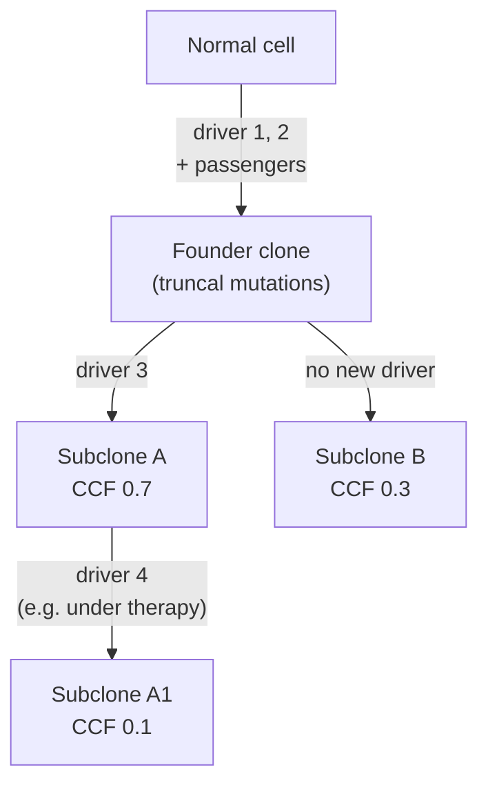

# Module 7 — Tumour Evolution, Heterogeneity, Purity, Ploidy and VAF

**Weeks 8–9 of 16 · ~10 hours · Prerequisites: Modules 2–6**

| Activity | Week 8 | Week 9 |
|---|---|---|
| Lesson notes | Sections 1–4 (1.5 h) | Sections 5–8 (1.5 h) |
| Reading | Weinberg Ch 11 (selected, 1 h); Nowell 1976 (0.5 h) | Hanahan 2022 (1 h); McGranahan & Swanton 2017 (0.5 h) |
| Hands-on exercise | Part A–B: VAF arithmetic and detection power (1 h) | Part C–D: cohort VAFs and the EGFR resistance story (1 h) |
| Quiz + flashcards | Flashcards (0.5 h) | `quizzes/quiz_07.md` + flashcards tag `M07` (1 h) |
| Buffer | 0.5 h | 0.5 h |

**Why two weeks.** This is the module where biology turns into numbers you compute every day. Week 8 builds the evolutionary picture and the VAF equation. Week 9 applies it to heterogeneity, therapy resistance, low-VAF calling and the 2022 Hallmarks update.

Coordinates are **GRCh38** unless stated otherwise.

---

## Learning objectives

By the end of this module you can:

1. **Describe** tumour evolution as Darwinian selection on somatic variation, and **distinguish** linear, branching and neutral patterns and truncal vs branch mutations.
2. **Derive and apply** the expected-VAF equation from purity, local copy number and mutation multiplicity, and **convert** an observed VAF into a cancer cell fraction (CCF).
3. **Explain** how purity and ploidy are estimated from depth ratios and B-allele frequencies, and **recognise** an ambiguous (degenerate) purity/ploidy solution, including whole-genome doubling.
4. **Interpret** spatial and temporal heterogeneity — multiregion sampling, therapy-resistant subclones, cfDNA — and **predict** how each changes what a single biopsy shows.
5. **Evaluate** a low-VAF call by weighing detection power, artefact likelihood and biological plausibility.

---

## Week 8

## 1. A tumour is a population, not a genotype

In 1976 Peter Nowell proposed that tumours evolve. Cells acquire heritable changes at random; the environment (space, nutrients, the immune system, later drugs) selects the cells that out-grow the rest; the winners expand into **clones**. Repeat this many times and you get a cancer.

Two ingredients are all evolution needs:

- **Variation** — mutation, copy-number change and epigenetic change (Module 5). Genome instability (an enabling characteristic, Module 6) raises the supply.
- **Selection** — anything that makes some cells leave more descendants than others. Driver mutations (Module 6) are, by definition, the variants that win under selection.

**Analogy for pipeline people.** Think of the tumour as a Git repository that has been forked thousands of times. Every cell division is a commit with a few random changes. The tumour you biopsy is a snapshot of whichever branches happened to be merged into the sample tube. Your VCF is a `git log` with the author names stripped off: it lists changes but not which branch each came from. Purity, ploidy and VAF analysis are how you reconstruct the branch structure.

### Key vocabulary

| Term | Meaning |
|---|---|
| **Clone** | A population of cells descended from one ancestral cell |
| **Founder (most recent common ancestor) clone** | The ancestor of all cancer cells in the sample |
| **Truncal (clonal) mutation** | Present in every cancer cell — it arose in or before the founder |
| **Branch (subclonal) mutation** | Present in only some cancer cells — it arose later in one lineage |
| **Subclone** | A population inside the tumour defined by shared branch mutations |
| **Clonal sweep** | A subclone with a strong advantage outgrows everyone, so its mutations become clonal |
| **Cancer cell fraction (CCF)** | The fraction of *cancer* cells carrying a mutation (1.0 = clonal) |

*Truncal mutations sit in every cell; the further down a branch, the smaller the CCF. Every subclone's CCF must be ≤ its parent's — the "sum rule" that clonality tools use to build trees.*

### Patterns of evolution

| Pattern | What it looks like | Where it is discussed |
|---|---|---|
| **Linear** | Successive sweeps; each new driver clone replaces the last | Classic Fearon–Vogelstein colorectal model (Module 6); now seen as an oversimplification |
| **Branching** | Several subclones coexist and diverge | The common finding in multiregion sequencing of solid tumours |
| **Neutral** | After the founder, subclones expand without strong selection; many low-VAF passengers | Proposed for some tumours; how often it applies is **actively debated** |
| **Punctuated** | Many changes at once (e.g. chromothripsis, whole-genome doubling), then expansion | Large SV/CN events (Module 8) |

**Established vs debated.** That tumours are clonal populations under selection is established. *How much* subclonal diversity reflects selection versus neutral drift, and how well bulk VAF can tell them apart, is an active research area.

---

## 2. Purity, ploidy and copy number: three numbers behind every VAF

| Quantity | Definition | Typical range |
|---|---|---|
| **Purity (p)** | Fraction of cells in the sample that are cancer cells | 0.1–0.95; pathology estimates are often optimistic |
| **Ploidy (ψ)** | Average total copy number across the cancer genome | ~2 (near-diploid) to ~4+ (after whole-genome doubling) |
| **Local total copy number (C)** | Copies of the locus in each cancer cell | 0 (homozygous deletion) to dozens (amplification) |
| **Multiplicity (m)** | How many of those C copies carry the mutation | 1 ≤ m ≤ C |

The non-cancer cells in the sample — stroma, immune cells, blood vessels — are assumed diploid and carry no somatic mutations. They **dilute** everything.

### Where purity comes from biologically

Tumours are not pure lumps of cancer cells. They contain fibroblasts, endothelial cells and immune infiltrate. Some types are characteristically **low purity**:

- **Pancreatic ductal adenocarcinoma** — a dense fibrous stroma (desmoplasia); purities of 0.1–0.3 are common, which historically hid KRAS mutations from low-depth sequencing.
- **Tumours with heavy immune infiltrate** (some MSI-high colorectal cancers, Hodgkin lymphoma).
- **Diffuse gliomas** — cancer cells infiltrate normal brain.

Haematological samples (AML bone marrow, CLL blood) are often high purity.

---

## 3. The VAF equation

Count the alleles at one position in a sample with purity *p*. Cancer cells contribute *p·C* copies, of which *p·m* carry the mutation. Normal cells contribute *2(1 − p)* copies, none mutant. So for a **clonal** mutation:

> **VAF = p·m / ( p·C + 2(1 − p) )**

For a **subclonal** mutation present in a fraction CCF of cancer cells, multiply the numerator by CCF:

> **VAF = CCF · p·m / ( p·C + 2(1 − p) )**

Rearranged to estimate CCF from an observed VAF:

> **CCF = VAF · ( p·C + 2(1 − p) ) / ( p·m )**

In a diploid region (C = 2, m = 1) this reduces to the Module 4 rule of thumb, **VAF ≈ p/2**.

### One purity, many VAFs

All rows below are **clonal** mutations (CCF = 1) at purity **p = 0.6**.

| Scenario | C | m | Expected VAF |
|---|---|---|---|
| Heterozygous, diploid region | 2 | 1 | 0.30 |
| Mutation, then **loss of the wild-type allele** (deletion) | 1 | 1 | 0.43 |
| Mutation, then **copy-neutral LOH** (mutant duplicated) | 2 | 2 | 0.60 |
| Trisomy, mutant allele gained | 3 | 2 | 0.46 |
| Trisomy, wild-type allele gained | 3 | 1 | 0.23 |
| Whole-genome doubling **after** the mutation | 4 | 2 | 0.375 |
| Whole-genome doubling **before** the mutation | 4 | 1 | 0.19 |
| 8-copy amplicon, mutation on one copy | 8 | 1 | 0.11 |
| 8-copy amplicon, mutation on all copies (e.g. EGFR mutant + amplified) | 8 | 8 | 0.86 |
| Subclonal, CCF 0.3, diploid | 2 | 1 | 0.09 |

**Lessons in this table:**

- **A low VAF does not mean subclonal.** The 8-copy row (0.11) and the post-WGD row (0.19) are both clonal. Without copy number you would misjudge them.
- **A high VAF in a tumour suppressor** (0.43–0.60 here, above p/2 = 0.30) is the signature of a **second hit by LOH** (Module 6). Module 4's TP53 case #3 (germline + LOH, tumour VAF 0.80) follows from the same arithmetic, applied to a germline allele that is also present in the normal cells: VAF = (2p + (1 − p)) / 2 = (1 + p)/2 = 0.80.
- **Multiplicity is a clock.** If a mutation sits on 2 of 4 copies after WGD, it happened **before** the doubling; if on 1 of 4, **after**. The same logic applies to single-chromosome gains. This is how whole-genome studies time events (Section 7).

> **Pipeline connection — where these numbers live**
> - Mutect2 writes the VAF estimate in `FORMAT/AF` and the read counts in `FORMAT/AD`. `AF` is a model estimate, not exactly `alt/(ref+alt)`; for CCF work, compute from `AD`.
> - **Purity and ploidy** come from a CN caller: ASCAT, FACETS, PURPLE, Sequenza, Battenberg, ABSOLUTE and others. GATK's own CNV workflow reports copy ratios and allele fractions but does not output a purity estimate.
> - **CCF and clustering** need VAF + local CN + purity together: PyClone-VI, DPClust, SciClone, PhylogicNDT and others. Garbage purity in → garbage clonality out.
> - Mutect2 itself does **not** know purity or copy number. It tests "is there any ALT signal beyond noise?" Clonality interpretation is a separate step.

---

## 4. How purity and ploidy are estimated

Two signals from a tumour–normal pair:

1. **Depth ratio** (tumour/normal read depth per segment, after GC and mappability correction). Usually shown as log2 ratio. Copy gains go up, losses go down.
2. **B-allele frequency (BAF)** at germline heterozygous SNPs (identified in the normal). In a balanced region BAF ≈ 0.5. LOH or allelic imbalance splits the BAF band into two (Module 3).

The expected depth ratio for a segment with total CN *C* is:

> **R = ( p·C + 2(1 − p) ) / ( p·ψ + 2(1 − p) )**

The denominator is the genome-average copy number of the sample, because sequencing is normalised to total library size. **Copy-ratio data are relative**: the same ratio can come from different absolute states.

### The purity/ploidy ambiguity

Two solutions can fit the same data equally well:

| | Solution A | Solution B |
|---|---|---|
| Purity | 0.80 | 0.67 |
| Ploidy | ~2 | ~4 |
| Segment with R = 0.60 | CN 1 | CN 2 |
| Segment with R = 1.40 | CN 3 | CN 6 |

Every CN in B is double that in A, and purity is adjusted so the ratios match exactly. BAF often cannot break the tie, because allelic states double too (1+0 → 2+0). What can:

- **Odd copy states.** If A needs a CN 3 segment with allelic state 2+1, B needs 4+2 — possible, but a fit with many such states becomes less parsimonious.
- **SNV multiplicities.** After WGD, clonal mutations that arose late sit at m = 1 of 4, giving a distinct low-VAF cluster (Section 3 table).
- **Orthogonal evidence:** pathology purity, flow-cytometry DNA index, or a known clonal driver (e.g. KRAS in pancreatic cancer) whose VAF pins purity.

Callers report alternative solutions with likelihoods. When they disagree, a human reviews the fit — and that human may be you.

### Whole-genome doubling (WGD)

WGD is the duplication of the whole chromosome set in a cancer cell, usually through a failed cell division. It is one of the most common large events in solid tumours — roughly a third of tumours in large pan-cancer studies — and is associated with **TP53 loss** (p53 normally arrests cells that become tetraploid; Module 6) and with poorer prognosis in several cancer types.

WGD buffers the cell against losing essential genes, so it is often followed by many single-copy losses. A tumour with ploidy ~3.2 is usually a doubled genome that has since lost material.

> **Pipeline connection — QC questions for every CN result**
> - Does the **purity** match the VAF peak of high-confidence clonal SNVs (≈ 2 × peak in near-diploid regions)?
> - Is **ploidy** ~2 or ~4? If the caller chose ~4, are there clonal SNVs at m = 1 of 4?
> - Are the integer CN states clean (segments sitting on horizontal bands), or is everything between bands (likely subclonal CN, or a wrong fit)?
> - Very low purity (< ~0.2) makes CN calling unreliable; report it rather than trusting the segments.

---

## Week 9

## 5. Heterogeneity in space and time

### Spatial heterogeneity

Multiregion sequencing — taking several biopsies from one tumour — showed that a single biopsy can miss subclonal drivers. Gerlinger et al. (2012) in renal cell carcinoma and the TRACERx lung study (Jamal-Hanjani et al. 2017) found that many driver mutations were **subclonal** or present in only some regions, while drivers such as **VHL** loss in clear cell renal cancer and **EGFR** or **KRAS** mutations in lung adenocarcinoma were usually **truncal**.

Implications:

- A **truncal** driver is a better drug target: every cancer cell has it.
- A driver absent from your biopsy may still be present elsewhere.
- A subclonal driver found in one biopsy may not represent the tumour.

### Temporal heterogeneity — evolution under therapy

Treatment is a powerful selective force. Resistant subclones that existed at low frequency before treatment — or that arose later — expand while sensitive cells die. Typical genomic routes:

| Route | Example |
|---|---|
| **Secondary mutation in the drug target** | EGFR T790M after 1st/2nd-generation EGFR inhibitors; ABL1 T315I under imatinib in CML |
| **Bypass pathway activation** | MET amplification bypassing EGFR inhibition |
| **Reversion restoring function** | BRCA1/2 reversion mutations under PARP inhibitors or platinum (Module 5) |
| **Lineage change (plasticity)** | EGFR-mutant lung adenocarcinoma transforming to small-cell lung cancer, with RB1 and TP53 loss |
| **Loss of the target** | Loss of CD19 expression after CD19-directed therapy in B-cell leukaemia |
| **Therapy-induced mutation** | Temozolomide-induced hypermutation (SBS11) in recurrent glioma (Module 5) |

### Liquid biopsy and cfDNA

Dying tumour cells shed DNA into the blood (**circulating tumour DNA, ctDNA**), as part of all cell-free DNA (cfDNA). Because it pools DNA from all sites, cfDNA can reveal heterogeneity that a single biopsy misses, and can track resistance over time. The **tumour fraction** in cfDNA is often below 1%, so VAFs are very low — CHIP variants (Module 4) are a major source of false "tumour" calls.

### Extrachromosomal DNA (ecDNA)

Some amplifications are carried on small circular DNA molecules outside chromosomes. ecDNA lacks centromeres, so it is **unequally segregated** at each division: daughter cells can get very different copy numbers. This produces extreme cell-to-cell heterogeneity and rapid adaptation. EGFR ecDNA in glioblastoma and MYC ecDNA in several cancers are well-known examples. In WGS, ecDNA looks like a high-level focal amplification with circular SV junctions; dedicated tools (e.g. AmpliconArchitect) reconstruct its structure.

> **Tumor spotlight — evolution and heterogeneity by cancer type**
> - **Lung (NSCLC):** EGFR/KRAS/ALK drivers usually truncal; smoking signatures mostly early, APOBEC often later and subclonal (TRACERx). EGFR inhibitor resistance via T790M, C797S, MET amplification or small-cell transformation.
> - **Colorectal:** truncal APC; KRAS/NRAS subclones emerge under anti-EGFR antibodies and can be tracked in cfDNA.
> - **Breast:** ESR1 mutations arise under aromatase inhibitors in metastatic ER+ disease — a classic acquired-resistance mutation found mainly after therapy.
> - **Prostate:** AR amplification and AR mutations emerge under androgen-deprivation therapy.
> - **Pancreatic:** very low purity is the main analytical challenge; KRAS is near-universal and truncal, so its VAF is a useful purity anchor.
> - **GBM:** EGFR ecDNA, mosaic RTK amplifications (EGFR, PDGFRA, MET in different cells), and temozolomide-driven hypermutation at recurrence.
> - **AML:** evolves from **clonal haematopoiesis** — DNMT3A/TET2/ASXL1 clones are often founding events, with NPM1 or FLT3 joining later. Relapse often comes from a minor subclone at diagnosis.
> - **CLL:** subclonal TP53 or SF3B1 mutations at diagnosis can expand after chemotherapy; TP53 status matters even at low VAF.
> - **CML:** BCR::ABL1 is the founding event; ABL1 kinase-domain mutations (e.g. T315I) emerge under tyrosine kinase inhibitors.
> - **Myeloma:** branching evolution from the precursor states MGUS and smouldering myeloma; primary IGH translocations or hyperdiploidy are early, later changes (e.g. 17p deletion) are often subclonal.

---

## 6. Low-VAF calls: when is a few reads real?

A subclone at CCF 0.2 in a 50%-pure diploid region gives VAF 0.05. At 60× that is ~3 reads — exactly where real mutations and artefacts overlap.

### Detection power

The number of ALT reads at a true variant is roughly **binomial(depth, VAF)**. Probability of seeing **≥ 3 ALT reads**:

| Depth | VAF 0.02 | VAF 0.05 | VAF 0.10 | VAF 0.20 |
|---|---|---|---|---|
| 30× | 0.02 | 0.19 | 0.59 | 0.96 |
| 60× | 0.12 | 0.58 | 0.95 | >0.99 |
| 100× | 0.32 | 0.88 | >0.99 | >0.99 |
| 200× | 0.77 | >0.99 | >0.99 | >0.99 |

*Computed from the binomial distribution, ignoring sequencing error and overdispersion — real power is somewhat lower.*

At typical clinical WGS depths (tumour ~60–100×), **subclones below ~5–10% VAF are detected incompletely**. Absence of a low-VAF call is weak evidence of absence.

### Real low-VAF variant vs artefact

| Evidence | Favours real | Favours artefact |
|---|---|---|
| Strand / read orientation | ALT reads on both strands and both read orientations | ALT only in one orientation (FFPE C>T, 8-oxoG G>T; Module 5) |
| Read position | Spread along reads | Clustered near read ends |
| Base and mapping quality | Comparable to REF reads | Low |
| Normal and PoN | ALT absent in matched normal and panel of normals | Seen in PoN (recurrent technical noise) |
| Sequence context | Unique sequence | Homopolymer, low-complexity, segmental duplication (Module 2) |
| Biology | Known hotspot fitting the tumour type; fits a subclone cluster | Random context; no supporting cluster |
| CHIP genes | — | DNMT3A, TET2, ASXL1, PPM1D, TP53 at low VAF in tumour *and* traces in normal (Module 4) |

> **Pipeline connection — Mutect2 filters for low-VAF territory**
> - `weak_evidence` — the log-odds (TLOD) is below threshold: not enough reads.
> - `strand_bias`, `orientation` (from `LearnReadOrientationModel`), `position`, `base_qual`, `map_qual` — the artefact signatures in the table above.
> - `panel_of_normals`, `normal_artifact`, `germline` — Module 4.
> - `contamination` — another person's DNA produces many low-VAF calls at their germline SNP sites.
> - Mutect2 keeps the **filtered** calls in the VCF. For a known hotspot in an expected tumour type, review filtered low-VAF calls in IGV rather than discarding them blindly; for discovery, trust the filters.

---

## 7. Reading history from a genome: timing events

Because mutations accumulate with time, the genome is a record:

- **Multiplicity timing.** A mutation on both copies of a duplicated region arose before the duplication (Section 3). Comparing the numbers of early (m = 2) and late (m = 1) mutations in gained regions estimates *when* in the tumour's history the gain happened.
- **Clock-like signatures.** SBS1 (CpG deamination, Module 5) accumulates roughly in proportion to cell divisions, giving a rough molecular clock.
- **Signature changes over time.** Clonal vs subclonal mutations can carry different signatures — e.g. tobacco SBS4 dominating early clonal mutations in lung cancer, with APOBEC rising in later subclones.

The PCAWG evolution study (Gerstung et al. 2020) applied this to 2,658 whole genomes. It reported that some driver mutations and copy-number gains can arise **years to decades before diagnosis**. Exact timings depend on mutation-rate assumptions and are estimates with wide uncertainty.

---

## 8. The 2022 Hallmarks update: new dimensions

Hanahan's 2022 paper keeps the 2011 framework and proposes new candidates. Read it with Module 6's tables open.

| New dimension | Proposed as | What it means | Genomic footprint |
|---|---|---|---|
| **Unlocking phenotypic plasticity** | Emerging hallmark | Cancer cells escape terminal differentiation — they de-differentiate, block differentiation or switch lineage | Lineage switching under therapy (EGFR-mutant adenocarcinoma → small-cell; prostate adenocarcinoma → neuroendocrine); differentiation block in AML (e.g. PML::RARA, Module 10) |
| **Non-mutational epigenetic reprogramming** | Enabling characteristic | Gene expression changes driven by the microenvironment and epigenetic state, not DNA sequence | Largely **invisible to WGS**; seen in methylation and RNA data (Module 10) |
| **Polymorphic microbiomes** | Enabling characteristic | Microbes in the gut or tumour can promote or protect against cancer | E.g. colibactin-producing *E. coli* leaves a mutational signature (SBS88, Module 8) |
| **Senescent cells** | Emerging hallmark | Senescent cells — cancer or stromal — secrete signals that can promote tumour growth | Not directly visible in DNA |

The 2022 paper also treats the two 2011 "emerging hallmarks" (reprogramming energy metabolism and avoiding immune destruction) as established core hallmarks.

**Why it matters for you.** Two of the four new dimensions are non-genetic. They are a reminder that a WGS report captures the **mutational** part of a tumour's evolution, but not all of it — one of the strongest arguments for adding RNA (Module 10) and methylation data.

*Established vs debated:* these are proposals for discussion in the paper, not consensus categories. Expect argument about whether each meets the bar of a hallmark.

---

## Worked example: EGFR in lung adenocarcinoma — a clonal driver and a resistant subclone

**The truncal driver.** EGFR **L858R** — `NM_005228.5:c.2573T>G`, `p.(Leu858Arg)`; GRCh38 `chr7:55191822 T>G` (EGFR is on the + strand). It sits in the kinase domain (exon 21) and shifts the kinase towards its active conformation, making the tumour dependent on EGFR signalling (oncogene addiction, Module 6). It is almost always **truncal**: in multiregion studies it is present in every region.

**Diagnosis biopsy.** Purity 0.5. L858R VAF 0.40 with local CN 4 (EGFR is gained), total depth 80×.

- Expected VAF if m = 1: 0.5 / (2 + 1) = 0.17. If m = 2: 1.0 / 3 = 0.33. If m = 3: 1.5 / 3 = 0.50.
- An observed 0.40 lies between m = 2 and m = 3. With binomial noise at 80× both are plausible. Either way the mutation is clonal and the **mutant allele is preferentially gained** — common for oncogenes, where duplicating the mutant copy increases signalling. Tumour suppressors show the mirror image: loss of the wild-type copy.

**Treatment.** The patient receives a first-generation EGFR inhibitor (e.g. erlotinib) and responds for about a year, then progresses.

**Progression biopsy.** L858R is still present. A new mutation, **T790M** — `NM_005228.5:c.2369C>T`, `p.(Thr790Met)`; GRCh38 `chr7:55181378 C>T`, exon 20 — is found at VAF 0.06 at purity 0.4, CN 4.

- CCF assuming m = 1: 0.06 × (0.4·4 + 1.2) / 0.4 = 0.06 × 2.8 / 0.4 = **0.42**. A resistant subclone in ~40% of cancer cells.
- T790M is the **gatekeeper** residue. Methionine at 790 restores EGFR's affinity for ATP, so the first-generation drug is out-competed. It is the most common resistance mechanism to first- and second-generation EGFR inhibitors (around half of cases in published series).
- T790M usually arises **in cis** with the sensitising mutation (on the same allele). The two positions are ~10 kb apart, so short reads cannot phase them directly; phasing needs long reads or is inferred.

**Next step clinically.** Osimertinib, a third-generation inhibitor, binds covalently to cysteine 797 and is active against T790M. Resistance to osimertinib can then occur via **C797S** (removing the cysteine), MET amplification, or small-cell transformation — evolution continues.

**Lessons:**

- The same tumour, sequenced at two times, has a different clonal structure.
- A low-VAF call (0.06) can be clinically decisive. At 80× that is ~5 ALT reads — reviewing it in IGV is essential.
- **Germline T790M** exists and is rare, associated with familial lung cancer risk. A T790M at VAF ~0.5 in **both** tumour and normal before any treatment means germline, not acquired resistance (Module 9).
- Osimertinib is now also used first-line for EGFR-mutant NSCLC in many settings, changing which resistance mechanisms are seen. Check current guidance.

---

## Common misconceptions

1. **"Low VAF means subclonal."** VAF depends on purity, copy number and multiplicity. An amplified or post-WGD clonal mutation can have a low VAF. Compute CCF.
2. **"VAF ≈ 0.5 means germline."** In a high-purity tumour with LOH, a somatic mutation can reach 0.5 or above. Always check the matched normal.
3. **"The caller's purity/ploidy is the truth."** It is the best-fitting model. Degenerate solutions (ploidy 2 vs 4) are common; check it against clonal SNV VAFs.
4. **"One biopsy represents the whole tumour."** Spatial and temporal heterogeneity mean subclonal drivers can be missed or over-represented.
5. **"Resistance mutations are always newly created by the drug."** Many resistant subclones pre-exist at low frequency and are **selected**, not induced — though some therapies (temozolomide) are themselves mutagenic.
6. **"No call at a hotspot means no mutation."** At 60×, detection power for a 5% VAF variant is only ~50–60%.

---

## Hands-on exercise (~2 h across both weeks)

### Part A — VAF arithmetic (Week 8, 30 min)

Write a small function (Python, R or a spreadsheet) for `expected_vaf(p, C, m, ccf=1)` and `ccf(vaf, p, C, m)`. Then answer:

1. Reproduce the Section 3 table at p = 0.6.
2. A TP53 frameshift has VAF 0.72 at purity 0.8. Local CN = 2, BAF shows LOH. What are m and the CCF? What does this say about the second hit?
3. A PIK3CA H1047R has VAF 0.12 at purity 0.7 in a diploid region. Is it clonal? What if the region is actually CN 4 with m = 1?
4. In a tumour with p = 0.5, a germline heterozygous SNP shows tumour BAF 0.75 and normal BAF 0.50. Which allelic states (total CN, mutant copies) are consistent with this?

### Part B — Detection power (Week 8, 30 min)

1. Using `scipy.stats.binom` (or R `pbinom`), reproduce the detection-power table in Section 6.
2. Your lab's somatic workflow needs ≥ 4 ALT reads. What depth gives ≥ 90% power at VAF 0.05?
3. Optional: rerun with a beta-binomial (overdispersion, ρ ≈ 0.01). How much does power drop?

### Part C — VAFs in real cohort data (Week 9, 30 min)

1. In cBioPortal (https://www.cbioportal.org), open the TCGA pancreatic adenocarcinoma PanCancer Atlas study and query **KRAS**.
2. In the **Mutations** tab, display the tumour allele-frequency column (column names vary by version; look for "Allele Freq").
3. Sketch the distribution of KRAS VAFs. What do they tell you about the purity of these samples?
4. Repeat for a TCGA AML or a TCGA lung adenocarcinoma study. Compare.
5. If the study offers purity, ploidy, "fraction genome altered" or WGD attributes in its clinical data, plot KRAS VAF against purity.

### Part D — The EGFR resistance story (Week 9, 30 min)

1. In ClinVar or Ensembl, look up EGFR **L858R** and **T790M**. Confirm the GRCh38 positions and `NM_005228.5` HGVS used above. Note the review status.
2. In COSMIC (https://cancer.sanger.ac.uk/cosmic, free registration may be needed), view EGFR's mutation distribution. Where do exon 19 deletions, L858R, T790M and C797S fall relative to the kinase domain?
3. In cBioPortal, find a study of EGFR-mutant lung cancer with samples after treatment (search "EGFR" or "osimertinib" in the study list; availability varies). What fraction of T790M calls have lower VAF than the sensitising mutation in the same sample? What does that suggest?

### Record your answers

| Item | Your answer |
|---|---|
| A2: m, CCF and second-hit mechanism | |
| A3: clonal or not, both scenarios | |
| A4: allelic states | |
| B2: depth needed | |
| C3–4: KRAS VAF distribution, PAAD vs other | |
| D3: T790M vs sensitising VAF | |

---

## Self-test

- Quiz: `quizzes/quiz_07.md` → answer key `answer_keys/answer_key_07.md`
- Flashcards: `flashcards.csv`, tag `M07`

---

## Further reading

1. **Weinberg RA. *The Biology of Cancer*, 2nd ed. 2014. Ch 11 (Multi-Step Tumorigenesis).** Core reading for clonal evolution and the multistep model.
2. **Nowell PC. The clonal evolution of tumor cell populations. *Science.* 1976;194(4260):23–28.** The founding paper; short.
3. **McGranahan N, Swanton C. Clonal heterogeneity and tumor evolution: past, present, and the future. *Cell.* 2017;168(4):613–628.** Readable modern review of heterogeneity and its clinical consequences.
4. **Hanahan D. Hallmarks of Cancer: New Dimensions. *Cancer Discov.* 2022;12(1):31–46. doi:10.1158/2159-8290.CD-21-1059** — core reading for week 9.

Optional: Gerstung M, et al. The evolutionary history of 2,658 cancers. *Nature.* 2020;578:122–128 (PCAWG) — for Section 7.

---

## Facts to double-check (accuracy log)

- **EGFR coordinates and HGVS** — L858R `chr7:55191822 T>G` (c.2573T>G) and T790M `chr7:55181378 C>T` (c.2369C>T) on `NM_005228.5`. Confirm in ClinVar/Ensembl (Part D1).
- **"T790M in about half of first/second-generation EGFR-inhibitor resistance"** — published series typically report ~50–60%; check a current review.
- **"WGD in roughly a third of tumours"** — pan-cancer estimates vary by cohort and method (primary vs metastatic); check Bielski et al. 2018 (*Nat Genet*) or PCAWG.
- **The 2022 hallmark groupings** (which new dimensions are "emerging hallmarks" vs "enabling characteristics") — confirm against the paper's figures as you read it.
- **Gerlinger et al. 2012 / TRACERx 2017 statements** about truncal vs subclonal drivers — summarised from memory; confirm in McGranahan & Swanton 2017.
- **Osimertinib use** (first-line and post-T790M) and resistance mechanisms — check current guidelines; this changes.
- **Mutect2 filter names** — confirm against the GATK version you run; names have changed across releases.
