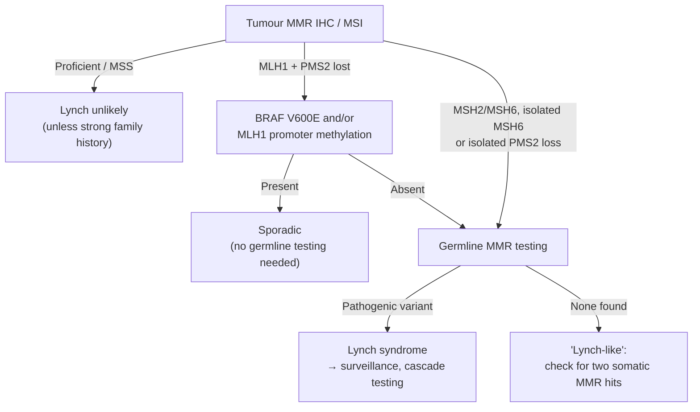

# Module 9 — Hereditary Cancer

**Week 11 of 16 · ~5 hours · Prerequisites: Modules 4, 6, 8**

| Activity | Time |
|---|---|
| Lesson notes | 1.5 h |
| Reading: Weinberg Ch 7 (familial cancer sections) + Ch 12 (repair syndromes) + Richards et al. 2015 (skim criteria tables) | 1 h |
| Hands-on exercise (ClinVar, gnomAD, UCSC, pedigree reasoning) | 1.5 h |
| Quiz (`quizzes/quiz_09.md`) + flashcards (tag `M09`) | 0.5 h |
| Buffer | 0.5 h |

**Why this module matters for a tumour–normal pipeline.** Module 4 showed that your matched normal is a germline genome. This module covers what is *in* it that matters: inherited cancer-predisposition variants, how they are classified, how to tell whether one actually drove the tumour, and the responsibilities that come with finding one.

Coordinates are **GRCh38** unless stated otherwise.

---

## Learning objectives

By the end of this module you can:

1. **Explain** autosomal dominant inheritance of cancer predisposition, and **distinguish** penetrance, expressivity, de novo variants and mosaicism.
2. **Describe** the genes, tumour spectrum and mechanism of hereditary breast and ovarian cancer (BRCA1/2), Lynch syndrome and Li-Fraumeni syndrome, plus other syndromes relevant to the course's eight tumour types.
3. **Apply** the ACMG/AMP five-tier framework to reason about a germline variant's classification, and **use** ClinVar review status and gnomAD frequencies correctly.
4. **Assess** whether a germline variant is relevant to a specific tumour, using locus-specific LOH, mutational signatures and MSI status.
5. **Identify** technical blind spots for germline cancer genes in WGS (pseudogenes, large deletions, mosaicism and CHIP) and the ethical requirements for returning findings.

---

## 1. Inherited predisposition: the genetics

### Two hits again — but one is inherited

Knudson's model (Module 6) explains hereditary cancer: a person inherits one non-functional copy of a tumour suppressor in **every cell**. Only **one** more somatic hit is needed in any cell, so cancers come earlier, are more often multiple or bilateral, and cluster in families.

Most cancer-predisposition genes are **tumour suppressors**, inherited in an **autosomal dominant** pattern: one inherited copy raises risk, and each child of a carrier has a **50%** chance of inheriting it. At the **cellular** level, though, the gene is recessive — the tumour still needs the second hit.

### Key terms

| Term | Meaning | Example |
|---|---|---|
| **Penetrance** | Probability a carrier develops the disease (often by a given age) | BRCA1: high but not 100% |
| **Expressivity** | Range of how the disease shows up in carriers | Lynch: colorectal in one relative, endometrial in another |
| **High vs moderate penetrance** | Large vs modest risk increase | BRCA1/2 high; CHEK2, ATM moderate |
| **De novo** | New in the patient, absent from both parents | Common for TP53 in Li-Fraumeni — family history can be absent |
| **Mosaicism** | Present in only some of the body's cells, from a post-zygotic event | Low VAF in blood; may be missed or confused with CHIP |
| **Founder variant** | One ancestral variant common in a population | Ashkenazi Jewish BRCA1/2 variants |
| **Biallelic (recessive) syndrome** | Both germline copies affected | Biallelic MMR → constitutional MMR deficiency (CMMRD); biallelic BRCA2 → Fanconi anaemia; biallelic MUTYH → MUTYH-associated polyposis |

**Clinical red flags** that suggest a hereditary syndrome: early age at diagnosis, multiple primary cancers, bilateral cancers in paired organs, rare tumours (male breast cancer, adrenocortical carcinoma), and several relatives with related cancers.

---

## 2. Hereditary breast and ovarian cancer — BRCA1 and BRCA2

**Genes.** BRCA1 (17q21.31) and BRCA2 (13q13.1). Both are needed for **homologous recombination** (Module 5): BRCA1 helps commit DSB repair to HR; BRCA2 (with PALB2) loads RAD51 onto DNA.

**Tumour spectrum.**

| | BRCA1 | BRCA2 |
|---|---|---|
| Breast cancer risk to age 80 | ~72% | ~69% |
| Ovarian cancer risk to age 80 | ~44% | ~17% |
| Typical breast subtype | Often **triple-negative** | Often ER-positive |
| Other | — | **Male breast**, **pancreatic**, **prostate** (often aggressive) |

*Risk figures from a large prospective cohort (Kuchenbaecker et al. 2017). Population breast cancer risk is ~12% for comparison. Estimates vary by study and variant.*

**Founder variants.** About 1 in 40 people of Ashkenazi Jewish ancestry carries one of three founder variants: BRCA1 `c.68_69del` (old name 185delAG), BRCA1 `c.5266dup` (5382insC) and BRCA2 `c.5946del` (6174delT). Other founder variants exist in other populations (e.g. Iceland, French Canada, Poland).

**Biology to genome.** Biallelic loss → HRD → SBS3, ID6, LOH/TAI/LST scars, tandem duplications (Module 8) → **PARP inhibitor and platinum sensitivity**.

**Moderate-penetrance and related genes:** PALB2 (risk closer to BRCA2), CHEK2, ATM, RAD51C, RAD51D, BARD1, BRIP1. Panels vary in which they include.

---

## 3. Lynch syndrome — inherited mismatch repair deficiency

**Genes.** MLH1, MSH2, MSH6, PMS2, and **EPCAM** — deletions at the 3′ end of EPCAM cause read-through transcription that **methylates and silences the neighbouring MSH2** promoter.

**Prevalence.** Estimated at around 1 in 300 people — among the most common hereditary cancer syndromes, and largely undiagnosed.

**Tumour spectrum.** Colorectal and **endometrial** cancers are the most common; also ovarian, gastric, small bowel, urothelial (upper tract), biliary, pancreatic, brain and sebaceous skin tumours.

**Risk varies by gene**: highest for MLH1 and MSH2, intermediate for MSH6 (endometrial risk notable), lowest for PMS2. Gene-specific estimates are curated by the Prospective Lynch Syndrome Database (PLSD).

**Tumour phenotype:** MSI-high/dMMR, hypermutation, MMR signatures (Module 8). This is why **universal MMR/MSI screening** of colorectal and endometrial tumours is recommended in many guidelines: it catches Lynch carriers who have no family history.

**The screening algorithm (colorectal):**

**Rare variant: constitutional MLH1 epimutation** — MLH1 methylation present in normal tissues (germline-like), sometimes heritable. Methylation of MLH1 in the **normal** sample is the clue.

---

## 4. Li-Fraumeni syndrome — germline TP53

**Gene.** TP53 (17p13.1) — the guardian of the genome (Module 6).

**Tumour spectrum.** The "core" cancers: **sarcomas** (soft tissue and bone), **early-onset breast cancer** (often HER2-positive), **brain tumours**, **adrenocortical carcinoma** and **leukaemias**. Many other cancers occur. Lifetime risk is very high, and multiple primary tumours are common.

**Practical features:**

- **De novo** variants are frequent, so family history may be absent. Adrenocortical carcinoma or choroid plexus carcinoma in a child warrants TP53 testing regardless of family history.
- **TP53 R337H** is a lower-penetrance founder variant common in southern Brazil.
- **Radiation sensitivity:** carriers have a higher risk of radiation-induced cancers, which affects treatment choices.
- **Surveillance protocols** (whole-body MRI) have improved outcomes in carriers.

**The CHIP trap (Module 4).** A TP53 variant at **low VAF in blood** is often **clonal haematopoiesis**, especially in older or chemotherapy-treated patients — not Li-Fraumeni. A true constitutional variant should be ~0.5 VAF and present in a non-blood tissue (e.g. skin fibroblasts). Mosaic constitutional TP53 also exists, so low VAF needs confirmation, not dismissal.

---

## 5. Other syndromes mapped to the course's tumour types

| Tumour type | Syndromes / genes |
|---|---|
| **Breast** | BRCA1/2, PALB2, CHEK2, ATM, TP53 (Li-Fraumeni), PTEN (Cowden), CDH1 (lobular, with hereditary diffuse gastric cancer), STK11 (Peutz–Jeghers) |
| **Colorectal** | Lynch; **APC** (familial adenomatous polyposis — hundreds to thousands of polyps); **MUTYH** biallelic (MUTYH-associated polyposis, SBS36); POLE/POLD1 proofreading-domain variants; SMAD4/BMPR1A (juvenile polyposis); STK11 |
| **Lung** | Rare; germline EGFR T790M (familial lung adenocarcinoma, Module 7); Li-Fraumeni |
| **Prostate** | BRCA2 (most important), ATM, CHEK2, BRCA1, PALB2, Lynch (especially MSH2), **HOXB13 G84E** |
| **Pancreatic** | BRCA2, PALB2, ATM, BRCA1, Lynch, **CDKN2A** (familial melanoma–pancreatic cancer), STK11, PRSS1 (hereditary pancreatitis) |
| **GBM / brain** | Li-Fraumeni; **CMMRD** (biallelic MMR — childhood GBM, often hypermutated); NF1 (gliomas); Lynch |
| **Myeloid (AML, MDS, MPN)** | **Germline predisposition to myeloid neoplasms**: DDX41 (most common; often adult onset), RUNX1, CEBPA, GATA2, ETV6, ANKRD26. Recognised as a category in current WHO and ICC classifications |
| **CLL, myeloma** | Familial clustering is well documented, but driven by many common low-risk variants; no single high-penetrance gene in most families |

**Why heme is tricky.** In haematological cancers, the **blood is the tumour**. A blood "normal" contains tumour cells, so germline testing needs a non-haematopoietic sample — typically **cultured skin fibroblasts** (hair follicles or buccal swabs are alternatives with caveats). A variant at ~0.5 VAF in both a leukaemic blood sample and a "normal" blood sample could be germline or a truncal leukaemia mutation.

---

## 6. Classifying germline variants: ACMG/AMP

The 2015 ACMG/AMP guideline (Richards et al.) is the standard framework for **germline** variant classification. (Somatic variants use a different framework — AMP/ASCO/CAP — in Module 12.)

### Five classes

| Class | Meaning | Action |
|---|---|---|
| **Pathogenic (P)** | Causes disease | Clinically actionable |
| **Likely pathogenic (LP)** | ≥ ~90% certainty of pathogenicity | Treated like P in most settings |
| **Variant of uncertain significance (VUS)** | Insufficient or conflicting evidence | **Not** used for clinical decisions; may be reclassified |
| **Likely benign (LB)** | ≥ ~90% certainty benign | Not reported in many settings |
| **Benign (B)** | Not disease-causing | Not reported |

### Evidence types (criteria codes)

Evidence is labelled by strength — very strong (**PVS**), strong (**PS/BS**), moderate (**PM**), supporting (**PP/BP**) and stand-alone benign (**BA**) — and combined by rules.

| Evidence | Pathogenic example | Benign example |
|---|---|---|
| **Predicted null effect** | **PVS1**: nonsense, frameshift, canonical splice site in a gene where loss of function causes disease | — |
| **Population frequency** | **PM2**: absent or extremely rare in gnomAD | **BA1**: allele frequency > 5%; **BS1**: higher than expected for the disease |
| **Functional data** | **PS3**: well-established assay shows damage | **BS3**: assay shows no damage |
| **Segregation** | **PP1**: co-segregates with disease in a family | **BS4**: does not segregate |
| **De novo** | **PS2**: confirmed de novo | — |
| **Same amino acid change** | **PS1**: same protein change as an established pathogenic variant | — |
| **Computational** | **PP3**: predictors agree it is damaging | **BP4**: predictors agree it is benign |

**Gene-specific rules.** ClinGen **Variant Curation Expert Panels** (VCEPs) adapt the criteria for particular genes (e.g. ENIGMA for BRCA1/2, InSiGHT for MMR genes, a TP53 VCEP). ClinGen also recommends refinements (e.g. for PVS1 and computational evidence) and a points-based Bayesian version. Always check whether a VCEP rule set exists for your gene.

### Reading ClinVar correctly

- **Review status (stars)** matters more than the classification label. Expert panel (3 stars) > multiple submitters, no conflicts (2 stars) > single submitter (1 star).
- **"Conflicting classifications"** is common — read the individual submissions.
- ClinVar records are **assertions**, not truths. Classifications change; record the date you looked.

> **Pipeline connection — germline variants in a tumour–normal workflow**
> - **Mutect2 is not a germline caller.** By design it suppresses variants present in the normal (`germline`, `normal_artifact`). A pathogenic BRCA2 variant can be completely absent from the somatic VCF.
> - Germline findings need a **separate germline call on the normal** (e.g. HaplotypeCaller, DeepVariant), usually restricted to a defined gene list and governed by consent.
> - Use **gnomAD** frequencies per genetic-ancestry group: a variant rare overall can be common in one population (founder variants), and vice versa.
> - **Large deletions and duplications** (e.g. BRCA1 exon deletions, often Alu-mediated; EPCAM 3′ deletions) are missed by SNV/indel callers — they need germline CNV calling from depth.
> - **PMS2** has a highly similar pseudogene (**PMS2CL**), so reads from its 3′ exons mismap (Module 2). Low mapping quality or missing coverage there is expected; clinical labs use special methods.
> - Mosaic and CHIP variants show **low VAF in the normal**. Don't auto-dismiss or auto-report them — flag for review.

---

## 7. Is this germline variant relevant to *this* tumour?

A pathogenic germline variant does not automatically explain the cancer in front of you. A BRCA2 carrier can develop a tumour driven by unrelated mechanisms. Evidence that the germline variant was **causal** in the tumour:

| Evidence | What you look for |
|---|---|
| **Locus-specific second hit** | LOH of the wild-type allele at the gene (tumour VAF rises towards (1 + p)/2 in copy-neutral LOH, Module 7), or a second somatic mutation |
| **Tumour phenotype matches** | HRD signature/score for BRCA1/2/PALB2 (Module 8); MSI/dMMR for Lynch |
| **Tumour type in the syndrome's spectrum** | BRCA2 in breast, ovarian, pancreatic, prostate; Lynch in colorectal/endometrial |

Large tumour–normal sequencing studies have found that BRCA1/2 variants are often **biallelic and HRD-positive in the "core" tumour types** (breast, ovarian, pancreatic, prostate), but frequently **monoallelic without HRD** in other tumour types — where the germline variant may be incidental to that tumour (Jonsson et al. 2019). This affects whether PARP inhibitors are likely to help.

---

## 8. Returning germline findings: ethics and practice

- **Consent first.** Patients must know whether germline findings will be looked for and returned, and be able to opt out where policy allows.
- **Confirmation.** Research or somatic-pipeline findings require confirmation in an accredited clinical laboratory before clinical use.
- **Genetic counselling** is the route for disclosure: risk explanation, surveillance options and family implications.
- **Cascade testing.** First-degree relatives have a 50% chance of carrying the variant; testing them enables prevention (risk-reducing surgery for BRCA, colonoscopy for Lynch, MRI surveillance for Li-Fraumeni).
- **Secondary (incidental) findings.** The ACMG maintains a list of genes for which pathogenic variants should be reported when found incidentally in clinical exome/genome sequencing. It includes many cancer genes (BRCA1/2, MMR genes, TP53, APC, MUTYH and others). It is updated periodically — v3.3 was published in 2025 — so check the current version.
- **VUS handling.** VUS should not drive clinical decisions; establish a policy for whether and how they are re-reviewed.
- **Equity.** Reference databases under-represent many ancestries, producing more VUS and more misclassification in those groups.

> **Tumor spotlight — germline yield by cancer type (approximate)**
> - **Ovarian (high-grade serous):** ~15–20% carry germline BRCA1/2 — germline testing is recommended for all patients in many guidelines.
> - **Pancreatic:** roughly 5–10% carry a germline pathogenic variant (BRCA2, ATM, PALB2, BRCA1, Lynch, CDKN2A); universal germline testing is commonly recommended.
> - **Prostate (metastatic):** around 10% carry germline DNA-repair variants, BRCA2 most often.
> - **Breast:** depends heavily on age, subtype (triple-negative higher) and family history.
> - **Colorectal:** ~3% Lynch; higher in early-onset disease.
> - **Lung, GBM, myeloma:** low germline yield in unselected adults; much higher in children with GBM (Li-Fraumeni, CMMRD).
> - **AML/MDS:** germline DDX41 and others are increasingly recognised in adults — and require a non-blood normal.

---

## Worked example: BRCA2 c.5946del in pancreatic cancer — from normal BAM to family

**The variant.** BRCA2 `NM_000059.4:c.5946del`, `p.(Ser1982Argfs*22)` — the Ashkenazi founder variant historically called 6174delT. Deleting one T in exon 11 shifts the reading frame and creates a premature stop codon 22 codons later. The truncated mRNA is expected to undergo NMD (Module 3), and any protein made would lack the C-terminal domains needed for DNA binding and nuclear localisation.

**ACMG/AMP reasoning.** PVS1 (frameshift in a gene where loss of function causes HBOC) + PS4-type case–control evidence + extensive literature → **Pathogenic**. ClinVar lists it with multiple concordant submissions, including expert-panel review. (Confirm the current status in Part A.)

**What the pipeline shows (purity 0.7):**

| Sample | VAF | Interpretation |
|---|---|---|
| Normal (blood) | 0.49 | Germline heterozygous |
| Tumour | 0.85 | Copy-neutral LOH with the variant retained: (1 + 0.7)/2 = 0.85. The wild-type allele is gone — **second hit** |
| Mutect2 somatic VCF | Absent, or filtered `germline`/`normal_artifact` | Correct behaviour for a somatic caller — this is why a germline call on the normal is needed |
| Tumour genome | SBS3 prominent, many microhomology deletions (ID6), high LOH/TAI/LST score | **HRD phenotype confirms the germline variant is driving this tumour** |

**Clinical meaning (check current guidelines):**
- Pancreatic cancer with germline BRCA1/2: platinum-based chemotherapy is favoured, and a PARP inhibitor (olaparib) has been approved as maintenance for germline BRCA-mutated metastatic pancreatic cancer after platinum (POLO trial).
- **Family:** each first-degree relative has a 50% chance of carrying it. Carriers can have breast MRI, consider risk-reducing salpingo-oophorectomy, and prostate and pancreatic surveillance under current guidance.
- **Future resistance:** a BRCA2 **reversion** mutation (Module 5) restoring the reading frame may appear in progression samples or cfDNA.

**Lesson:** one variant links four modules — HGVS and NMD (3), germline vs somatic VAF (4), LOH arithmetic (7) and HRD signatures (8).

---

## Common misconceptions

1. **"No family history means not hereditary."** De novo variants (common in TP53), small families, incomplete penetrance and adoption all hide inheritance. Universal tumour screening exists for this reason.
2. **"A pathogenic germline variant explains the patient's tumour."** Check for a second hit and a matching tumour phenotype; outside core tumour types it may be incidental.
3. **"Mutect2 will flag germline pathogenic variants."** It is designed to suppress them. Germline calling is a separate, consented analysis.
4. **"A VUS is probably pathogenic."** Most VUS that are reclassified are downgraded to benign. Do not act on a VUS clinically.
5. **"A TP53 variant in blood means Li-Fraumeni."** Low-VAF TP53 in blood is often CHIP. Confirm VAF ~0.5 and presence in a non-blood tissue.
6. **"Germline testing from blood works for every cancer."** In haematological cancers, the blood is the tumour; use skin fibroblasts or another non-haematopoietic tissue.

---

## Hands-on exercise (~1.5 h)

### Part A — One founder variant across databases (30 min)

1. In **ClinVar** (https://www.ncbi.nlm.nih.gov/clinvar/), search `BRCA2 c.5946del`.
   - Record the classification, review status (stars), number of submissions and date last evaluated.
   - Record the GRCh38 position and the HGVS on the MANE Select transcript.
2. In **gnomAD** (https://gnomad.broadinstitute.org), find the same variant (use the GRCh38 position or HGVS).
   - Record the overall allele frequency and the frequency in the Ashkenazi Jewish group.
   - Why would BA1/BS1 (frequency-based benign criteria) be misapplied if you used the Ashkenazi Jewish frequency naively? How do disease-specific frequency thresholds solve this?
3. Repeat for **TP53 R337H** (`NM_000546.6:c.1010G>A`). Note its frequency pattern across ancestry groups and its ClinVar classification.

### Part B — A VUS with conflicts (20 min)

1. In ClinVar, filter for **MSH6** variants with "Conflicting classifications".
2. Open one missense variant. List the submitters and their classifications.
3. Which ACMG/AMP criteria are likely driving the disagreement (e.g. PP3 vs BP4, PS3 vs BS3, PM2)? What evidence would resolve it?

### Part C — Hard regions for germline genes (20 min)

1. In the **UCSC Genome Browser** (GRCh38), go to **PMS2** (7p22.1).
2. Turn on a mappability or "Problematic Regions" track and the segmental duplication track.
3. Which PMS2 exons overlap the PMS2CL duplication? What would you expect to see in your normal BAM there (MAPQ, depth)?
4. Look at **BRCA1** with the RepeatMasker track. What repeat family is dense in its introns, and why does that matter for large germline deletions?

### Part D — Pedigree reasoning (20 min)

For each family, name the most likely syndrome and the first gene(s) to test:

1. Proband: colorectal cancer at 42 (tumour MSI-H, MSH2 and MSH6 lost on IHC). Mother: endometrial cancer at 50. Maternal uncle: ureteric (upper tract urothelial) cancer.
2. Proband: osteosarcoma at 16. Sibling: adrenocortical carcinoma at 3. Mother: breast cancer at 31.
3. Proband: pancreatic cancer at 58; Ashkenazi Jewish ancestry. Sister: breast cancer at 45. Father: prostate cancer at 60.
4. Proband: AML at 65 with a variant at VAF 0.48 in the leukaemic blood sample in DDX41. What sample do you need to determine whether it is germline?

### Record your answers

| Item | Your answer |
|---|---|
| A1: BRCA2 c.5946del ClinVar status, stars, GRCh38 position | |
| A2: gnomAD overall and AJ frequencies; BA1 reasoning | |
| A3: TP53 R337H pattern | |
| B: MSH6 VUS — criteria in conflict | |
| C: PMS2 exons affected; BRCA1 repeat family | |
| D: four pedigrees | |

---

## Self-test

- Quiz: `quizzes/quiz_09.md` → answer key `answer_keys/answer_key_09.md`
- Flashcards: `flashcards.csv`, tag `M09`

---

## Further reading

1. **Weinberg RA. *The Biology of Cancer*, 2nd ed. 2014. Ch 7 (Tumor Suppressor Genes — familial cancer sections) and Ch 12 (Maintenance of Genomic Integrity — repair-deficiency syndromes).**
2. **Richards S, et al. Standards and guidelines for the interpretation of sequence variants: a joint consensus recommendation of the ACMG and AMP. *Genet Med.* 2015;17(5):405–424.** Skim the criteria tables; you will return to them in Module 12.
3. **Kuchenbaecker KB, et al. Risks of breast, ovarian, and contralateral breast cancer for BRCA1 and BRCA2 mutation carriers. *JAMA.* 2017;317(23):2402–2416.** Source of the risk figures in Section 2.
4. **NCI PDQ® Cancer Genetics summaries** (cancer.gov) — "Genetics of Breast and Gynecologic Cancers" and "Genetics of Colorectal Cancer": regularly updated, clinician-level reviews.

Optional: Jonsson P, et al. Tumour lineage shapes BRCA-mediated phenotypes. *Nature.* 2019;571:576–579 — for Section 7.

---

## Facts to double-check (accuracy log)

- **BRCA1/2 risk figures** (72%/69% breast; 44%/17% ovarian to age 80) — from Kuchenbaecker 2017; other studies differ.
- **"~1 in 40 Ashkenazi Jewish individuals carries one of three founder variants"** and **"Lynch ~1 in 300"** — commonly cited estimates; confirm in NCI PDQ.
- **BRCA2 c.5946del HGVS** (`NM_000059.4`, `p.(Ser1982Argfs*22)`) and **TP53 R337H** (`NM_000546.6:c.1010G>A`) — confirm in ClinVar (Part A).
- **Germline yields** in the Tumor spotlight box — approximate ranges; vary by cohort, gene list and selection.
- **ACMG SF list** (v3.3, 2025) — check the current version and gene count before using it in policy.
- **Olaparib in germline BRCA-mutated metastatic pancreatic cancer** (POLO) and other therapy statements — check current approvals in your jurisdiction.
- **Germline predisposition to myeloid neoplasms** gene list — check the current WHO (5th ed.) and ICC 2022 classifications.
- **Li-Fraumeni core tumours and surveillance** — check current NCCN or equivalent guidance.
