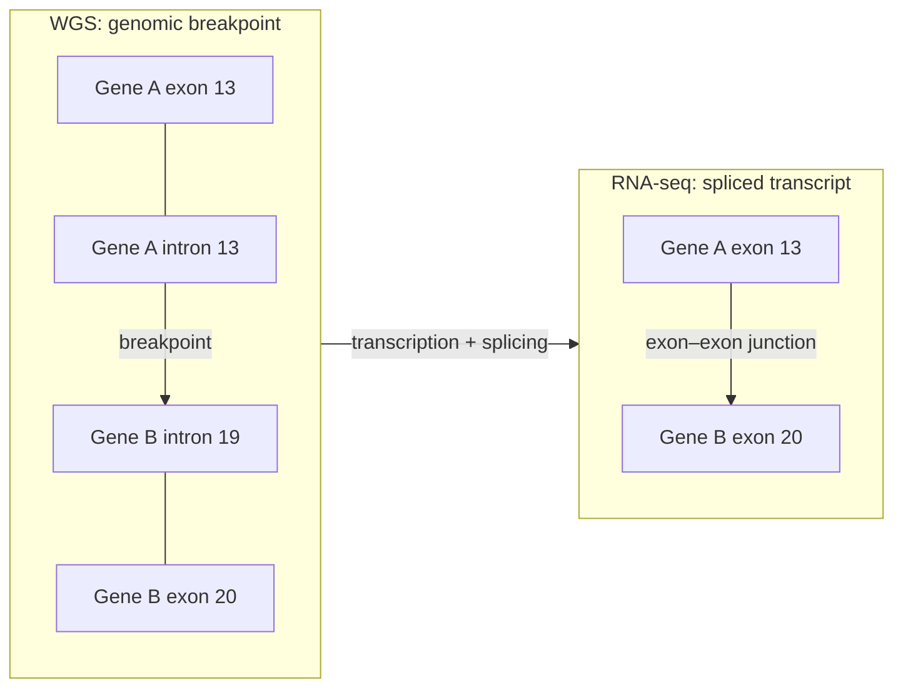

# Module 10 — The Transcriptome in Cancer: What RNA Adds to WGS

**Week 12 of 16 · ~5 hours · Prerequisites: Modules 1, 3, 6, 8**

| Activity | Time |
|---|---|
| Lesson notes | 1.5 h |
| Reading: Weinberg Ch 4 (translocations and fusion oncogenes) + Mertens et al. 2015 | 1 h |
| Hands-on exercise (GTEx, cBioPortal, fusion-caller output, allele-specific expression) | 1.5 h |
| Quiz (`quizzes/quiz_10.md`) + flashcards (tag `M10`) | 0.5 h |
| Buffer | 0.5 h |

**The core idea.** WGS tells you what the genome **could** do. RNA tells you what the cell is **actually doing** with it: which genes are on, which alleles are used, which exons are joined, and which fusions are made into transcripts. WGTS (whole-genome + whole-transcriptome sequencing) pairs the two so each answers questions the other cannot.

Coordinates are **GRCh38** unless stated otherwise.

---

## Learning objectives

By the end of this module you can:

1. **Explain** how transcription, splicing and nonsense-mediated decay determine what RNA-seq measures, and **choose** suitable library types and quantification units for tumour RNA.
2. **Interpret** gene-expression results in a single tumour against appropriate reference cohorts, including outlier expression driven by amplification or translocation.
3. **Evaluate** a fusion call using junction and spanning reads, reading frame, breakpoint location and known artefacts — and **relate** it to the DNA-level SV.
4. **Use** allele-specific expression and RNA VAF to confirm that a DNA variant is expressed, to detect NMD and to spot aberrant splicing.
5. **List** what RNA adds to WGS for clinical interpretation, and **identify** key RNA QC metrics.

---

## 1. From gene to transcript: what RNA-seq actually measures

Recall Module 1: a gene is **transcribed** into pre-mRNA, **introns are spliced out**, a cap and poly-A tail are added, and mature mRNA is exported and translated.

What this means for your data:

| Biology | Consequence in RNA-seq |
|---|---|
| Only **expressed** genes produce reads | A mutation in a silent gene is invisible in RNA |
| **Splicing** joins exons | Reads span exon–exon junctions → you need a **splice-aware aligner** (e.g. STAR) |
| **Alternative splicing** → several isoforms per gene | Gene-level counts hide isoform switches; isoform-level tools (Salmon, RSEM, kallisto) estimate them |
| **Nonsense-mediated decay (NMD)** degrades mRNAs with a premature stop codon more than ~50–55 nt upstream of the last exon–exon junction (Module 3) | Truncating alleles are often **under-represented** in RNA |
| **RNA editing** (ADAR converts A to I, read as G) | A>G (or T>C on the reverse strand) mismatches that are **not** DNA mutations |
| mRNA abundance spans orders of magnitude | Depth in RNA is wildly uneven; low-expressed genes have little power |

### Library choices

| Choice | Option | Trade-off |
|---|---|---|
| RNA selection | **Poly-A selection** | Clean mRNA; poor for degraded (FFPE) RNA |
| | **rRNA depletion (total RNA)** | Works on degraded RNA; also captures non-polyadenylated and intronic (pre-mRNA) reads |
| | **Exome capture (targeted RNA)** | Robust on FFPE; good for fusions in captured genes |
| Strandedness | Stranded | Tells which strand was transcribed — essential for overlapping antisense genes and fusion orientation |

### Units

| Unit | What it is | Use |
|---|---|---|
| **Raw counts** | Reads/fragments per gene | Input for differential expression (DESeq2, edgeR) |
| **TPM** (transcripts per million) | Length- and depth-normalised; sums to 10⁶ per sample | Comparing genes within a sample; rough cross-sample comparisons |
| **FPKM/RPKM** | Older length/depth normalisation | Sums differ between samples — avoid for cross-sample comparison |

> **Pipeline connection — RNA QC metrics to track**
> - **RNA integrity:** RIN for fresh-frozen; **DV200** (% of fragments > 200 nt) for FFPE.
> - **Mapping rate**, **rRNA fraction**, **exonic vs intronic vs intergenic** read fractions (high intronic = degraded or total-RNA library).
> - **Gene-body coverage**: strong 3′ bias indicates degradation (poly-A selection keeps only the 3′ ends of broken molecules).
> - **Strand specificity** matches the library type.
> - **Sample identity:** genotype concordance between the RNA and the DNA of the same patient at common SNPs (e.g. somalier, NGSCheckMate). Sample swaps between DNA and RNA are a real-world failure mode.

---

## 2. Expression in a single tumour

### The comparator problem

A tumour–normal DNA pair has a natural control. Tumour RNA usually does **not** — the matched normal is blood, which expresses a completely different programme. So "is gene X high?" must be asked against:

- a **reference cohort of the same tumour type** (e.g. TCGA), to find outliers; and/or
- **normal tissue** of the same origin (e.g. **GTEx**), to see whether a gene is normally expressed there.

Batch effects (library type, lab, FFPE vs frozen) can be larger than biology. Compare like with like, or correct carefully.

### Expression explained by the genome

| DNA event | RNA consequence | Example |
|---|---|---|
| **Focal amplification** | Outlier high expression of the amplified oncogene | ERBB2 in HER2-positive breast cancer; MYC; EGFR in GBM |
| **Promoter/enhancer hijacking by translocation** | Oncogene placed next to a strong enhancer → overexpression, no fusion protein | IGH translocations in myeloma: CCND1 (t(11;14)), NSD2/FGFR3 (t(4;14)), MAF (t(14;16)); MYC in Burkitt lymphoma |
| **Homozygous deletion** | No expression | CDKN2A, PTEN |
| **Promoter methylation** (invisible to WGS) | Low or absent expression with no DNA change | MLH1 (sporadic MSI), MGMT (GBM), CDKN2A (Module 6) |
| **TERT promoter mutation** | TERT expression switched on | Many GBMs, melanomas, bladder cancers |

**Amplified ≠ expressed.** A gene inside an amplicon may be a passenger. RNA shows which amplified genes are actually overexpressed — a better guide to the driver.

### Expression patterns as biomarkers

| Tumour type | Expression-based classification |
|---|---|
| Breast | **PAM50** intrinsic subtypes: luminal A, luminal B, HER2-enriched, basal-like, normal-like |
| Colorectal | **Consensus Molecular Subtypes** CMS1–4 (CMS1 is MSI-immune) |
| Pancreatic | **Classical vs basal-like** — basal-like is more aggressive |
| GBM | Proneural, classical, mesenchymal programmes |
| Heme | Expression classifiers for leukaemia subtypes; cell-of-origin in lymphoma |

RNA can also estimate the **tumour microenvironment** (immune and stromal cell mixtures by deconvolution), detect **viral transcripts** (e.g. HPV E6/E7, which inactivate p53 and Rb — Module 6), and check whether predicted **neoantigens** are actually expressed.

---

## 3. Fusions: where RNA shines

A **fusion gene** joins parts of two genes, usually through a structural variant (translocation, inversion, deletion or duplication; Module 3). Two kinds of oncogenic outcome:

1. **Chimeric protein** — e.g. BCR::ABL1: the BCR part makes ABL1's kinase domain constitutively active.
2. **Regulatory swap** — a strong promoter drives an intact partner's coding sequence, e.g. TMPRSS2::ERG puts ERG under an **androgen-responsive** promoter.

### DNA vs RNA view (from Module 3)

Breakpoints usually fall in **introns**, often thousands of bases from any exon. Splicing then joins the nearest exons. So:

- **WGS** tells you an SV exists and where exactly it broke — but not which exons are joined in the transcript, whether it is in frame, or whether it is expressed.
- **RNA** shows the exon–exon junction directly, the reading frame and the expression level.

### Evidence a fusion caller uses

| Evidence | Meaning |
|---|---|
| **Junction (split) reads** | A single read crosses the fusion junction — gives the exact exon boundary |
| **Spanning fragments (discordant pairs)** | Each mate maps to a different partner gene |
| **Breakpoint at a canonical exon boundary** | Expected for real fusions; artefacts often break mid-exon |
| **Reading frame** | In-frame for chimeric kinases; frame matters less for promoter-swap fusions |
| **Expression** | Fusion fragments per million (FFPM in STAR-Fusion) |

Common tools: **STAR-Fusion**, **Arriba**, **FusionCatcher**. Using two callers and requiring DNA SV support (in WGTS) greatly improves specificity.

### Common false positives

- **Read-through transcripts** between neighbouring genes (transcription continuing past one gene into the next). Often found in normal tissue too.
- **Paralogues and pseudogenes** — reads mismap between similar genes.
- **Library artefacts** — template switching and ligation chimeras, typically with few supporting reads and non-canonical breakpoints.
- **Recurrent "normal" fusions** seen across many unrelated samples, including normal tissues. Callers ship blacklists of these.

### Clinically important fusions in the course's tumour types

| Tumour | Fusion | Mechanism / significance |
|---|---|---|
| **Lung (NSCLC)** | **EML4::ALK**, ROS1, RET, NTRK fusions; **MET exon 14 skipping** | Targetable with specific kinase inhibitors |
| **Prostate** | **TMPRSS2::ERG** (about half of cases in Western cohorts) | Androgen-driven ERG overexpression; via interstitial deletion on 21q22 or translocation |
| **CML** | **BCR::ABL1**, t(9;22) | Diagnostic; imatinib and successors |
| **AML** | **PML::RARA** (APL), RUNX1::RUNX1T1, CBFB::MYH11, KMT2A rearrangements | Define WHO subtypes; PML::RARA → differentiation therapy (ATRA + arsenic) |
| **GBM** | FGFR3::TACC3; **EGFRvIII** (internal deletion of exons 2–7) | FGFR-targetable in trials; EGFRvIII seen as an exon 1–8 junction in RNA |
| **Pancreatic** | NRG1, NTRK, ALK fusions in KRAS-wild-type tumours | Rare but targetable |
| **Breast** | Rare; ETV6::NTRK3 in **secretory carcinoma** | NTRK inhibitors |
| **Myeloma** | IGH translocations (Section 2) | Usually enhancer hijacking, not chimeric proteins |
| **Any solid tumour** | **NTRK1/2/3 fusions** | Tumour-agnostic approvals of TRK inhibitors |

---

## 4. Splicing aberrations

| Event | Cause | Cancer |
|---|---|---|
| **MET exon 14 skipping** | SNVs/indels at exon 14 splice sites (Module 3) | NSCLC — targetable |
| **EGFRvIII** | Genomic deletion of exons 2–7 | GBM |
| **AR-V7** | Inclusion of a cryptic exon → androgen receptor lacking its ligand-binding domain, constitutively active | Castration-resistant prostate cancer; associated with resistance to AR-targeted drugs |
| **Cryptic 3′ splice-site usage** | **SF3B1** hotspot mutations (e.g. K700E) in the spliceosome | MDS with ring sideroblasts, CLL |
| **Intron retention / exon skipping in TSGs** | Splice-site mutations, deep intronic variants | Any; RNA confirms what DNA predicts |

**Deep intronic variants** can create new splice sites and inactivate a gene with no coding change. WGS finds them; RNA confirms their effect. This is one of the strongest WGTS arguments for germline genes too (Module 9).

---

## 5. Allele-specific expression (ASE) and RNA VAF

For a heterozygous variant, RNA VAF compares how much each allele is transcribed. With no complications, RNA VAF ≈ DNA VAF.

| Observation | Likely biology |
|---|---|
| RNA VAF ≈ DNA VAF | Variant allele expressed normally |
| RNA VAF ≪ DNA VAF for a nonsense/frameshift | **NMD** degrading the mutant transcript |
| RNA VAF ≈ 0 for a missense | Mutant allele silenced (methylation, imprinting), or the gene not expressed in the tumour cells |
| RNA VAF ≫ DNA VAF | Mutant allele preferentially expressed (cis regulatory change, or mutant allele amplified and the other copy silenced) |
| Gene not expressed at all | The mutation is **biologically silent** in this tumour — relevant for neoantigens and for interpreting passengers |
| A>G mismatch only in RNA, absent in DNA | **RNA editing** — not a mutation |

**Monoallelic expression** of a germline-heterozygous SNP in a TSG, without DNA LOH, suggests **epigenetic silencing** of one allele — a second hit that WGS alone cannot see (Module 6).

> **Pipeline connection — using RNA in a WGTS workflow**
> - **Rescue and confirm:** a low-VAF DNA call at a hotspot with clear RNA support is more credible (the RNA is an independent sample of molecules). Absence in RNA is not disproof — the gene may be lowly expressed.
> - **Do not call somatic variants from RNA alone** for reporting without care: RNA editing, splice-junction misalignment and allele-specific expression all distort RNA VAFs.
> - **Fusions:** require RNA junction reads **and** a DNA SV breakpoint consistent with them where possible.
> - **Integrate CN and expression:** report which amplified genes are overexpressed; which deleted genes are absent.
> - **Identity:** always check DNA–RNA genotype concordance.

---

## 6. What RNA adds to WGS — summary

| Question | WGS alone | + RNA (WGTS) |
|---|---|---|
| Is the fusion expressed and in frame? | Breakpoint only; frame inferred | **Direct** |
| Is the amplified gene overexpressed? | No | **Yes** |
| Is a gene silenced epigenetically? | No | **Low/absent expression; monoallelic expression** |
| Does a splice-site or deep intronic variant cause mis-splicing? | Predicted | **Observed** |
| Does NMD remove a truncated transcript? | Predicted | **Observed** (low RNA VAF) |
| Tumour subtype, immune microenvironment | Partly (signatures, CN) | **Expression classifiers, deconvolution** |
| Viral transcripts (HPV, EBV) | Integration sites | **Active viral gene expression** |
| Is a neoantigen expressed? | No | **Yes** |

**What RNA cannot replace:** reliable detection of mutations in lowly expressed genes, germline variants, copy-number and mutational signatures, and the precise genomic breakpoint.

---

## Worked example: EML4::ALK in non-small-cell lung cancer

**The biology.** **ALK** (anaplastic lymphoma kinase, 2p23) encodes a receptor tyrosine kinase that is barely expressed in adult lung. **EML4** (2p21) is a ubiquitously expressed microtubule-associated protein with a **coiled-coil** domain that forms oligomers. An **inversion** within the short arm of chromosome 2 joins the 5′ part of EML4 to the 3′ part of ALK. The fusion protein:

- is expressed from the **EML4 promoter** — so ALK is now on in lung cells;
- **oligomerises** through EML4's coiled-coil, bringing ALK kinase domains together so they activate each other — **ligand-independent signalling** through RAS–MAPK and PI3K–AKT (Module 6).

EML4::ALK is found in a few percent of NSCLC, enriched in younger patients and never- or light smokers with adenocarcinoma, and is usually **mutually exclusive** with EGFR and KRAS drivers.

**The DNA view (WGS).** Two SV breakpoints from one inversion: one in **EML4 intron 13** and one in **ALK intron 19** (for the most common variant, "variant 1"). The SV caller reports breakend (BND) records with inversion orientation. The breakpoints are intronic and usually differ from patient to patient.

**The RNA view.** Junction reads join the last base of **EML4 exon 13** to the first base of **ALK exon 20** — the same junction in every variant-1 patient regardless of the intronic breakpoints. The junction is **in frame**, and ALK exon 20 onward contains the full kinase domain. Other variants join different EML4 exons (e.g. exon 6 in variant 3) to the same ALK exon 20.

**An expression clue.** ALK reads come only from exons 20–29 (the 3′ part included in the fusion), with almost none from exons 1–19. This **5′/3′ imbalance** is itself evidence of a fusion — some targeted RNA assays use it to catch fusions with unknown partners.

**Clinical meaning (check current guidelines):** ALK tyrosine kinase inhibitors (e.g. alectinib, lorlatinib) are standard first-line therapy. Under treatment, **ALK kinase-domain resistance mutations** (e.g. G1202R) can emerge — Module 7's evolution story again. Clinically, ALK status is also tested by IHC and FISH break-apart probes; RNA NGS reports the exact partner and variant, which may influence response.

**Lessons:**
- The **genomic** breakpoint is patient-specific; the **transcript** junction is shared and clinically meaningful.
- RNA proves the fusion is expressed and in frame; WGS proves it is a genuine rearrangement rather than a library artefact.

---

## Common misconceptions

1. **"If WGS finds an SV between two genes, there is a functional fusion."** It may be out of frame, not expressed, or not join exons as expected. RNA confirms.
2. **"RNA-seq can replace DNA for mutation calling."** Expression level, NMD, ASE and RNA editing make RNA VAF unreliable as a DNA proxy, and silent genes are invisible.
3. **"High expression in a tumour means the gene is a driver."** Expression must be judged against the tissue of origin and the tumour cohort; many high genes reflect cell type or microenvironment.
4. **"More junction reads always means a real fusion."** Read-through transcripts and recurrent normal-tissue fusions can be well supported; use blacklists, breakpoints and DNA support.
5. **"FPKM values can be compared freely between samples."** Use TPM or properly normalised counts, and account for batch and library type.
6. **"Low RNA VAF for a nonsense mutation means it is subclonal."** NMD lowers RNA VAF even for clonal truncating mutations.

---

## Hands-on exercise (~1.5 h)

### Part A — Normal expression baselines in GTEx (15 min)

1. At https://gtexportal.org, look up **ALK**, **ERG** and **ERBB2**.
2. In which normal tissues is each highly expressed? Is ALK expressed in normal lung? Is ERG expressed in normal prostate epithelium?
3. Explain why a high ALK or ERG level in the tumour is suspicious for a fusion.

### Part B — Copy number vs expression (20 min)

1. In cBioPortal, open the TCGA breast PanCancer Atlas study and query **ERBB2**.
2. In **Plots**, put ERBB2 **putative copy-number alterations** on the x-axis and ERBB2 **mRNA expression** on the y-axis.
3. Are all amplified tumours overexpressing? Are there high-expressing tumours without amplification?
4. Repeat for **CDKN2A** in a TCGA glioblastoma study. What is the expression in tumours with deep deletion?

### Part C — Fusions in cohort data (15 min)

1. In cBioPortal, open the TCGA prostate adenocarcinoma study and query **ERG**. Look at the structural variant / fusion annotations. What is the most common partner?
2. Open the TCGA lung adenocarcinoma study and query **ALK, ROS1, RET**. Are their fusions mutually exclusive with **EGFR** and **KRAS** mutations?

### Part D — Triage a fusion-caller output (20 min)

The table below is **mock data** for teaching (illustrative read counts, not from a real sample). For each row, decide: report, review, or reject — and why.

| Fusion | Junction reads | Spanning frags | Breakpoints at exon boundaries? | In frame? | DNA SV support? | In normal-tissue blacklist? |
|---|---|---|---|---|---|---|
| EML4::ALK (EML4 ex13 → ALK ex20) | 48 | 31 | Yes | Yes | Yes (inversion) | No |
| TMPRSS2::ERG (TMPRSS2 ex1 → ERG ex4) | 22 | 15 | Yes | — (regulatory) | Yes (deletion) | No |
| Gene X::Gene Y — adjacent genes, same strand, 40 kb apart | 35 | 10 | Yes | Yes | No | Yes |
| Gene P::Gene Q — paralogous pair | 3 | 0 | No (mid-exon) | No | No | No |
| ETV6::NTRK3 in a breast sample | 6 | 4 | Yes | Yes | Not called (low tumour purity) | No |

### Part E — RNA VAF reasoning (20 min)

For each variant, purity 0.6, explain the DNA vs RNA VAF:

| Gene | Variant | DNA VAF | RNA VAF |
|---|---|---|---|
| KRAS | G12D (missense) | 0.30 | 0.32 |
| TP53 | R213* (nonsense, not in last exon) | 0.58 | 0.12 |
| APC | Frameshift in the last exon | 0.29 | 0.27 |
| PIK3CA | H1047R | 0.15 | 0.00 (PIK3CA TPM normal) |
| Unknown gene | A>G mismatch | 0.00 | 0.40 |

### Record your answers

| Item | Your answer |
|---|---|
| A: ALK/ERG/ERBB2 normal tissue patterns | |
| B: ERBB2 and CDKN2A CN vs expression | |
| C: ERG partners; ALK/ROS1/RET exclusivity | |
| D: five fusion decisions | |
| E: five RNA VAF explanations | |

---

## Self-test

- Quiz: `quizzes/quiz_10.md` → answer key `answer_keys/answer_key_10.md`
- Flashcards: `flashcards.csv`, tag `M10`

---

## Further reading

1. **Weinberg RA. *The Biology of Cancer*, 2nd ed. 2014. Ch 4 (Cellular Oncogenes)** — sections on chromosomal translocations, BCR::ABL1 and the activation of oncogenes by rearrangement.
2. **Mertens F, Johansson B, Fioretos T, Mitelman F. The emerging complexity of gene fusions in cancer. *Nat Rev Cancer.* 2015;15(6):371–381.** How fusions arise, how they act, and how sequencing changed their discovery.
3. **Wang Z, Gerstein M, Snyder M. RNA-Seq: a revolutionary tool for transcriptomics. *Nat Rev Genet.* 2009;10(1):57–63.** Short primer on what RNA-seq measures.
4. **Haas BJ, et al. Accuracy assessment of fusion transcript detection via read-mapping and de novo fusion transcript assembly-based methods. *Genome Biol.* 2019;20:213.** Benchmark of fusion callers (STAR-Fusion, Arriba and others) — useful for choosing and tuning tools.

---

## Facts to double-check (accuracy log)

- **EML4::ALK variant structure** (variant 1: EML4 exon 13 → ALK exon 20; variant 3: exon 6) and **frequency in NSCLC** ("a few percent") — check COSMIC Fusions or a current review.
- **TMPRSS2::ERG frequency** ("about half of prostate cancers in Western cohorts") — lower in some Asian cohorts; check cBioPortal/TCGA and the literature.
- **NMD rule** (~50–55 nt upstream of the last exon–exon junction) — standard textbook rule with known exceptions.
- **EGFRvIII** (exons 2–7 deleted) prevalence in GBM — estimates vary; confirm before quoting a number.
- **AR-V7 and drug resistance** — association is established; its use as a clinical biomarker is still debated.
- **Drug statements** (ALK inhibitors, TRK inhibitors' tumour-agnostic approvals) — check current approvals.
- **TPM vs FPKM** guidance — standard practice; fine.
