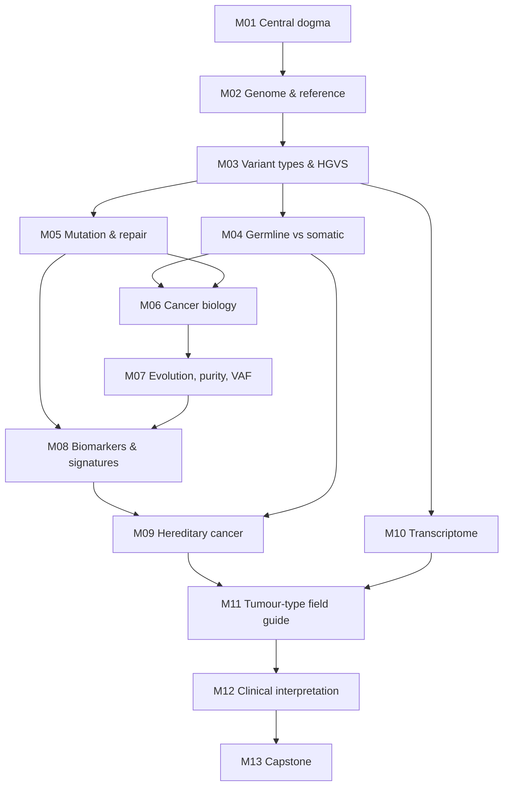

# Cancer101

A beginner-friendly repository for learning the **fundamentals of cancer biology and cancer genomics** — written for bioinformaticians who run tumour–normal sequencing pipelines and want to understand *what* those pipelines detect and *why* it matters biologically and clinically.

---

## What's here

| Folder | Contents |
|---|---|
| [`CancerBasics/`](CancerBasics/) | **Cancer Genomics for Pipeline Engineers** — a structured, self-paced 16-week course with lessons, exercises, quizzes, answer keys and Anki flashcards |
| [`CancerGenomics/`](CancerGenomics/) | Topic notes on cancer genetics and genomics |
| [`Literature/`](Literature/) | Key papers, reviews and publications |

---

## The course: Cancer Genomics for Pipeline Engineers

**Format:** self-paced · 16 weeks × ~5 h/week (~80 h) · undergraduate to early-graduate level
**Audience:** people comfortable with FASTQ/BAM/VCF, alignment, somatic calling (e.g. BWA/GATK, Mutect2) and HPC, but newer to genetics, mutation biology, cancer biology and clinical interpretation.
**Goal:** be able to trace a tumour–normal case from FASTQ to an interpreted variant report, explaining the biology at every step — and to make better QC and interpretation decisions along the way.
**Conventions:** GRCh38 coordinates throughout; diagrams in Mermaid (rendered natively by GitHub).

### What every module contains

- Measurable learning objectives
- Lesson notes, with biology first and analogies for pipeline people
- **Pipeline connection** boxes showing where each concept appears in BAMs, VCFs, Mutect2 filters or QC metrics
- **Tumour spotlight** boxes linking concepts to specific cancer types
- Common misconceptions
- A worked example built on a real, well-known variant
- A hands-on exercise using free tools and public data (Ensembl, UCSC, IGV, ClinVar, gnomAD, cBioPortal, COSMIC, VEP, VariantValidator)
- A quiz (in `CancerBasics/quizzes/`) with a separate answer key (in `CancerBasics/answer_keys/`) for honest self-testing
- 25 flashcards per module in `CancerBasics/flashcards.csv`
- Further reading, plus a **"facts to double-check"** log

### Course outline

| Week | Module | Topic | Worked example | Status |
|---|---|---|---|---|
| 1 | [M01](CancerBasics/module_01_central_dogma.md) | DNA, genes and the central dogma | KRAS G12D: from VCF line to protein | ✅ |
| 2 | [M02](CancerBasics/module_02_genome_organization.md) | Human genome organisation and reference genomes | TERT promoter C228T/C250T | ✅ |
| 3–4 | [M03](CancerBasics/module_03_variant_types_hgvs.md) | Variation, mutation types and HGVS | EGFR exon 19 deletion | ✅ |
| 5 | [M04](CancerBasics/module_04_germline_vs_somatic.md) | Germline vs somatic variation | TP53 R175H: one variant, five stories | ✅ |
| 6 | [M05](CancerBasics/module_05_mutation_and_repair.md) | How mutations arise and are repaired (+ sequencing artifacts) | Three hypermutated colorectal cancers | ✅ |
| 7 | [M06](CancerBasics/module_06_cancer_biology.md) | Cancer biology fundamentals: hallmarks, oncogenes, tumour suppressors, two hits | BRAF V600E across tissues | ✅ |
| 8–9 | M07 | Tumour evolution, heterogeneity, purity, ploidy and VAF | — | 🔜 |
| 10 | M08 | Genomic biomarkers and signatures (TMB, MSI, HRD, COSMIC SBS, copy-number patterns) | — | 🔜 |
| 11 | M09 | Hereditary cancer (BRCA1/2, Lynch, Li-Fraumeni; secondary findings) | — | 🔜 |
| 12 | M10 | The transcriptome in cancer (expression, fusions, allele-specific expression; WGS vs WGTS) | — | 🔜 |
| 13 | M11 | Tumour-type field guide (see below) | — | 🔜 |
| 14 | M12 | Clinical interpretation (AMP/ASCO/CAP, ClinGen/CGC/VICC, ACMG/AMP; OncoKB, CIViC, ClinVar, gnomAD, COSMIC) | — | 🔜 |
| 15–16 | M13 | Capstone: one tumour–normal case from FASTQ to interpreted report | — | 🔜 |

Full syllabus, weekly time budget and prerequisite map: [`CancerBasics/00_course_overview.md`](CancerBasics/00_course_overview.md)

### Cancer types covered (M11 field guide + spotlights throughout)

Breast · colorectal · lung (NSCLC adenocarcinoma, with squamous and small-cell contrasts) · prostate · pancreatic · haematological (AML, CML, MPN, CLL) · glioblastoma · multiple myeloma.

For each: driver and marker genes, variant classes to look for, germline genes to watch, key clinical biomarkers, and what WGS/WGTS can and cannot detect.

### Prerequisite map



---

## How to use the course

1. **Start with** [`CancerBasics/00_course_overview.md`](CancerBasics/00_course_overview.md).
2. **Each week:** read the module, do the exercise, then take the quiz *before* opening its answer key.
3. **Flashcards:** import `CancerBasics/flashcards.csv` into Anki (*File → Import*; fields `Front`, `Back`, `Tags`). Tags `M01`–`M13` let you study one module at a time.
4. **Exercises** use free web tools. Optional parts use your own BAM/VCF files — only do those if your data governance allows it, and never commit patient data to this repository.

---

## Core reading

**Textbook:** Weinberg RA. *The Biology of Cancer*, 2nd ed. Garland Science; 2014. Each module lists the relevant chapters. The book is used for the biology; it is dated on signatures, biomarker thresholds, clinical tiers and current therapies, so later modules use newer sources for those.

**The Hallmarks of Cancer series**

1. Hanahan D, Weinberg RA. The hallmarks of cancer. *Cell.* 2000. doi:[10.1016/s0092-8674(00)81683-9](https://doi.org/10.1016/s0092-8674(00)81683-9) — M06
2. Hanahan D, Weinberg RA. Hallmarks of cancer: the next generation. *Cell.* 2011. doi:[10.1016/j.cell.2011.02.013](https://doi.org/10.1016/j.cell.2011.02.013) — M06
3. Hanahan D. Hallmarks of cancer: new dimensions. *Cancer Discov.* 2022;12(1):31–46. doi:[10.1158/2159-8290.CD-21-1059](https://doi.org/10.1158/2159-8290.CD-21-1059) — M07

Module-specific papers are listed at the end of each module. See also [`Literature/`](Literature/).

---

## Key resources

| Resource | Used for |
|---|---|
| [Ensembl](https://www.ensembl.org) · [UCSC Genome Browser](https://genome.ucsc.edu) · [IGV](https://igv.org) | Genes, transcripts, genome tracks, reads |
| [ClinVar](https://www.ncbi.nlm.nih.gov/clinvar/) · [gnomAD](https://gnomad.broadinstitute.org) | Variant classifications; population frequencies |
| [COSMIC](https://cancer.sanger.ac.uk/cosmic) · [COSMIC Signatures](https://cancer.sanger.ac.uk/signatures) | Somatic mutations, Cancer Gene Census, mutational signatures |
| [cBioPortal](https://www.cbioportal.org) · [The Cancer Genome Atlas (TCGA)](https://www.cancer.gov/tcga) | Cohort-level mutation, copy-number and expression data |
| [Ensembl VEP](https://www.ensembl.org/Tools/VEP) · [VariantValidator](https://variantvalidator.org) | Consequence annotation; HGVS checking |
| [OncoKB](https://www.oncokb.org) · [CIViC](https://civicdb.org) | Clinical actionability (Module 12) |

---

## Repository layout

```
Cancer101/
├── README.md
├── CancerBasics/
│   ├── 00_course_overview.md
│   ├── module_01_central_dogma.md
│   ├── module_02_genome_organization.md
│   ├── module_03_variant_types_hgvs.md
│   ├── module_04_germline_vs_somatic.md
│   ├── module_05_mutation_and_repair.md
│   ├── module_06_cancer_biology.md
│   ├── module_07 … module_12             (in progress)
│   ├── capstone_project.md                (in progress)
│   ├── quizzes/          quiz_01.md … quiz_06.md
│   ├── answer_keys/      answer_key_01.md … answer_key_06.md
│   ├── flashcards.csv    (Front,Back,Tags — Anki-importable)
│   ├── glossary.md                        (in progress)
│   └── progress_tracker.md                (in progress)
├── CancerGenomics/
└── Literature/
```

---

## Content guidelines

- **Biology first.** Emphasise the underlying biological and clinical principles, then connect them to data.
- **Introductory to intermediate depth.** Every term is defined on first use.
- **Light, illustrative code only.** Exercises include short commands (e.g. `bcftools`, `samtools`) to connect concepts to real files. Full pipelines and workflow code belong in separate pipeline repositories.
- **Accuracy over completeness.** No invented citations or statistics. Each module ends with a "facts to double-check" log; guidelines and drug approvals are dated and should be checked against current sources.

---

## Disclaimer

This material is for **education only**. It is not medical advice and must not be used to make clinical decisions. Clinical guidelines, drug approvals and variant classifications change; always consult current authoritative sources. The course materials were drafted with the help of an AI assistant; items needing verification are flagged in each module.

---

*Created as part of my personal learning journey in cancer bioinformatics.* 🚀
